The **Business Glossary** is a semantic layer built on top of Mia-Platform Data Catalog that provides a shared, business-friendly vocabulary for an organization's data.  
It is organized around **Terms**, the lowest independent unit describing a business concept, a metric, or a definition (e.g. `Churn Rate`, `GDPR`, `Cash Flow`). Terms can be linked to one another to express semantic relationships, and, most importantly, they can be associated to the data assets (System of Records, Tables, Columns) that implement them, bridging the gap between business language and technical metadata.

Within Data Catalog frontend, the Business Glossary is accessible from the new **Terms** tab, located alongside **Assets**, **Custom properties** and **Connections**.

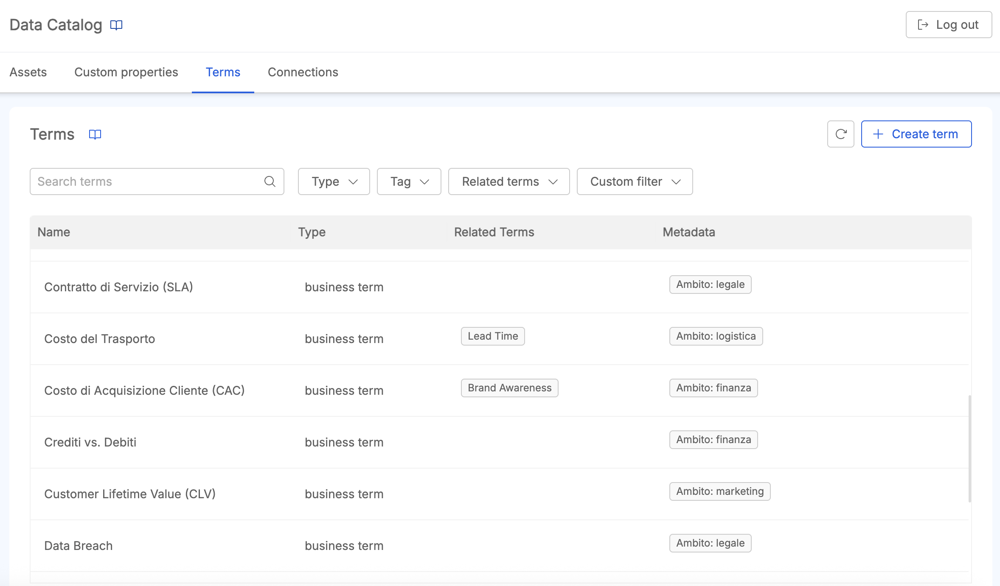

:::caution
Creating, editing, or deleting terms, managing their relations, and associating/dissociating them to data assets require the `admin:glossary` permission. Browsing terms and their associations only requires the `read:glossary` permission.  
See the [Secure Access section](/products/data_catalog/secure_access.mdx) to learn more about the authorization process.
:::

## Terms List and Search

Accessing the **Terms** tab shows the list of all the terms defined in the glossary. For each term, the table shows:

* **Name**, the term title;
* **Type**, the Term Type assigned to the term;
* **Related Terms**, a list of the [related terms](#related-terms) linked to it (with a `+N` badge in case they don't fit the available space);
* **Metadata**, showing together the tags assigned to the term and the values of any [custom property](#custom-properties-for-terms) applied to it.

Next to the search bar, it is possible to filter the list by:

* **Type**: only terms matching the selected Term Type(s) are returned;
* **Tag**: only terms that contain at least one of the chosen tags are returned;
* **Related term**: only terms that are related to the selected term(s) are returned;
* **Custom filter**: only terms that present a match with all the values defined on the selected custom properties are returned, in the same way already described for [Assets custom filters](/products/data_catalog/frontend/data_catalog_assets.mdx#advanced-filters).

Each applied filter is shown as a removable chip below the filter bar; the `Clear all` link resets the whole search.

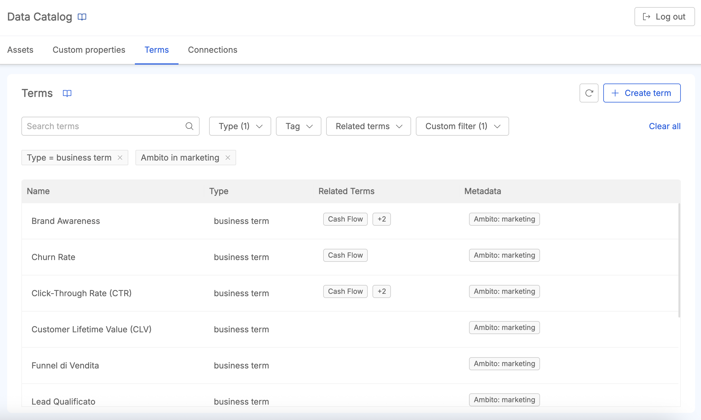

## Term Types

Every term is assigned a **Term Type**, which classifies the term much like assigning it to a class or category - for example a *Business Term*, a *Process*, an *Acronym*, a *KPI*, or any other classification meaningful to the organization. Term Types are entirely user-defined: there is no predefined taxonomy shipped with the Business Glossary, so each organization is free to model whichever set of Term Types best represents how it wants to organize its business vocabulary.

A Term Type can be introduced in two ways, both from the same searchable dropdown available when [creating](#create-a-term) or [editing](#edit-a-term) a term:

* by selecting a Term Type that has already been defined for another term in the glossary;
* by typing a value that doesn't match any existing Term Type: a `Create new: <value>` option appears, allowing a brand new Term Type to be introduced on the fly, without leaving the term creation/edit form.

Once introduced, a Term Type is immediately available for selection on any other term: it is not exclusive to the term that first defined it, but shared across the whole glossary.

:::info
There is currently no dedicated page to list, rename, or delete Term Types: they only exist as long as at least one term references them, and the searchable dropdown on term creation/edit is their only management surface.
:::

### Term Uniqueness

Within the Business Glossary, a term is uniquely identified by the combination of its **Name** and its **Term Type**. As a consequence:

* two terms can share the same Name, as long as they are assigned different Term Types (e.g. a term named `Client` typed as *Business Term* and another term named `Client` typed as *Acronym* can coexist);
* two terms cannot share both the same Name and the same Term Type.

This constraint is enforced whenever a term is created or edited; see [Edit a Term](#edit-a-term) for how renaming a term or changing its Term Type affects the places where it is referenced.

## Create a Term

By clicking the `Create Item` button, a modal lets the user define a new term:

* **Name** (required): the term title;
* **Type** (required): the [Term Type](#term-types) assigned to the term, selected or created on the fly from the searchable dropdown;
* **Description** (optional): a free text description of the term.

  

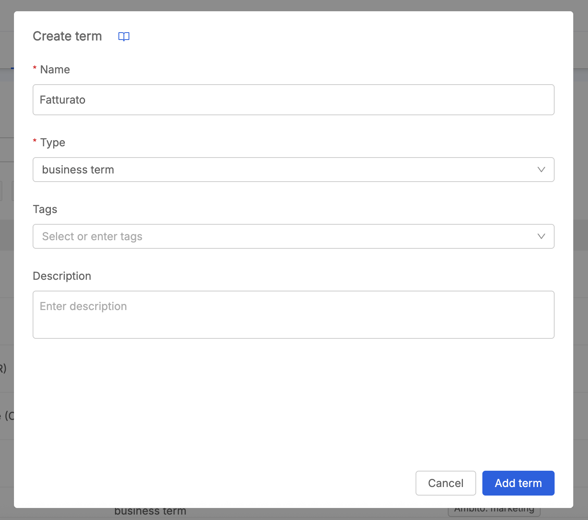

  

## Term Details Navigation

Clicking on a term from the search results opens its detail page, organized in two tabs: **General** and **Assets**.

### General

The **Details** card shows the term's **Name**, **Type**, **Tags** and **Description**, all of them editable inline by users with enough permissions.

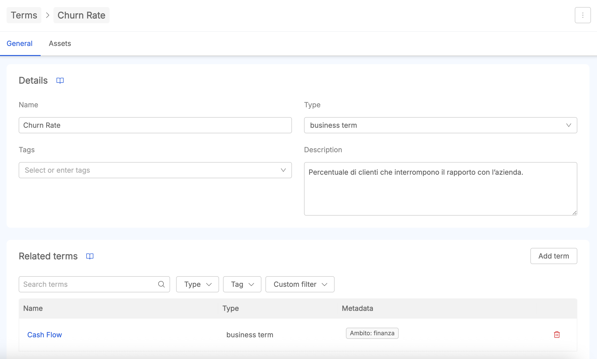

#### Related Terms

Below the Details card, the **Related terms** card lists the terms currently linked to the one being viewed. From here it is possible to:

* search and filter existing terms (by name, tag, or [custom filter](/products/data_catalog/frontend/data_catalog_assets.mdx#advanced-filters)) and click `Add term` to link one or more of them;
* click on a related term's name to navigate to its own detail page;
* remove a relation via the trash icon at the end of its row.

Removing a relation is bidirectional: if term `A` has term `B` as a related term and the relation is removed from `A`, then `B` will no longer show `A` among its own related terms either.

#### Custom Properties

Further down, the **Custom properties** card allows to enrich the term with metadata, exactly as already described for [Metadata Enrichment](/products/data_catalog/frontend/data_catalog_assets.mdx#metadata-enrichment) on other asset types; a term can as well end up with **Unknown custom properties**, following the same [dedicated behavior](/products/data_catalog/frontend/data_catalog_assets.mdx#unknown-custom-properties) already documented for SoR, Table and Column assets. See the [Custom Properties for Terms](#custom-properties-for-terms) section below for what changed on the Custom Properties management side.

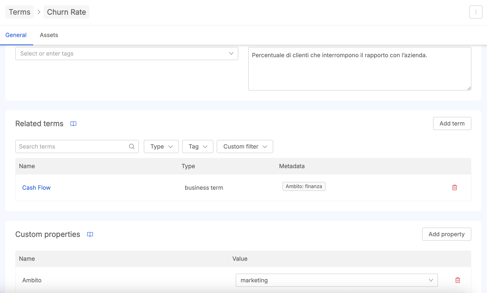

### Assets

The **Assets** tab shows the **All assets** section, listing every data asset (SoR, Table, Column) currently associated to the term. Similarly to the other search experiences of Data Catalog, it is possible to filter this list by asset type, tags, or custom filter, and clicking on a row navigates to that specific asset's detail page.

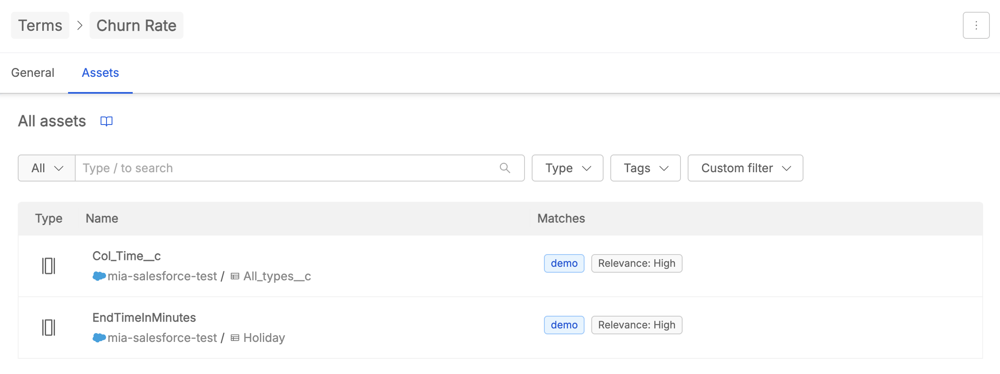

## Edit a Term

Users with enough permissions can edit a term's **Name**, **Type**, **Tags** and **Description** directly inline, from the Details card described in the [General tab](#general) of the term detail page.

:::info
As described in [Term Uniqueness](#term-uniqueness), a term is uniquely identified within the glossary by the combination of its **Name** and its **Term Type**. Renaming a term and/or changing its Term Type is automatically reflected wherever that term is referenced: on every other term listing it among its [Related terms](#related-terms), and on every data asset it has been [associated](#associating-terms-to-data-assets) to.
:::

## Delete a Term

From the term detail page, the menu button on the top-right corner of the page shows the `Delete term` action. A confirmation modal is shown before proceeding; once confirmed, the user is redirected to the Terms list.

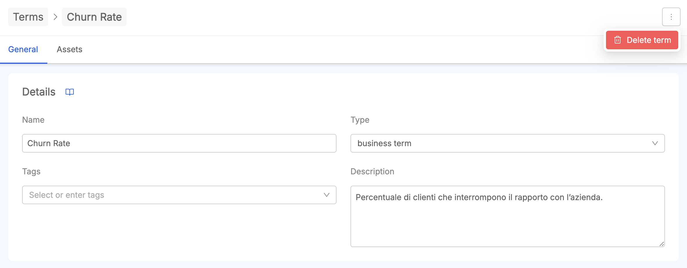

:::caution
Deleting a term is a permanent action:
- it disappears from the **Related terms** card of every other term that referenced it;
- it disappears from the list of associated Business Glossary terms of every data asset it was linked to.
:::

## Custom Properties for Terms

**Terms** is now a selectable option among the **Applicable asset types** of a custom property, next to Columns, System of Records and Tables. This means custom properties can be defined to be applicable only to glossary terms, only to other asset types, or to any combination of them.

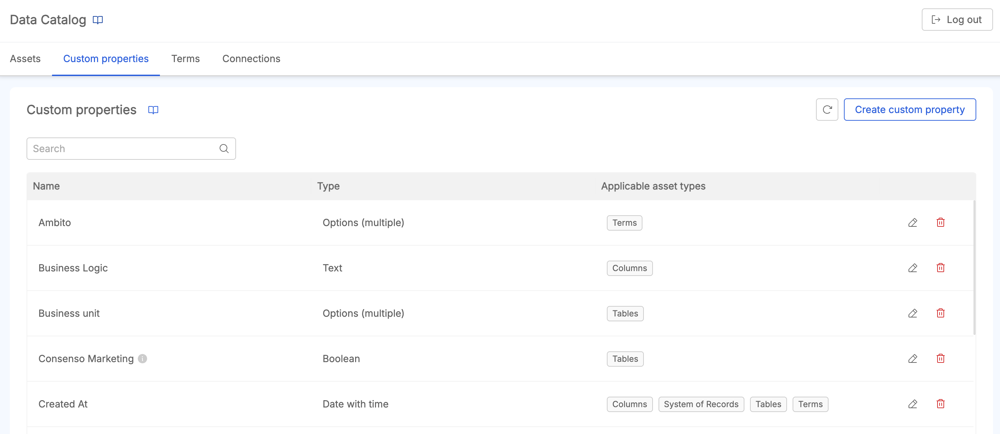

  

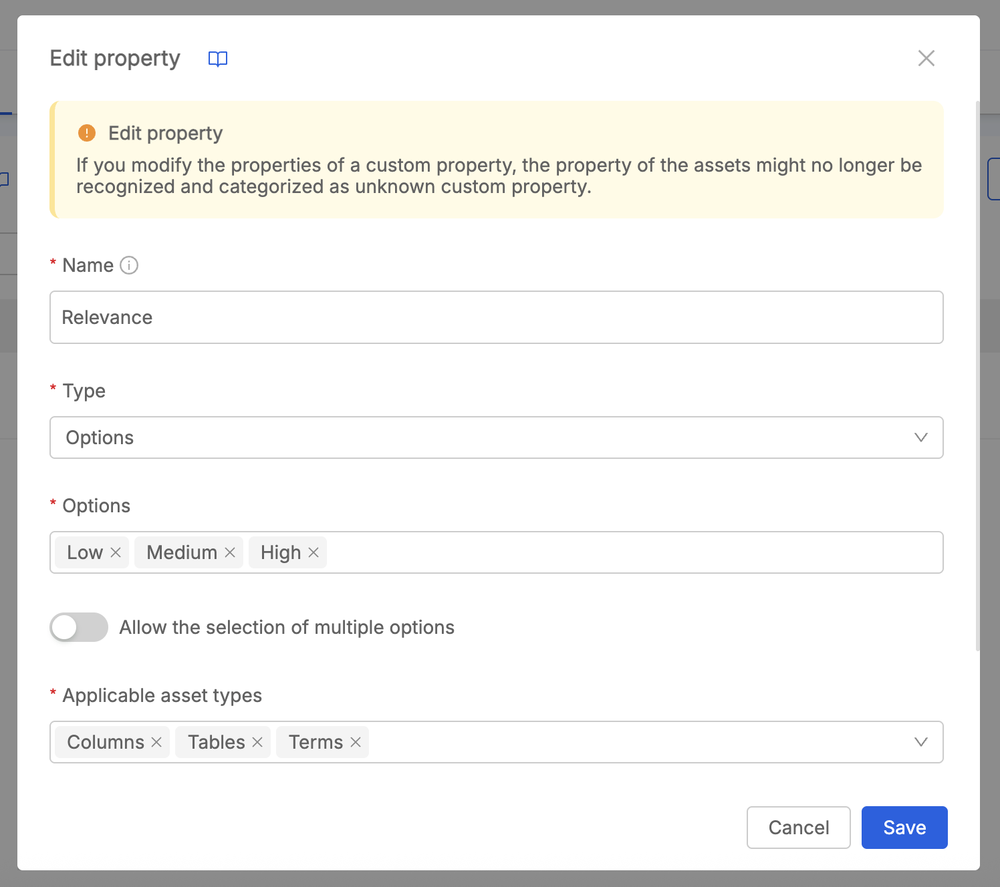

  

Everything already described in the [Custom Properties Management](/products/data_catalog/frontend/data_catalog_assets.mdx#custom-properties-management) documentation, including creation, edit, and deletion caveats, applies unchanged when Terms is selected as one of the applicable asset types.

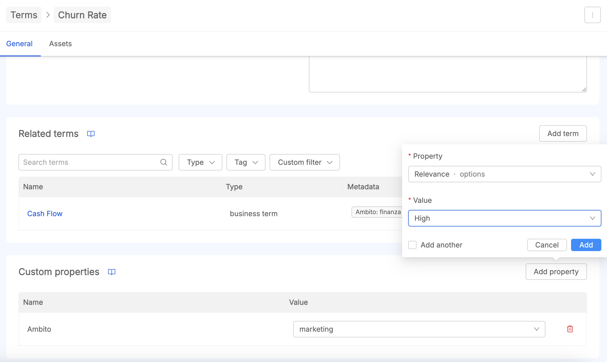

## Associating Terms to Data Assets

Starting from a data asset's detail page (SoR, Table, or Column), a new **Related terms** card is available in the **General** tab, allowing to link Business Glossary terms to that specific asset.

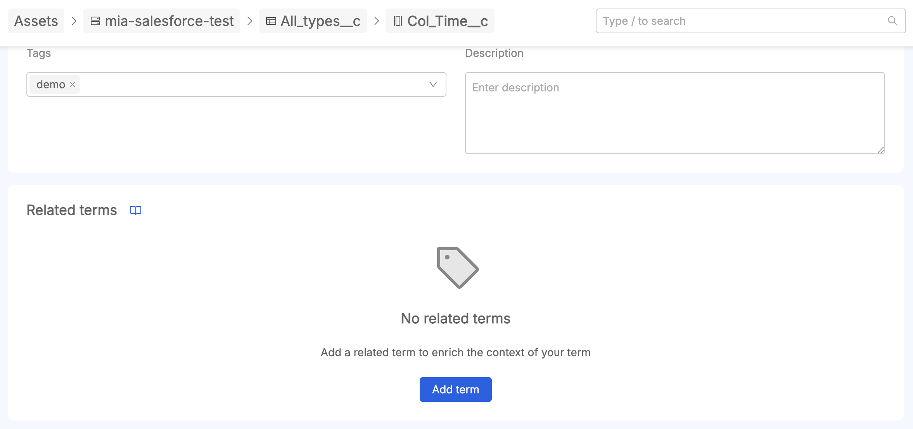

Clicking `Add term` opens the same search experience already described for a term's own [Related terms](#related-terms) card: it is possible to search and filter existing terms by name, tag, or custom filter, and select one or more of them to associate to the asset. Once associated, a term can be removed from the asset via the trash icon at the end of its row.

:::info
The reverse view, showing all the data assets associated to a given term, is available in that term's [Assets tab](#assets).
:::
