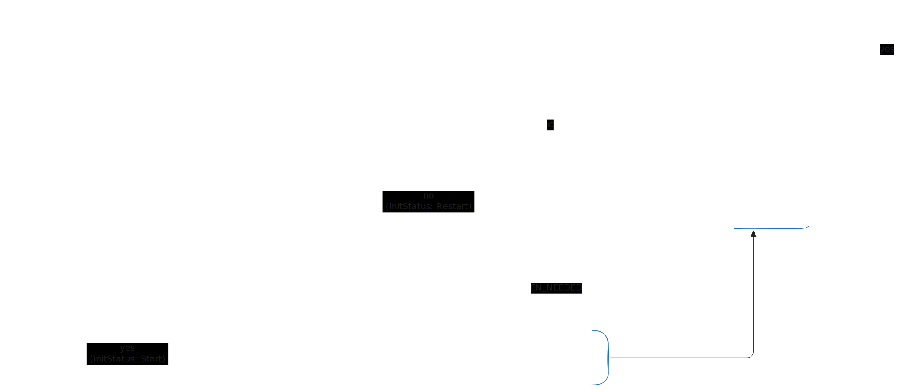

## Startup Behavior

In the diagram below is described how the service decides whether to resume
a change stream or start a new one. Such behavior can be configured for
each collection selecting the desired `snapshot` mode.



> **⚠️ CAUTION**
>
> To let Mongezium resume change stream events, the header of each Mongezium message contains [the resume token](https://www.mongodb.com/docs/manual/changeStreams/#resume-tokens). At startup, the service will read the latest message and create the change stream with the given resume token.
>
> It may happen that the `oplog.rs` collection grows in size and certain resume token may disappear.  
> In such case, a new change stream will be opened, listening for new changes
> without performing any snapshot operation. To enforce the execution of a snapshot
> procedure, please set the `snapshot` field of collections entries to `when_needed`.
> Consequently, when a resume token will return a not found error, a new snapshot
> will be performed.

## Usage Requirements

To use the application, the following requirements must be met:

- MongoDB must be in replica-set.
- the connection string must have privileges to access the `oplog` and the `admin` collection. More specifically, it needs permission to enable `changeStreamPreAndPostImages` on the collection of the configured database;
- Kafka connection must have permission to read/write the topics declared in the `collectionMappings` registry;
- both collections and topics must be defined in the MongoDB cluster and the Kafka Cluster, respectively.

## Messages Spec

Output Kafka messages key is compliant with the following schema:

```json
{
    "type": "object",
    "properties": {
        "$oid": {
            "type": "string"
        }
    }
}
```

Output Kafka messages payload is compliant the following schema:

```json
{
    "type": "object",
    "oneOf": [
        {
            "properties": {
                "op": {"const": "c"},
                "before": {"type": "null"},
                "after": {"type": "object"}
            }
        },
        {
            "properties": {
                "op": {"const": "r"},
                "before": {"type": "null"},
                "after": {"type": "object"}
            }
        },
        {
            "properties": {
                "op": {"const": "u"},
                "before": {"type": "object"},
                "after": {"type": "object"}
            }
        },
        {
            "properties": {
                "op": {"const": "d"},
                "before": {"type": "object"},
                "after": {"type": "null"}
            }
        }
    ]
}
```
