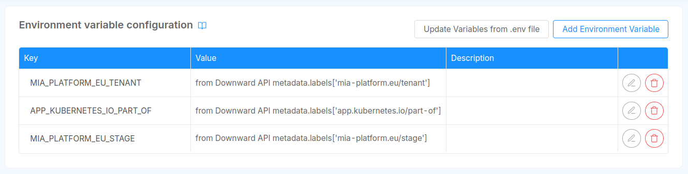
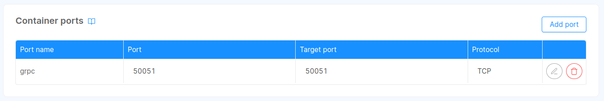

import ControlPlaneOperatorSchema from "@site/static/schemas/data-fabric-control-plane-operator.config.schema.json"
import StateChannelSchema from "@site/static/schemas/fast-data-control-plane-state.schema.json"
import FeedbackChannelSchema from "@site/static/schemas/fast-data-control-plane-feedback.schema.json"
import SchemaViewer from "../snippets/schema_viewer.mdx"

Fast Data Control Plane Operator is a service that has to be deployed in each [Fast Data Runtime](/products/fast_data/runtime_management/overview.mdx#runtime) (a Console project released in a specific environment) whose main objectives are:

* recognize in which runtime it is executing and register itself on the main Control Plane instance to acknowledge its existence within detected runtime;
* expose an interface towards Fast Data [workloads](/products/fast_data/runtime_management/overview.mdx#workload) to allow a bidirectional communication with them where it can:
    * forward on the [state channel](#state-channel) the desired state that has been requested by users;
    * gather actual workloads state from the [feedback channel](#feedback-channel);
* send to the main Control Plane instance the workloads state (e.g. whether they are up-and-running, _active_ or _paused_) of the [Fast Data Pipeline](/products/fast_data/runtime_management/overview.mdx#pipeline) they are linked to;

## Configuration

Configuration of _Control Plane Operator_ is a straightforward process that involves setting up a ConfigMap and specifying essential environment variables.

### Environment Variables

Control Plane service can be customized using the following environment variables:

| Name                                 | Required | Description                                                                                                                                                                                                                 | Default Value                            |
|--------------------------------------|----------|-----------------------------------------------------------------------------------------------------------------------------------------------------------------------------------------------------------------------------|------------------------------------------|
| `GRPC_PORT`                          | -        | This variable determines the TCP port where the **gRPC controller** binds its listener                                                                                                                                      | 50051                                    |
| `LOG_LEVEL`                          | -        | Specify the centralized application log level, choosing from options such as `debug`, `error`, `info`, `trace` or `warn`                                                                                                    | `info`                                   |
| `FD_OPERATOR_CONFIGURATION_FILEPATH` | -        | Set the location of the configuration file                                                                                                                                                                                  | `~/.fd/control_plane/configuration.json` |
| `OTEL_EXPORTER_OTLP_ENDPOINT`        | -        | The URL to a GRPC endpoint of an OpenTelemetry Collector.<br/>Specifying this value enables the support for OpenTelemetry tracing                                                                                           |                                          |
| `MIA_PLATFORM_EU_TENANT`             | &check;  | Identifier of the company that contains the project where this service is configured.<br/>This is retrieved exploiting [Downward API](/products/console/api-console/api-design/services.md#from-downward-api) configuration |                                          |
| `APP_KUBERNETES_IO_PART_OF`          | &check;  | Identifier of the project where this service is configured.<br/>This is retrieved exploiting [Downward API](/products/console/api-console/api-design/services.md#from-downward-api) configuration                           |                                          |
| `MIA_PLATFORM_EU_STAGE`              | &check;  | Environment where this service is deployed to.<br/>This is retrieved exploiting [Downward API](/products/console/api-console/api-design/services.md#from-downward-api) configuration                                        |                                          |

:::tip
This is how environment variables using Downward API should look like under Control Plane Operator microservice page of Console Design area:


:::

### Config Maps

The configuration of the service is handled by a JSON file whose location is defined by the `FD_OPERATOR_CONFIGURATION_FILEPATH`. When instantiating
[Control Plane application](/runtime-components/applications/fast-data-control-plane/10_overview.md) from Marketplace, Control Plane service configuration is generated with
a dedicated Config Map, named `control-plane-operator-config`.  
This file contains a template configuration that should help in configuring the service.

<SchemaViewer schema={ControlPlaneOperatorSchema} />

### Upstream

Control Plane Operator needs to know the address of main Control Plane instance, so that it can send to it the feedbacks collected
from the different Fast Data workloads. This can be configured through the `url` field under `upstream` property in the configuration file.

An example of a simple configuration is shown here, where it is assumed that Control Plane service is located within `data-fabric` namespace:

```json
{
  "upstream": {
    "url": "http://control-plane.data-fabric.svc.cluster.local:50051"
  }
}
```

The `url` can use both `http` and `https` protocol, although the former is used as default. The latter can be configured as default connection
protocol setting the property `assume_http2` to `true`.  
Furthermore, it is possible to customize the request headers by adding ad-hoc ones within the property `headers`. This can be useful for setting an
`Authorization` header or an API key in the expected header.

Below is provided a complete example of the configuration:

```json
{
  "upstream": {
    "url": "http://control-plane.data-fabric.svc.cluster.local:50051",
    "assume_http2": true,
    "headers": {
      "secret": {
        "type": "env",
        "key": "CP_OPERATOR_API_KEY"
      }
    }
  }
}
```

:::tip
The following properties support [secret resolution](/products/fast_data/configuration/secrets_resolution.md):
- `upstream.headers.*`
:::

:::caution
In order for a _runtime_ to be recognized and managed by the main Control Plane instance, it has to belong to **one and only one** _runtime view_. Consequently,
_runtimes_ that do not belong to any _runtime view_ are <u>simply ignored</u> by the system, while it is forbidden for a _runtime_ to belong to multiple _runtime views_.
:::

### Pipelines Configuration

Control Plane Operator requires an additional configuration file to learn the topology of Fast Data Pipelines deployed within the runtime
of execution. Such information is _automatically_ generated and added by Fast Data Configurator to the Control Plane Operator
when it recognizes it as a known plugin, that is when Control Plane Operator service has been instantiated from Mia-Platform Marketplace.

:::danger

[//]: # (TODO add link to marketplace plugin!!!!)
To configure Control Plane Operator, <u>always</u> start from the Mia-Marketplace plugin item. 

When configuring Control Plane Operator **without** using the corresponding Mia-Platform Marketplace item, such **automatic configuration is not added**
by Fast Data Configurator, so that the service won't be able to recognize Fast Data Pipelines and match them with state feedbacks collected 
from Fast Data workload.
:::

### Enable gRPC communications

Control Plane Operator service **must** be reachable through [gRPC](https://grpc.io/) from [Fast Data Workloads](/products/fast_data/runtime_management/overview.mdx#workload)
deployed in its namespace. In this manner Fast Data Workloads can receive [state updates](#state-message) and send back their actual status
as [feedback](#feedback-message).

Thus, it is necessary to expose the port where the gRPC controller runs in the Control Plane service, which by default is the `50051`.
This operation can be achieved by setting the proper port to the list of [_Container Ports_](/products/console/api-console/api-design/microservice-container-ports.md)
that can be found in the Console Design area, under the specific microservice resource. In the image below it is shown how
the container ports card should appear: 



:::tip
When instantiating Fast Data Control Plane application, _Container Ports_ are pre-filled with all the needed ports using their default value.  
In case either the HTTP or the gRPC port chosen through [environment variables](#environment-variables) has been edited, please change the _Container Ports_ accordingly.
:::

## Runtime Communication

Communications to/from runtime's workloads happen through a [bidirectional channel](https://grpc.io/docs/what-is-grpc/core-concepts/#bidirectional-streaming-rpc)
whose _State_ and _Feedback_ messages are exchanged in their respective direction.

### State Message

The _State Message_ is employed to notify the desired state of each [pipeline](/products/fast_data/runtime_management/overview.mdx#pipeline)
to the underlying workloads. Each pipeline has a general state, that can be overridden.  
For each pipeline, there could be different `overrides` that can change individually the state of a particular
[artifact](/products/fast_data/runtime_management/overview.mdx#artifact). Also, each artifact can have additional `overrides`
for each [execution stage](/products/fast_data/runtime_management/overview.mdx#execution-step) of the pipeline where is employed.

The state that can be set at pipeline level, or artifact level, or execution stage level is an _Activation State_, which can be:

- `pause` &rarr; request workloads to stop consuming from the data stream
- `resume` &rarr; request workloads to resume consuming the data stream

<SchemaViewer schema={StateChannelSchema} />

### Feedback Channel

The _Feedback Message_ defines the format for workloads to notify the Control Plane Operator about the state of their artifacts.
The information that can be extracted from these messages is:

- which artifacts are up-and-running;
- which workloads have already successfully reconciled their state with the one requested in the latest _State Message_;  

Workloads connected to a Control Plane Operator **periodically** generate and send these messages through the established bidirectional channel.

<SchemaViewer schema={FeedbackChannelSchema} />

## Migration Guides

Here are the migration steps to perform between each version of the service.

### From 0.1.x to 0.3.0

Control Plane Operator will accept workload connections only after it has been registered to the Control Plane. 
To let the workloads resume their data stream processing if such registration process fails, you can configure their [Force Resume feature](/products/fast_data/runtime_management/workloads.mdx#force-the-resume-of-workload-operations).    