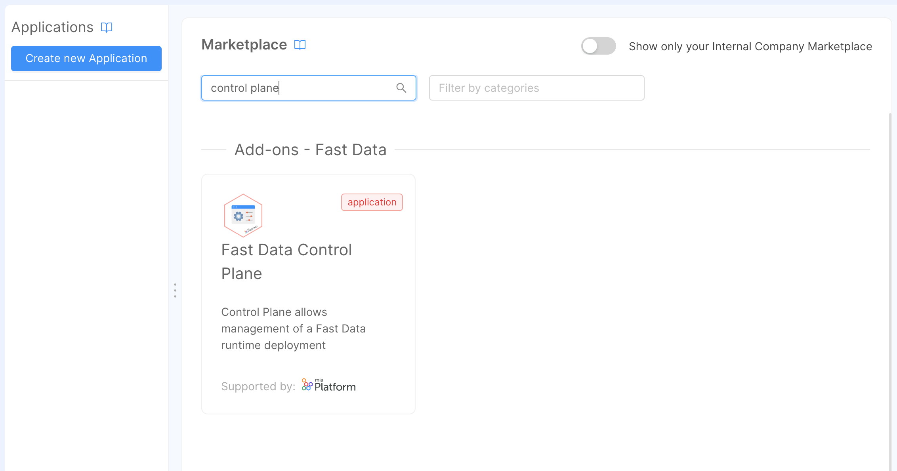
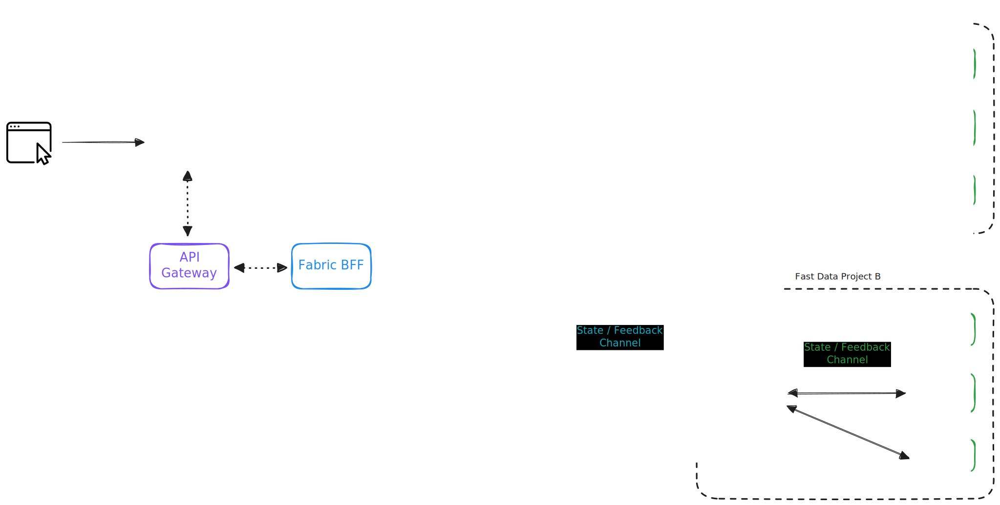
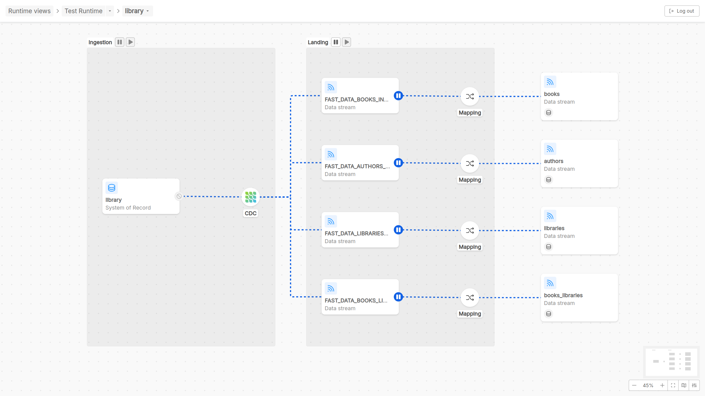
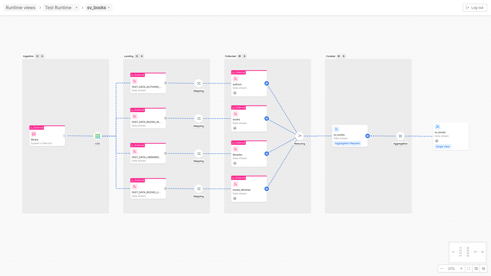

import Tabs from '@theme/Tabs';
import TabItem from '@theme/TabItem';

## Introducing Fast Data Control Plane

Mia-Platform Fast Data includes a Runtime Management solution, **Fast Data Control Plane**.  

It provides a general overview of the Fast Data pipelines released on one or more runtime environments,
and allows users to monitor and govern the execution of their Fast Data systems.

In particular, this Fast Data suite component offers functionalities to pause and resume the 
consumption of data streams along Fast Data pipelines with just a few clicks.  

Therefore, processes such as Fast Data [Initial Load management and Full Refresh](/products/fast_data/concepts/data_loading.mdx) actions can be 
easily managed from a user-friendly web interface supported by robust backend functionalities.

### Benefits

With Fast Data Control Plane, user can govern the execution of Fast Data microservices involved 
in messages consumption along the overall data pipeline with fine-grained control.  

This Fast Data Runtime Management flexibility, enables strategic management of the runtime environment in various scenarios:

- **Strategic Resource Allocation**: 
  - Dynamically allocate resources by pausing and resuming microservices involved in messages consumption based on workload and resource availability.
  - Efficiently utilize computing resources and prioritize critical processes during peak demand
  
  This leads to performance optimization, ensuring data consistency.
- **Initial Load and Full Refresh processes management**: Govern and control initial load and full refresh processes directly from a user 
  interface without frictions and without altering your workloads configuration deployed in runtime. 
  
  For example, start the ingestion of a massive data system into the Fast Data environment. Only after the ingestion process is complete, 
  initiate the processing of updates from the Real Time Updater (and the Single View Trigger Generator if active) to generate Single Views.  
- **Performance Testing and Simulation**: 
  - Simulate different scenarios for performance testing by pausing and resuming messages consumption along pipeline.
  - Observe system behavior under various conditions to identify bottlenecks and optimize resource allocation.
- **Enhanced System Reliability**: 
  - Gracefully handle unexpected situations or system maintenance by pausing specific data pipeline steps.
  - Resume operations post-maintenance to minimize downtime and enhance overall system reliability.

### Application Deployment

#### Control Plane

The Fast Data Runtime Management solution is distributed as a [Mia-Platform Marketplace application](/runtime-components/applications/mia_applications.md), which automatically
instantiates most of the needed resources and pre-populate configuration files with default values that are quick to edit.

:::tip Configure control plane in a dedicated Project

We strongly recommend to configure such application into a **dedicated Console Project** (for example one named _Data Fabric_) that can be reached from all the other ones.
In this manner the Fast Data Runtime Management software can run mostly independently of the actual Fast Data runtimes, so that updates to them still allow to receive and visualize
the Fast Data states from all the others runtimes.

:::

[Control Plane application](/runtime-components/applications/fast-data-control-plane/10_overview.md) can be found in the Marketplace by looking it up in using the keyword `control plane`, which will present you with an option for instantiating its configuration.
This option should appear as _Fast Data Control Plane_, which will provide all the configurations of _Fast Data Control Plane_ solution,
alongside the resources needed for introducing an authorization layer (see box tip below for more information).

:::tip Set secure application access

As Control Plane is a powerful tool for governing Fast Data at runtime, it is important to ensure that only authorized users can access and interact with it, especially if the interaction is performed on a Fast Data production environment.

By combining different capabilities and tools offered and managed in Mia-Platform Suite, Control Plane can be setup with a solid authorization security layer, and permissions control mechanisms can be built on top of it.

To find out how to better address this goal, please visit the related [documentation page](/products/fast_data/runtime_management/secure_access.md) that explains how to manage the Fast Data Control Plane With Access Control.
:::

Below is shown the Marketplace application page where the term `control plane` has been looked up. In case this application is not available in your Marketplace, please contact your Console administrator to verify if the Fast Data license is active for your Company.

Among the services provided by Control Plane application, the main components in charge of deploying the Fast Data Runtime Management solution are:

- [`control-plane`](/products/fast_data/runtime_management/control_plane.mdx), which is responsible for dispatching control actions to the registered Fast Data runtimes and receiving from them the feedbacks to display in the dedicated UI
- [`control-plane-fe`](/products/fast_data/runtime_management/control_plane_frontend.mdx), which exposes the UI for visualizing Fast Data runtimes, their state and interact with them
- [`fabric-bff`](/products/fast_data/runtime_management/control_plane_fabric_bff.mdx), which is in charge of processing requests for Control Plane made by the corresponding frontend

Please remember that, in order to properly access Fast Data Runtime Management application, it is necessary to fill in all the necessary configurations the services require.

:::info
For more details on the services configuration, please head over the dedicated documentation section of each component.
:::

#### Control Plane Operator

Once the Control Plane is configured, it is then necessary to configure and deploy in each Fast Data Runtime namespace a new service, the [Control Plane Operator](/products/fast_data/runtime_management/control_plane_operator.mdx).
Its main responsibilities are:

- connecting to the main Control Plane instance and register itself on it to notify of its Fast Data Runtime existence
- gather from the Fast Data services deployed in its namespace the current state for the Fast Data Runtime
- forward collected feedbacks to the main Control Plane instance so that user can visualize the updated state

The Control Plane Operator is available as a [Mia-Platform Marketplace plugin](/runtime-components/plugins/mia-platform-plugins.md), which comes with a blueprint of the configuration to speed up its setup.

---
## Architecture

In the diagram below is shown how the different services are linked together. In particular, the Control Plane FE connects with the main
Control Plane service via both REST APIs and Websocket, while Control Plane and Control Plane Operators communicate through GRPC channels.

In particular, in the Data Fabric Project is highlighted which components the Fast Data Control Plane applications releases.

---

## Concepts

Here are listed some concepts that are used on the Runtime Management solution. 
These concepts are in addition to the ones already provided by [Fast Data Section](/products/fast_data/concepts/glossary.mdx).

### Workload 

A _workload_ represents a microservice of a Fast Data architecture that can be controlled through Control Plane. 

Each workload can manage one or more [artifacts](#artifact).
:::info
At startup, a workload will have all its artifacts in a `paused` state, meaning that no actions will be performed 
by the service until the Control Plane will receive a command to `resume` at least one artifact for a specific workload.

Upon receiving this command, the involved artifacts will be in a `running` state.
:::

### Runtime

Within the context of Fast Data Control Plane, a _runtime_ corresponds to [a runtime environment of Mia-Platform Console](/products/console/monitoring/introduction.md),
where it is expected that an instance of Control Plane Operator has been deployed. In particular, a runtime can be identified across Fast Data Control Plane solution by these three parameters:

- [Console company](/products/console/company-configuration/overview.md)
- [Console project](/products/console/project-configuration/index.md)
- [Console runtime environment](/products/console/monitoring/introduction.md)

For example, let's suppose we created a Company `Supermarkets` and a Project `Warehouse`. The configurations of this specific `Warehouse` Project, deployed in the environment `PREPRODUCTION`,
composes a _runtime_ for the Control Plane.
In case those same configurations of `Warehouse` Project were released in another environment, such as `PRODUCTION`, then those would be treated as another _runtime_ different from the one mentioned earlier.

The main Control Plane instance can manage one or more runtimes, once they are registered by each deployed Control Plane Operator.

### Runtime View

Within the context of Fast Data Control Plane, a _runtime view_ corresponds to a group of one or more [_runtimes_](#runtime) that are logically clustered together. These groupings
may either arise from business requirements or spontaneously depending on how Console projects are related each other.

For example, one may decide to group together runtimes based on their deployed environment, such as `test`, `preprod`, `production`,
or based on their business units, such as split the Fast Data runtimes related to warehouse from the ones managing customers and orders.

:::caution
In order for a _runtime_ to be recognized and managed by the main Control Plane instance, it has to belong to **one and only one** _runtime view_. Consequently,
_runtimes_ that do not belong to any _runtime view_ are <u>simply ignored</u> by the system, while it is forbidden for a _runtime_ to belong to multiple _runtime views_.
:::

### Pipeline

A _pipeline_ is a group of entities that spans across different workloads. Each pipeline is managed separately.

There are two different types of pipelines, with different scopes and goals: we will explore them later in [their dedicated section](#pipelines). 

### Artifact

An _artifact_ represents a unique entity inside the pipeline. This entity can be of different types, depending on its occurrence inside the pipeline, which are:

- **System of Record**: represents a data source. 
- **Data Streams**: represents a source where data is managed. Can either be:
  - an ingestion topic
  - a projection 
  - a trigger topic or a projection change
  - a single view 

Each artifact is linked to a Fast Data resource, which can be conversely related to multiple artifacts appearing in different pipelines.  

### Execution Step

An _Execution Step_ represent a particular operation performed over a data flow. This operation can change, depending on the stage where the execution step is located:

- **CDC**: is the step that registers changes from the data source of a pipeline, sending the corresponding operations to an ingestion topic. 
  This step cannot be controlled by the Control Plane.
- **Mapping** : is the step that reads the changes from an ingestion topic and performs:
  - validation of the data and the operation contained in the ingestion topic
  - casting of the fields contained inside a message
  - storage of data inside MongoDB

  This step is managed by either the Projection Storer or the Real-Time Updater.    
- **Reducing** : is the step involved to compute the identifier of the curated data that is aggregated by a pipeline. 
  This step is managed by the Single View Trigger Generator (SVTG).

  :::caution Standard Architecture
  For runtimes implementing the [Standard Architecture](/products/fast_data/concepts/architecture.md#standard-architecture), i.e. having a Real-Time Updater that performs 
  the execution of [strategies](/products/fast_data/configuration/strategies.md), the Reducing step cannot be controlled since no SVTG is employed.  
  :::

- **Aggregation** : is the step where the data collected by the Reducing step is aggregated and stored into a Single View.
  This step is managed by the Single View Creator. 

### Stage

A stage represent a set of artifacts and execution steps that are grouped together by their scope.

- **Ingestion**: is where the data is received. This stage contains the following components:
  - **Artifact**: System of Record
  - **Execution Step**: CDC     
- **Landing**: is where the data is validated and parsed accordingly. This stage contains the following components:
  - **Artifact**: Ingestion Topic
  - **Execution Step**: Mapping     
- **Collected**: is where the data is stored and queried to notify what changes have been performed on the final data
  that should be represented. This stage contains the following components:
  - **Artifact**: Projection
  - **Execution Step**: Reducing   
- **Curated**: is where the data is aggregated and produce an output that is persisted, i.e. a single view. 
  This stage contains the following components:
  - **Artifact**: Trigger Topic or Projection Changes collection
  - **Execution Step**: Aggregation      

---
## Pipelines

By using the concepts provided, the Control Plane offers two kind of pipelines, where is possible to manage a subset of artifacts and execution steps. 

### Domain Pipeline

A **Domain pipeline**  represents a set of entities that have been configured to be related each others. 
The concept of ***Domain***, in the way it is represented in Control Plane, is strongly related to the concept of [ER-schema](/products/fast_data/configuration/config_maps/erSchema.md), 
that provides a way to declare how projections in your System of Records are joined together.  

For this reason, inside the detail page of a Domain pipeline, two main Fast Data flow phases are graphically represented:

 - **Ingestion phase:** At the beginning of the flow there is the ingestion phase, wherein a System of Record is represented, as well as the CDC, that reacts to changes of data on some external sources and sends the occurred events (typically through a message broker like Kafka with different topics configured) to some different destinations, identified as data streams in the pipeline graphical visualization;
 - **Landing phase:** Once ingested, the data flowing on the different data streams originally coming from the System of Record can be transformed in order to guarantee coherency and consistency in the format in which data have to be saved and persisted. Thus, this phase is identified with the Mapping step, in which Cast Functions act to adequate data formats, and by the final step of the Domain pipeline, that represents data stream persisted and related together through a configured ER-schema

Taking in consideration the Fast Data microservices architecture, in Domain pipelines runtime governance there are two actors that Control Plane frontend can interact with: [Real-time updater](/products/fast_data/realtime_updater.md) or [Projection storer](/products/fast_data/projection_storer.md).
More specifically, for what concerns Domain pipeline runtime interaction, user can decide to play/pause the consumption of messages performed by a Real-time updater (or Projection storer) across the different ingestion messages on topics of pipeline data streams.

### Single View Pipeline

A **Single View pipeline**  represents the data pipeline 
whose final output is the data aggregation to update a Single View. 

In other words, each Single View pipeline represents how data streams coming from different input sources are managed 
and aggregated in order to obtain a Single View.  

For this reason, inside the detail page of a Single View pipeline, in addition to the already mentioned Ingestion and Landing phases, other two more phases are graphically represented:

 - **Collected phase:** In this phase, there is the reducing step in which a calculation is performed to identify from which base projection the aggregation will start
 - **Curated phase:** In this phase, the aggregation is performed to update the Single View as output of the data pipeline

Referring to the different Fast Data architectures that can be implemented, in Single View pipelines runtime governance there are two actors that Control Plane frontend can interact with: 
[Single View Trigger Generator](/products/fast_data/single_view_trigger_generator.md) and [Single View Creator](/products/fast_data/single_view_creator.md).  
More specifically, for what concerns Single View pipeline runtime interaction, user can decide to play/pause the consumption of messages performed by a Single View Trigger Generator 
(if involved in an event-base pipeline architecture) and by a Single View Creator, respectively across the different PR-updates messages and sv-trigger messages on topics of pipeline data streams.

:::info
In realizing a Single View implementation, different external Domain pipelines can be involved. 

This is the reason why, across the Ingestion and Landing phases, even externally defined Domain pipelines 
can be displayed to make clear from which data stream the Single View pipeline has been configured.

Given that the same one Domain pipeline can be adopted for obtaining different Single View pipelines, 
users accessing a Single View pipeline cannot perform play/pause actions on the external Domain pipeline sources, 
as that action may impact other Single View pipelines present in your runtime Fast Data system.  
:::
---

## Useful Resources

Now, you are equipped with the basic concepts for understanding how Fast Data Runtime Management works.

Here are some useful links to start adopting Runtime Management features into your Fast Data solution:

- visit the [documentation page](/products/fast_data/runtime_management/database_setup.mdx) describing how to prepare your database for running the application
- visit the dedicated [documentation page](/products/fast_data/runtime_management/control_plane_frontend.mdx) to learn how to interact with the frontend provided by the Runtime Management;
- visit the dedicated [documentation page](/products/fast_data/runtime_management/control_plane.mdx) for configuring the Control Plane service to your specific needs;
- visit the dedicated [documentation page](/products/fast_data/runtime_management/control_plane_fabric_bff.mdx) for configuring the Fabric BFF service to your specific needs;
- visit the dedicated [documentation page](/products/fast_data/runtime_management/control_plane_operator.mdx) for configuring the Control Plane Operator service to your specific needs;
- visit the [workload section](/products/fast_data/runtime_management/workloads.mdx) to learn how to let new or existing Fast Data microservices interact with the Control Plane;
- visit the [guide about secure access](/products/fast_data/runtime_management/secure_access.md) if you want to have your Control Plane managed through authorization mechanisms;
- visit the [compatibility matrix](/products/fast_data/runtime_management/compatibility_matrix.md) to check whether your infrastructure and Fast Data services are already equipped to support Fast Data Runtime Management.