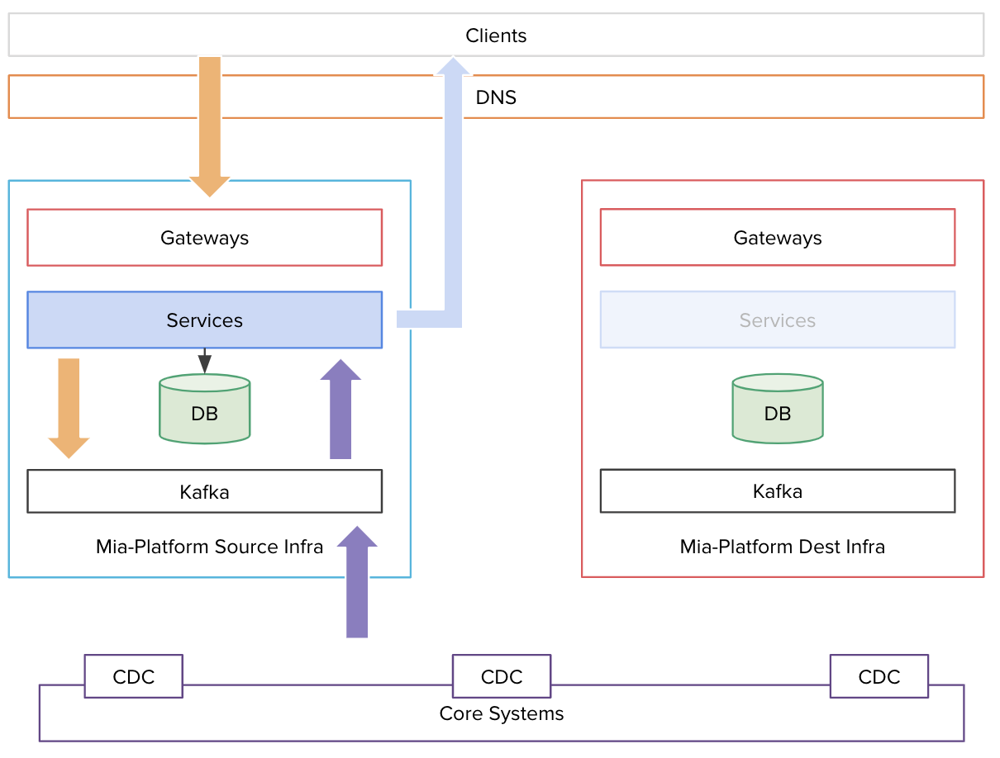
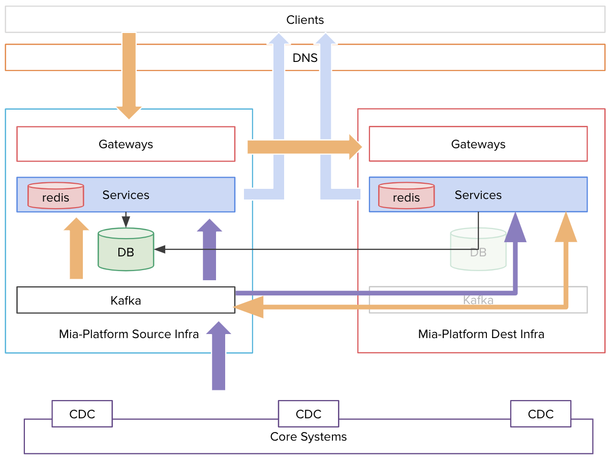
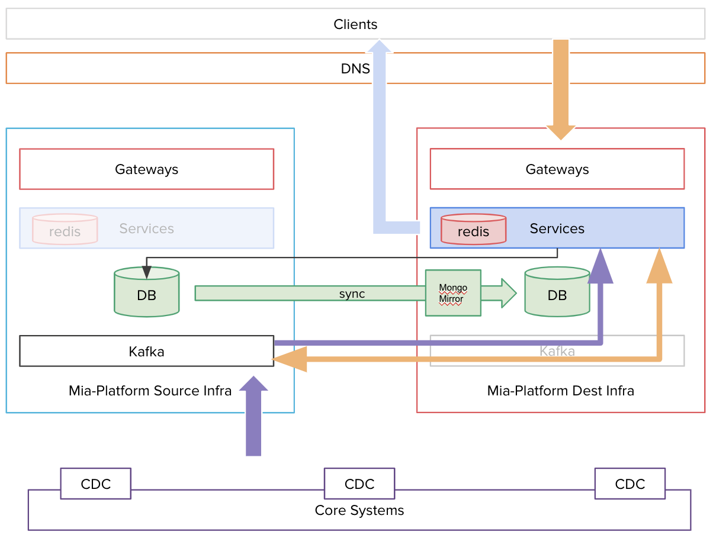

# Mia-Platform Fast Data migration

A Fast Data system is typically composed of three different resources:
* A Kubernetes Cluster in which all the services are running
* A MongoDB Cluster in which data are stored
* Kafka Cluster used for data streaming and communication

During a migration from PaaS to OnPremise or, generically speaking, from one infrastructure to another using the same components, each resource is migrated by itself. You can decide to execute the three different migrations following the order that fits better to your system.

:::caution
This is a very crucial operation. We strongly suggest to simulate the migration in advance to find out the best order of your use case. If you're in doubt, don't hesitate to make contact with us!
:::

The execution order of these steps can vary depending on the context. Your network configuration has a major impact on this.
It is crucial to pay attention to each step, doing them one by one and leaving a reasonable time between each other, in order to be able to check if everything is working.
Of course, it would be useful and ideal to test every step in a test environment before trying them in a production one.

Please note that the second and third steps can't be rollbacked: in our context, that would be a mess.

*An architectural example*

## Requirements

Before the start of the migration, you should make sure that the following requirements are satisfied:

* Destination infrastructure must be ready and tested in all its parts (k8s cluster, MongoDB, Kafka, CI/CD tools, Mia-Platform Console).
* Users which have to migrate must own all the required permissions (admin is preferred) to access all the involved infrastructure components.
* Network setup must be carefully documented, also with infrastructural graphic designs.
* For each step of the migration, a detailed plan must be documented and shared across all the stakeholders.
* The CI/CD system (git repository, pipelines, docker image registry, etc.) must be able to deploy on both infrastructures.

Detailed requirements for each step are listed below.

## Services/apps and clients migration

Ahead of the execution of this step, we suggest checking the following points:

* Are all your services designed to be replica-safe? If so, you can have them replicated in both infrastructures for some time without worrying about interferences. All the Fast Data services are replica-safe.
* Is the destination k8s cluster able to deploy services (e.g. pulling docker images from registry)?
* Is the source infrastructure able to reach the destination infrastructure over some network?
* Is the destination infrastructure able to reach the source MongoDB and Kafka over some network?

To migrate your services, you should follow these steps:
1. Deploy the services in the destination k8s infrastructure, pointing to the source MongoDB and Kafka.
2. Redirect all the traffic from the source infrastructure to the destination one.
3. Switch off the services in the source k8s infrastructure.
4. Switch your DNS to redirect the traffic to the destination k8s infrastructure.

You can do every single step indicated above when you prefer (e.g. the DNS switch could be postponed by days or months if needed).

### Switch your DNS

*A snapshot of step 2 moment*

## MongoDB migration

:::caution
Before approaching the database migration, make sure to have an available VM to install [MongoMirror](https://www.mongodb.com/docs/atlas/import/mongomirror/) on it.
The VM must be placed in a "network position" where it can reach both the old database and the new one.
:::

To migrate MongoDB in a Fast Data environment you should achieve the following:

1. Replicate all the data from the source database to the destination one, keeping them in sync while still writing to the source database
2. Stop all the services from writing to the source database
3. Start writing on the destination database

Warning: the last two steps are going to cause a brief downtime in the MongoDB writing, but we might be able to give read access without any downtime. We'll explain in the following paragraphs how to achieve that.

### Replicate the data and keep source and destination in sync

Set up and start MongoMirror to replicate data from the source database to the destination one. Please pay attention to the oplog size / oplog window time: depending on the size of your data, the first replication can require some time, so you'll need the appropriate oplog size in the source database to complete it correctly.

### Stop the services from writing to the source database

When MongoMirror lag is 0, switch the MONGODB_URL to the destination URL for all the "reading" services (such as CRUD) and then teardown the writing services (e.g. SVC and RTU).

### Start writing on the destination database

When we're sure no service is writing on the source database, turn the MongoMirror replication off and then deploy the writing services with the MONGODB_URL pointing to the destination Mongo.

The last two steps will cause a little downtime in the writing operations.

It is possible to set up and run multiple MongoMirror instances at once. This way, you will partition the data to transfer and would be able to achieve an incremental services migration instead of an "all-in" one.

Please refer to [MongoMirror documentation](https://www.mongodb.com/docs/atlas/import/mongomirror/) for a detailed guide about its usage.

*In this example MongoMirror is installed closer to the destination Database*

## Kafka migration

First of all, we must decide how to perform the migration. In this case, we suggest to **not** use any Kafka migration tool, since it might make the process even more complex than it already is. This procedure will work for most of the use cases, but we suggest to carefully analyze the shortcomings of this solution to understand if they're acceptable for you. If you're in doubt, don't hesitate to make contact with us for advice!

:::caution
While we had taken in consideration some replication tools, we realized that such migration could be achieved even without any of them.
As we explain through the paragraph, this comes with some compromises, but we think they're usually acceptable in most of the cases.
However, this might not always be the case, so please pay attention to what you're doing at this stage.
:::

As stated earlier, this solution comes with some shortcomings, such as the following:
- all of the external producers (i.e. the producers out of the Mia Platform Fast Data scope) must be identified and enumerated upfront. This includes CDCs, CRMs, ETL software, etc.
- all the message history in the old cluster's topics will not be present in the new Kafka cluster history, which means it should be carefully kept until its natural expiration in order to not lose any historical data

If such shortcomings are acceptable for you, please keep reading.

The idea is to stop or switch, where possible, all the external systems that cause the generation of a Kafka message.
As an example, if a client is calling an HTTP endpoint and the service handling the call produces a Kafka message, the client is considered an external producer.
For this example we assume to have HTTP clients and Change Data Capture as external systems that cause new messages in Kafka.

To migrate Kafka, you should follow these steps:

1. Switch all of the external producers, like CDCs, to the new Kafka instance.
2. Switch off all services connected to Kafka.
3. Re-deploy all services connecting to the new Kafka.

###  Switch all of the external producers to the new Kafka instance

If some external services produce messages in Kafka, you should redirect them to the new Kafka instance. This includes the CDCs connected to your Systems of Record. At this point, you shouldn't see any new message coming from external sources (e.g. ingestion topics) but only - eventually - internal traffic between your microservices. 
Topics from the destination Kafka instance should start to accumulate lag.

### Switch off all services connected to Kafka

Before starting this, you should wait for each topic in the source Kafka instance to reach 0 lag. At this point, you can switch off all your services connected to the source Kafka, setting their replicas number to 0. Notice that this will cause downtime. After this step, you should see no consumers attached to the source topics.

### Re-deploy all services connecting to the new Kafka

Re-deploy all your services pointing at the destination Kafka instance. At this point, you should see the services starting to consume messages from the destination Kafka instance, and lag decreasing.

:::caution
Please notice that the procedure described above will force all the consumers to start reading topics from offset 0. This could cause issues on services making assumptions on offsets.
:::

