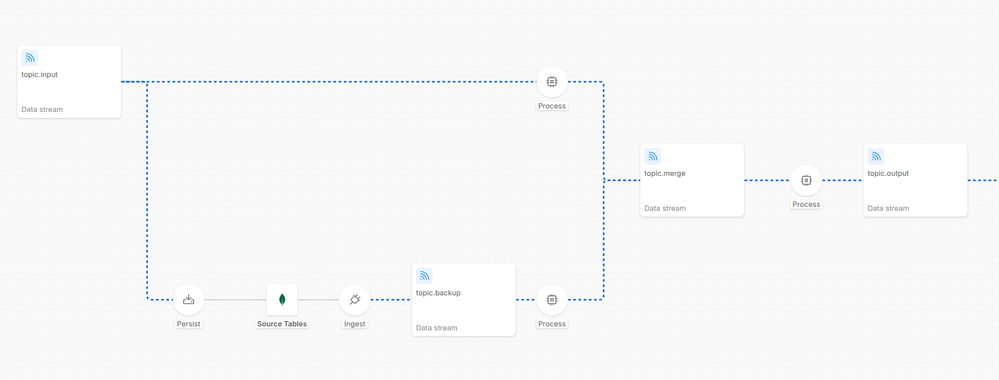

While you are evolving your Fast Data pipelines, you may need to perform a re-ingestion of all messages previously ingested into the system.
For example, you need to update a filter logic to refine data subsets, restructure how aggregations are organized, optimize storage by pruning obsolete records, fix transformation bugs, or generally evolve your Single View schema.

Especially in production environment, during Initial Load / Full Refresh processes it is extremely important not to lose the **Near Real-Time (NRT)operational continuity** from what is changing on the data sources ingested by your Fast Data Pipeline.

## Full Refresh architectural pattern

**To guarantee the business continuity** despite the need for a full events re-ingestion, you can see an example of **Full Refresh Architecture** (from a screenshot of the **Control Plane UI**).

As shown in the diagram, the messages from the _topic.input_ are consumed by two different flows:

- **NRT (Near-Real-Time) Layer**: the flow in the upper half of the pipeline shows a [Stream Processor service](/products/fast_data_v2/stream_processor/10_Overview.md), which is responsible to simply forward the message to the next stage of the pipeline and to ensure business continuity
- **Backup Layer**: the flow in the lower half of the pipeline shows several processes responsible to perform a backup of the messages in a backup store: in the example, the messages inside _topic.input_ are consumed by the [Kango service](/products/fast_data_v2/kango/10_Overview.md) to compact and generate MongoDB documents. These documents are then stored in a **MongoDB collection**, which can be used **as backup**. Then a [Mongezium service](/products/fast_data_v2/mongezium_cdc/10_Overview.md) is configured to read these MongoDB document changes and consequently generate the Kafka messages published to the _topic.backup_ topic, which can be read by a _Stream Processor_ that can stay **paused and activated only when you need to reingest messages** into the pipeline.

These operations can be easily executed leveraging **Fast Data Control Plane UI** to govern and orchestrate every stage of **Initial Load** or **Full Refresh** operations with precision and zero friction.

:::note
Thanks to the backup layer and full refresh architectural pattern, it is possible to eliminate some critical operational constraints: instead of requesting full refreshes from external data sources or relying on infinite topic retention, you maintain a controlled backup flow that you can internally manage within your pipeline architecture, minimizing time-loss and exposure to external systems and organizational overhead.
:::

To configure this **routing pattern** that enables the two different flows representing the regular processing of the messages (upper flow) and the backup management (lower flow), the _Stream Processor_ services of both the two layers must be configured with the **Custom Partitioner** settings, in order to make possible to produce messages on a segregated subset of the partitions of the _topic.merge_ topic. For more info about the custom partitioner settings, visit the dedicated [page](/products/fast_data_v2/stream_processor/20_Configuration.mdx).
By dedicating a set of topic partitions to the backup flow and the remaining ones to the regular flow, you reach a clearer separation of the two layers and can better regulate the speed of the reingestion of the backup messages with the speed of the ingestion in the regular flow.

In the last Process step in the above shown picture, a _Stream Processor_ can include a dedicated logic to further guard the system from introducing messages that we might want not to be included anymore (e.g. messages from the backup flow that are now older because the regular flow - still processing - has already produced newer messages of a specific identifier in the output stream - this guard can be implemented for example by checking the timestamp of the createAt / updatedAt fields of the event coming from the source database with a internal cache for the needed service logics).

Some final considerations:

- you can choose whether the backup store should include the messages already refined through a transformation logic layer, to have them as a ready-to-use backup faster to reingest into the pipeline, or instead to include the raw messages, to have a more complete backup that can be reingested even with different transformation logics
- you can decide to have a faster **backup store using a Kafka topic with infinite retention** without the MongoDB persistency layer, to have a faster reingestion of the messages and have Kafka itself to deal with retention and compaction because maybe you might not need an efficient and durable storage

## Controlled Initialization

When performing an _Initial Load_ process, you can even use the same architecture shown in the previous diagram.
During pipeline initialization, every Fast Data workload can be configured with a default **paused** runtime state. This is managed via the **`onCreate`** parameter within each microservice's **ConfigMap**. By initializing flows in a paused state, you ensure that no workload begins consuming data immediately after deployment, allowing for manual orchestration.
Then, start resuming the first execution steps: the NRT layer will start consuming messages from the input topic; the backup one will start too, butt remind keeping in a paused state its final process (not useful during a pipeline initialization).

## Iterative Pipeline Activation

Whenever it is necessary to start the _Full Refresh_ process or an _Initial Load_, you can simply resume the consumption from the UI, allowing the messages in the backup topic to be reingested into the pipeline in a controlled way.
Typically, this first step involves executing transformation logic to ensure incoming data is compliant with Fast Data formats (e.g., casting, mapping, and data quality enhancements).
Once processed, these messages are produced into the output streams, ready for the subsequent stages of the pipeline.

You can monitor the flow of the pipeline from the UI, and quickly identify bottlenecks or issues, or perform quick operations to fix them (e.g. pausing the regular flow, to allow the backup flow to process the messages and catch up with the regular flow, before resuming it again).

## Ingestion and Lag Monitoring

Whether it is during the regular flow of the pipeline, or an _Initial Load_ or a _Full Refresh_ operation, you have full visibility of the state of the pipeline and full control of it.

Once the environment is ready, you can regulate message loading into the ingestion layer of your pipeline, pausing and resuming consumptions of topic messages in services. As the queues fill, the Control Plane provides real-time visibility into **Consumer Lag** across every pipeline edge, allowing you to monitor the volume of data awaiting processing.

## Advanced Aggregation Management

When dealing with **Aggregate execution steps**, the **Aggregation Graph Canvas** provides a centralized strategic view. This interface is specifically designed to manage complex scenarios where multiple data streams must be merged.

**Best Practice: The Leaf-to-Head Strategy**
For efficient ingestion, it is recommended to resume consumption following a "bottom-up" approach:

1. **Start from the Leaves**: Resume consumption at the leaf nodes of the aggregation graph.
2. **Monitor Lag**: Observe the incremental decrease in consumer lag.
3. **Progression**: Once the lag approaches zero, move to the next level of the graph.
4. **Activate the Head Node**: Finally, resume the head node of the aggregation.

:::note
By keeping the head node in a **Paused** state while the leaves process data, you prevent the production of premature events in the output stream. Once the head is resumed, it will produce the final aggregated output, significantly reducing redundant processing load on downstream stages.
:::

By combining real-time **Consumer Lag monitoring** with granular **runtime state control**, the Control Plane transforms complex Initial Load and Full Refresh operations into a manageable, transparent, and highly efficient process.
