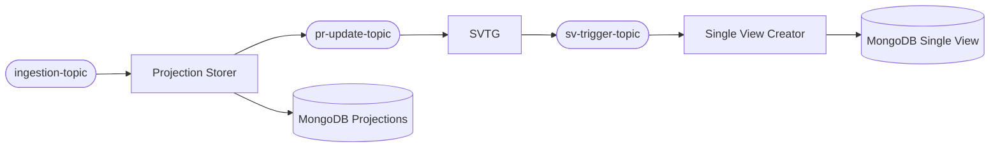
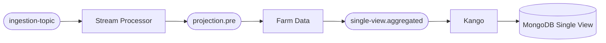

This section provides a comprehensive guide for teams migrating existing Fast Data v1 pipelines to the Fast Data v2 architecture.

:::info Scope
This guide covers the **service and configuration migration** — replacing v1 workloads (Real-Time Updater, Projection Storer, Single View Trigger Generator, Single View Creator) with the v2 ones (Stream Processor, Kango, Farm Data).
:::

## Why Migrate

Fast Data v1 was designed around MongoDB as the central coordination layer. Projection Changes written to MongoDB triggered downstream aggregation, which introduced latency and operational complexity at scale.

Fast Data v2 is **stream-first**: every stage of the pipeline communicates exclusively through Kafka topics. This eliminates the MongoDB coordination bottleneck and enables:

- **Up to 10× throughput improvement** in aggregation operations
- **Reduced infrastructure costs**: fewer Kafka topics, no Projection Changes topics
- **Simpler operations**: stateless Stream Processors, declarative aggregation graphs, no manual advanced custom strategies
- **Better observability**: every processing stage is independently monitorable through the Control Plane v2 UI

## Pipeline at a Glance

The diagrams below show how a typical Single View pipeline changes from v1 to v2 (simplified to one Projection and one Single View for clarity).

**Fast Data v1**

**Fast Data v2**

Key differences visible in the diagram:
- The `pr-update-topic`, `sv-trigger-topic`, and intermediate MongoDB Projections collection are **eliminated**
- **Farm Data** absorbs both the SVTG trigger logic and the SVC aggregation logic, coordinating purely via Kafka state
- **Kango** replaces the direct MongoDB writes that were embedded in SVC

## What Changes, What Stays the Same

### Unchanged

The following elements require **no modification** during migration:

| Element | Notes |
|---|---|
| CDC ingestion topics | Stream Processors consume the same topics as v1 RTU/PS |
| Persisted assets | If v1 Projections are still useful - for business purposes - it is possible to maintain them with same schemas |

### Replaced

How v2 workloads replace v1 services phylosophy and capabilities:

| v1 Service | v2 Replacement |
|---|---|
| Real-Time Updater (RTU) | Stream Processor + Kango |
| Projection Storer (PS) | Stream Processor + Kango |
| Single View Trigger Generator (SVTG) | Integrated into Farm Data |
| Single View Creator (SVC) | Farm Data + Kango (+ optional post-aggregation Stream Processor) |
| Control Plane Operator (gRPC-based) | Control Plane v2 (Piper — REST/MongoDB-based) |

### Eliminated (no replacement needed)

Which aspects and v1 components are no more useful and deletable in v2:

| v1 Component | Reason |
|---|---|
| Projection Changes topics | Farm Data uses stream state internally; no external coordination topic needed |
| `projectionChangesSchema.json` | Farm Data graph replaces this concept |
| `kafkaProjectionUpdates.json` | No longer needed |
| `erSchema.json` ConfigMap | Converted into Farm Data aggregation graph |
| `aggregation.json` ConfigMap | Logic moved into a post-aggregation Stream Processor (if field mapping is required) |

## How This Section is Organized

1. **[Component Mapping](/products/fast_data_v2/migration/component_mapping)** — detailed correspondence between every v1 artifact (service, ConfigMap, env var, topic) and its v2 equivalent, with conversion rules for ER Schemas, Cast Functions, and aggregation logic

2. **[Migration Steps](/products/fast_data_v2/migration/migration_steps)** — a generic step-by-step procedure applicable to any Fast Data v1 project, with configuration templates for each v2 workload

3. **[Worked Example](/products/fast_data_v2/migration/worked_example)** — a complete end-to-end migration walkthrough using a realistic Food Delivery project (3 Systems of Record, 10 Projections, 1 Single View)

## Recommended Learning Path Before Migrating

Before starting the migration, ensure you are familiar with:

1. **[Fast Data v2 Concepts](/products/fast_data_v2/concepts.mdx)** — especially the Fast Data Message Format, which all v2 workloads exchange
2. **[Stream Processor](/products/fast_data_v2/stream_processor/overview)** — the replacement for RTU/PS ingestion and cast function logic
3. **[Farm Data](/products/fast_data_v2/farm_data/overview)** — the replacement for SVTG + SVC aggregation
4. **[Kango](/products/fast_data_v2/kango/overview)** — the Kafka-to-MongoDB persistence layer that replaces direct writes
5. **[Architecture](/products/fast_data_v2/architecture.md)** — the standard pipeline patterns in Fast Data v2
