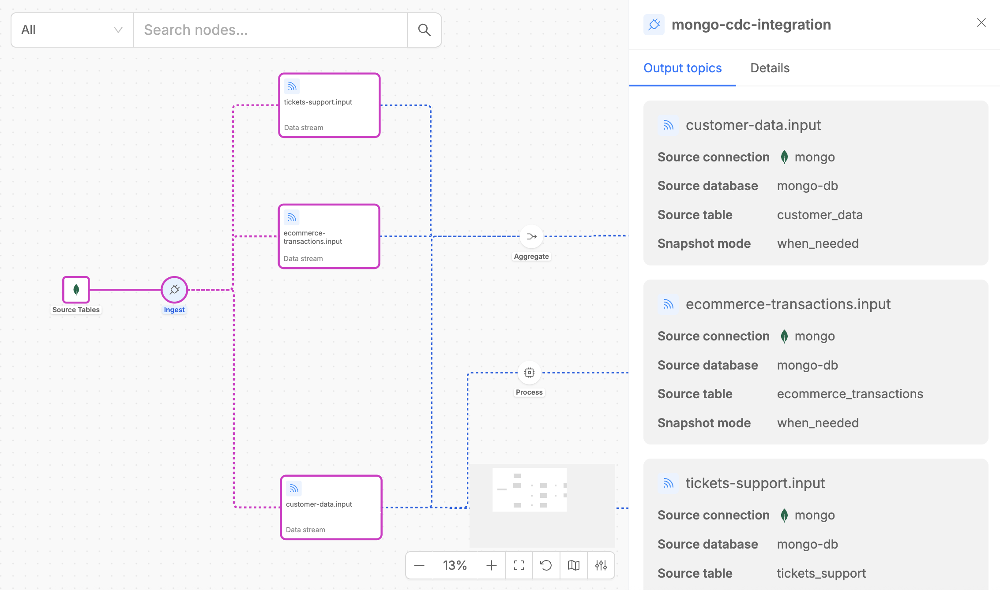
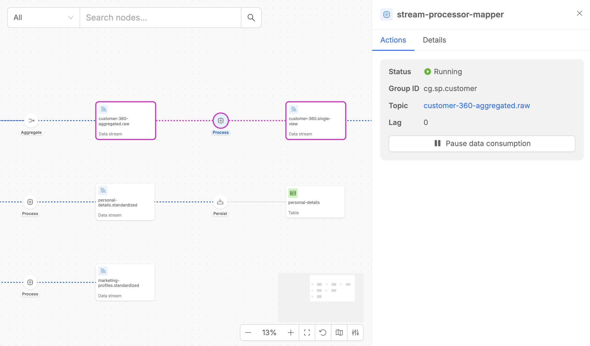
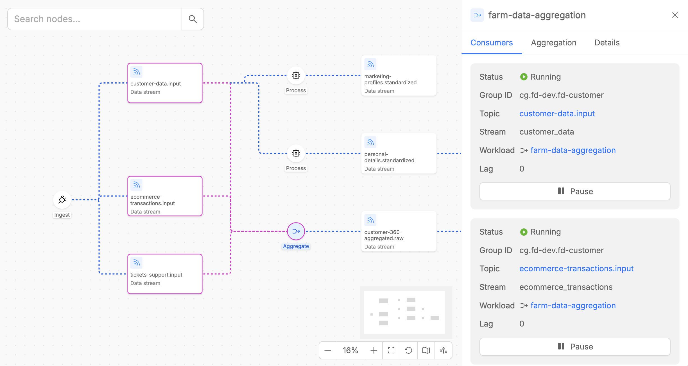
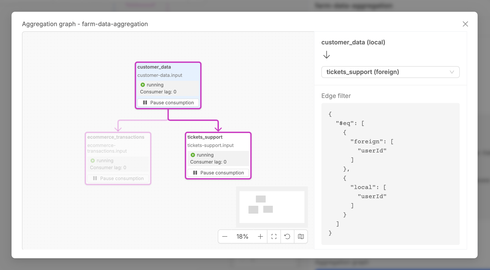
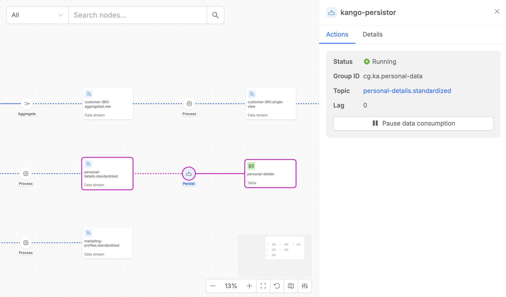
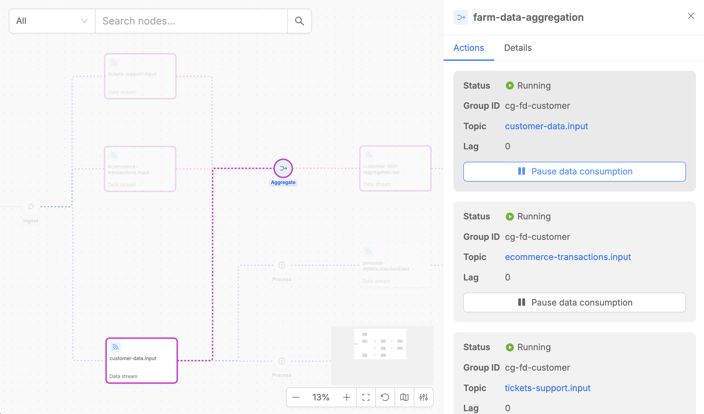

The Fast Data Control Plane UI provides a comprehensive visual interface for managing and monitoring your Fast Data v2 pipelines.  
This web-based interface allows you to visualize the entire data pipeline architecture, monitor real-time performance, and control runtime states of your Fast Data Engine workloads with just a few clicks.

Fast Data Control Plane shows various artifacts that represent different aspects of the overall architecture of Fast Data pipelines.

## Data Streams

Data Streams represent the channels through which data flows between different execution steps in your pipeline. In the Fast Data v2 architecture, these are Kafka topics that typically carry [Fast Data compliant messages](/products/fast_data_v2/concepts.mdx#fast-data-message-format) between workloads.

Each Data Stream lists its associated consumers, detailing essential metadata such as consumer names, runtime states, and the consumer groups that define each Fast Data workload.

## Execution Steps

Execution Steps are the core processing components of your Fast Data pipeline, implemented by the four specialized workloads of the Fast Data Engine v2. Each step appears as a circular node in the pipeline diagram and represents a specific data processing operation.

### Ingest

The **Ingest** step is implemented by [Mongezium](/products/fast_data_v2/mongezium_cdc/10_Overview.md), that acts as Change Data Capture (CDC) from MongoDB collections to Kafka streams.  

:::note
If input data streams originate from a custom CDC plugin or a CDC deployed in a different Kubernetes namespace, the Ingest execution step will not be rendered in Control Plane canvas. Consequently, visibility is limited to input streams consumed by Fast Data workloads within the current namespace.
:::

The Ingest step monitors MongoDB change streams in real-time and converts database operations (insert, update, delete) into Fast Data compliant messages that flow to downstream processing steps.

When you click on an Ingest step, the detail panel shows two tabs:

- **Output Topics**: Lists all Kafka topics where change events are published. Each topic corresponds to a MongoDB collection being monitored for changes.
- **Details**: Provides useful metadata like the type of the execution step, the version of the microservice that implements the steps and the number of replicas.

### Process

The **Process** step is implemented by [Stream Processor](/products/fast_data_v2/stream_processor/10_Overview.md), that provides powerful data transformation capabilities.

The Process step detail panel contains three tabs:

- **Consumers**: Shows the input stream that the Stream Processor is consuming from, including consumer group information and current lag metrics.
- **Function**: Displays the custom JavaScript transformation logic being executed on the data stream. This tab shows the actual processing code that filters, transforms, maps, or validates incoming messages.
- **Details**: Provides essential metadata, including the execution step type, the microservice version, and the number of replicas, alongside configuration details such as caching settings and other key parameters.

### Aggregate

The **Aggregate** step is implemented by [Farm Data](/products/fast_data_v2/farm_data/10_Overview.md) and performs real-time multi-stream data aggregation useful to create data products.

The Aggregate step offers three tabs in its detail panel:

- **Consumers**: Lists all input data streams being consumed for aggregation, along with consumer lag and runtime state for each stream.
- **Aggregation**: Provides access to the aggregation graph canvas (see detailed explanation in the next paragraph).
- **Details**: Provides essential metadata, including the execution step type, the microservice version, and the number of replicas, alongside configuration details such as caching settings, internal updates topic settings and other key parameters.

#### Aggregation Graph Canvas

The Aggregation Graph Canvas is a specialized visual interface within the Aggregate step that displays the entity relationship diagram configured for your aggregation logic. This canvas shows how different data streams are structurally combined to produce the final aggregated output.

The Aggregation Graph Canvas offers a comprehensive visual representation of entity relationships within the aggregation process, clearly illustrating how different data entities are related with each other to build the final aggregated output. This interface provides detailed information about relationship configurations that define how entities are joined and aggregated together.  
The canvas enables interactive exploration of the entire aggregation logic, allowing you to select any two data streams in the graph to examine the specific relationship configuration that governs their interaction, including join conditions and aggregation rules.

Moreover, from the Aggregation Graph Canvas, it is possible to control the runtime state for data consumption from the rendered data streams. For more information on how to control flows, proceed to the following paragraphs.

### Persist

The **Persist** step is implemented by [Kango](/products/fast_data_v2/kango/10_Overview.md) and handles the final storage of processed data from Kafka streams to MongoDB collections (Persisted Assets).

The Persist step detail panel includes two tabs:

- **Consumers**: Shows the input stream that Kango is consuming for persistence, including consumer group details and consumer lag metrics.
- **Details**: Provides useful metadata like the type of the execution step, the version of the microservice that implements the steps, the number of replicas and other information including connection name and the target MongoDB collection.

## Runtime States

Each execution step in your pipeline can be in one of four distinct runtime states, visually indicated by different colors and indicators in the Control Plane UI.

### Running

The **Running** state indicates that the workload's consumer is actively consuming data from the input stream.  

Running steps are indicated by blue dotted line in the UI.

### Paused

The **Paused** state means that the workload's consumer has stopped consuming data from its input streams. This is typically a user-initiated action for maintenance, testing, or controlled processing scenarios.

In Paused state, the workload remains healthy and responsive, no new messages are being consumed from input streams; thus, in case of new input messages, the displayed consumer lag will consequently increase.

Paused steps are indicated by grey line in the UI.

### Unsubscribed

The **Unsubscribed** state indicates that the workload's consumer is not subscribed to its input streams and therefore cannot consume any data.

This commonly occurs when the consumer group has been unsubscribed from that topic, or when the workload has no replicas running (scaled down completely).

In this state, the consumer cannot process any data and it is no more possible to interact with Play/Pause button and to know about consumer lag info.

Unsubscribed steps are typically indicated by orange line in the UI.

### Unknown

The **Unknown** state indicates that the Control Plane cannot determine the current state of the workload. This typically happens when the service is not reachable or responsive, the workload has crashed or encountered fatal errors, network issues prevent state communication, the service is in an invalid or corrupted state.

Unknown states require investigation and usually indicate operational issues that need immediate attention.

Unknown steps are indicated by red line in the UI.

## Control Runtime States

The Control Plane UI provides powerful controls for managing the runtime state of your Fast Data pipeline steps, enabling sophisticated operational strategies for data processing.

Each data flows inside the pipeline provides **Pause** and **Play** buttons that allow you to stop and start data consumption from the data stream.

- **Pause**: Stops the consumer from processing new messages while maintaining stream position
- **Resume**: Restarts data consumption from the previously maintained position

Pause and Play buttons are available whenever you click on a pipeline step that supports runtime state control for specific data flows.  
Additionally, for the Aggregate execution step, these same controls are also available directly within the Aggregation Graph Canvas, providing enhanced utility for managing Initial Load and Full Refresh scenarios, allowing for more efficient and optimized runtime control in these and other operational scenarios.

For more detailed operational strategies and best practices on using these runtime controls effectively, visit the [Best Practices documentation](/products/fast_data_v2/runtime_management/best_practices.md).

## Navigating UI

The Control Plane UI provides several features to help you efficiently navigate and interact with your pipeline visualization.

### Search elements on the canvas

The search feature enables you to quickly locate specific elements within your pipeline.

Simply type on the searchbar the name of an artifact or Fast Data workload and select it. The interface will instantly focus on and highlight the selected element, automatically opening the contextual drawer to display all relevant information about it.

### Highlight on Hover

Typically, when you hover over elements listed in the detail panels or drawers, the corresponding involved pipeline elements are instantly highlighted inside the canvas.

This highlighting feature significantly improves navigation efficiency, especially in complex pipelines with many interconnected components.
