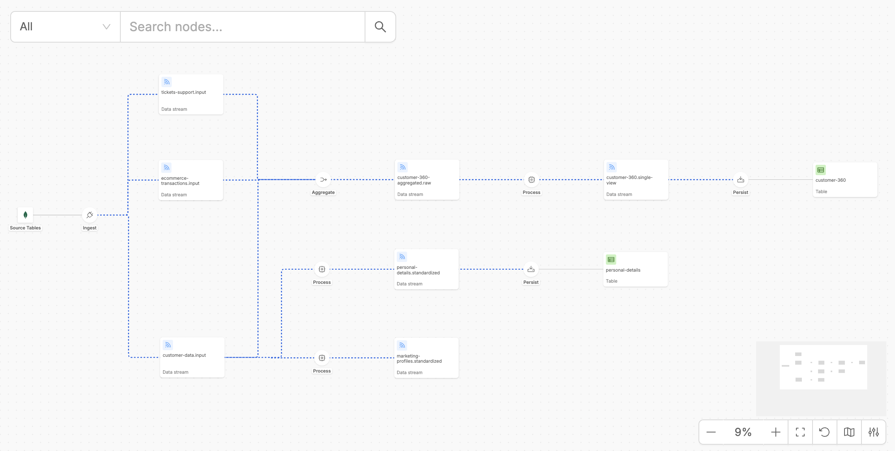
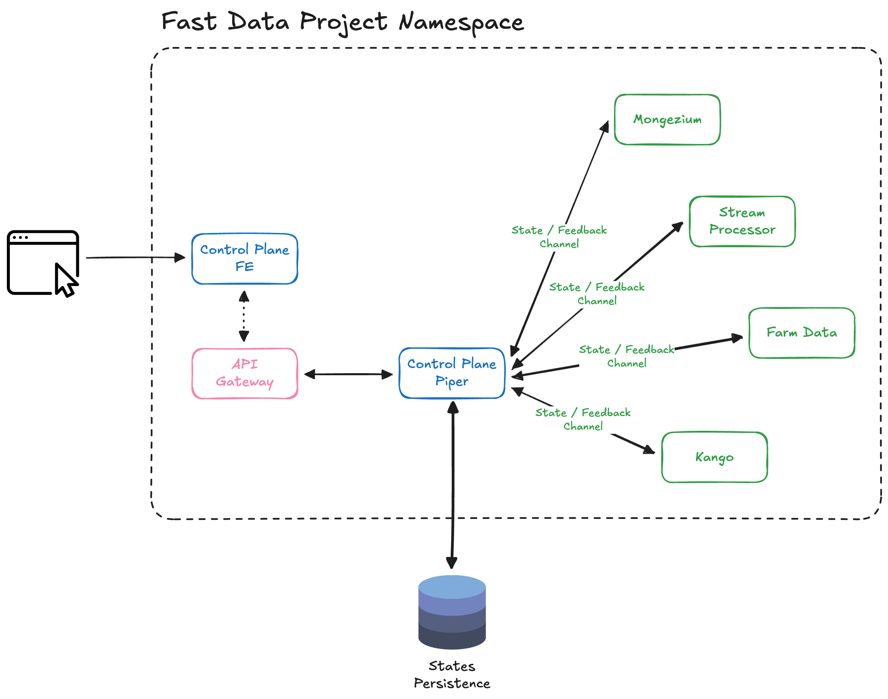

# Runtime Management

## Fast Data Control Plane

Mia-Platform Fast Data includes a Runtime Management solution, the **Fast Data Control Plane**.  

It provides an overall **visualization** of the Fast Data pipelines released on a specific namespace, and offers functionalities to **pause and resume the consumption of data streams** along Fast Data pipelines with just a few clicks.

Fast Data Control Plane enables strategic management of the runtime environment in various scenarios:

- **Visualize Fast Data Pipelines while building them**:
  - During the Fast Data pipeline development phase, users can seamlessly configure and deploy new pipeline steps while the Control Plane UI provides a step-by-step visual representation of the architecture.
  - Development is streamlined through incremental rendering on the frontend with continuous deployment, offering immediate visual feedback as the pipeline is built.

- **Strategic resource allocation and performance optimization**: 
  - Dynamically allocate resources by pausing and resuming microservices involved in messages consumption based on workload and resource availability.
  - Efficiently utilize computing resources and prioritize critical processes during peak demand.
  
- **Initial Load and Full Refresh processes management**: 
  - Govern and control each step of the Initial Load (or Full Refresh) from the Control Plane UI without any frictions.
  - Monitor consumer lag and workload health during these processes to ensure smooth execution.

- **Performance Testing and Simulation**: 
  - Simulate different scenarios for performance testing by pausing and resuming messages consumption along pipeline.
  - Observe system behavior under various conditions to identify bottlenecks and optimize resource allocation.

- **Enhanced System Reliability**: 
  - Gracefully handle unexpected situations or system maintenance by pausing specific data pipeline steps.
  - Resume operations post-maintenance to minimize downtime and enhance overall system reliability.

## Architecture

The Fast Data Control Plane architecture is designed to provide comprehensive monitoring and control capabilities for Fast Data pipelines deployed within a Kubernetes namespace.

The Control Plane consists of two main services that must be deployed in the same namespace as the Fast Data Engine workloads:

- **Control Plane Frontend**: Provides the user interface for visualizing and managing Fast Data pipelines. Users interact with this web-based interface to monitor pipeline status, pause/resume operations, and access real-time feedback about the system state.

- **Control Plane**: Acts as the orchestration engine that communicates with the Fast Data Engine workloads. It manages state transitions, coordinates pause/resume operations across pipeline components, and ensures consistent pipeline governance.

All components communicate through dedicated **State/Feedback channels** that enable:
- Real-time status monitoring and health checks
- Coordinated pause/resume operations across pipeline steps
- Bidirectional communication for control commands and status updates

The **API Gateway** provides secure access to the Control Plane services, while **States Persistence** MongoDB collection ensures that pipeline states and configurations are maintained consistently across system restarts and deployments.

## Useful Resources

Here are some useful links to start adopting Runtime Management features into your Fast Data v2 solution:

- visit the [Control Plane UI documentation](/products/fast_data_v2/runtime_management/control_plane_ui.md) to learn how to interact with the Control Plane frontend interface and manage your Fast Data pipelines;
- visit the [Application Configuration documentation](/products/fast_data_v2/runtime_management/application_configuration.md) to understand how to configure the Control Plane application and to enable the communication with the Fast Data Engine workloads;
- visit the [Compatibility Matrix](/products/fast_data_v2/runtime_management/compatibility_matrix.md) to check whether your infrastructure and Fast Data v2 services are compatible with the Runtime Management features;
- visit the [Best Practices documentation](/products/fast_data_v2/runtime_management/best_practices.md) for recommendations on initial load strategies, monitoring approaches, and optimization techniques.
