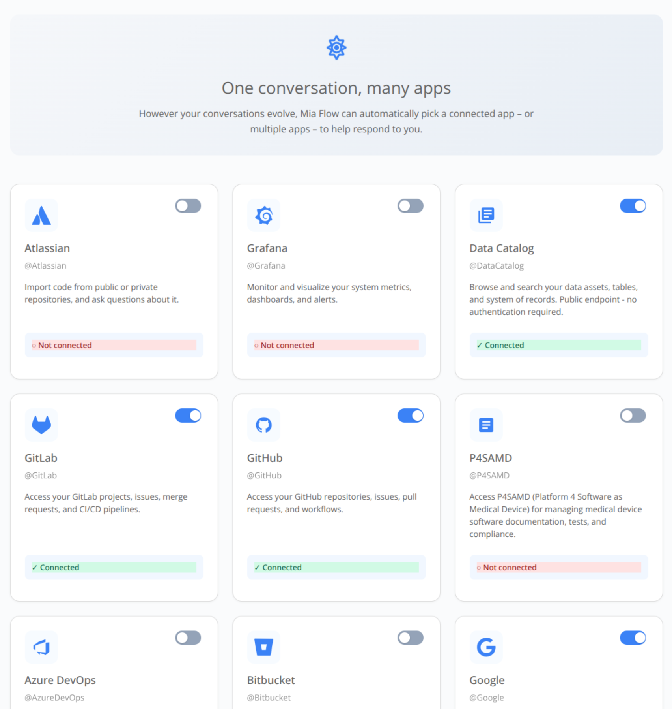

:::caution Beta

Flow is in **beta**. We are actively shaping the product, so things may change as we iterate. Your feedback is welcome.

:::

# Connected tools

Flow's AI assistant becomes useful in real projects only when it can read from and act on the systems your team already uses.
This page describes the connectors that ship with Flow, how authentication works inside the application, and how to add custom MCP servers.

## What is exposed

Flow provides a set of built-in integrations with third party tools and make them available to the assistant, including:

| Category           | Provider                                | Typical actions                                          |
| ------------------ | --------------------------------------- | -------------------------------------------------------- |
| Source control     | GitHub, GitLab, Bitbucket, Azure DevOps | Repositories, branches, pull/merge requests, code search |
| Project management | Atlassian (Jira / Confluence)           | Issues, sprints, wiki pages                              |
| Monitoring         | Grafana                                 | Dashboards, alerts, metrics                              |
| Cloud storage      | Google Drive (read-only)                | List, search, fetch file content                         |
| Platform           | Mia-Platform Console & Data Catalog     | Projects, services, lineage, catalog items               |

In addition to the built-in connectors, you can register any number of **custom MCP servers** from the Connectors page.
Flow loads them automatically and treats them like any other tools.

## The Connectors page

The **Connectors** page is the single hub for authenticating to all external providers. Each provider shows its current state with connect/disconnect actions.

Custom MCP servers support four authentication modes: `oauth`, `api_key`, `bearer`, and `none`. Once a server is added or removed, Flow refreshes the assistant's tool set on the next message you send.

## How authentication works

When you click **Connect** next to a provider, Flow drives the authentication flow with that provider. Once it completes, the corresponding tools become available to the assistant in every conversation. You can disconnect a provider at any time, and the related tools immediately stop being offered to the assistant.

Custom MCP servers can be configured inside the [AI Foundry](../../ai-foundry/basic-concepts/70_mcp-server.md) and used directly inside Flow.

## How the assistant picks tools

In a given turn, the assistant has access to the tools exposed by custom MCP servers it is connected to, plus Flow's built-in tools.

## See also

- [Chat](./20_chat.md): how tool calls surface inside a conversation.
- [Agentic AI](./40_agentic-ai.md): bundling tools and skills via agents and playbooks.
