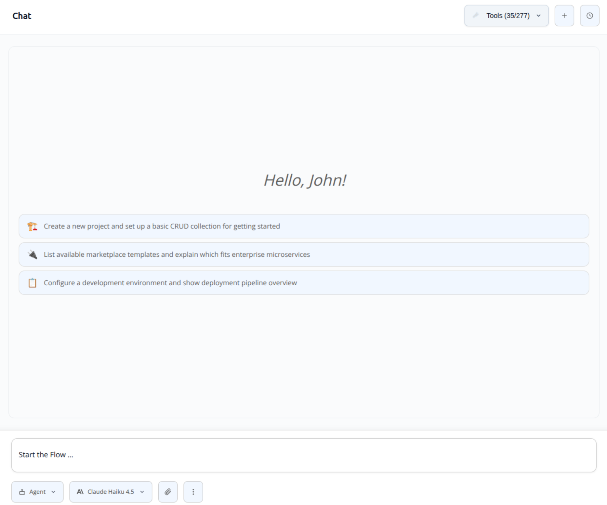

:::caution Beta

Flow is in **beta**. We are actively shaping the product, so things may change as we iterate. Your feedback is welcome.

:::

# Chat

The Chat page is the main entry point of Flow. It is where you describe what you want to build, ask questions about an existing project, and trigger tool calls against the systems you have connected. Each chat is a persistent **conversation** with its own session, memory.



## Anatomy of a conversation

A conversation is made of:

- **A unique session** that ties every message to the same AI context.
- **A name** (manually set or auto-generated) shown in the sidebar.
- **A type**: `Chat` (open-ended assistance), `Code` (tied to a generated project), or `Playbook` (started from a [playbook](./40_agentic-ai.md)).
- **Optional metadata** such as the linked project, tenant, environment, or playbook.

Conversations are stored in Flow. Re-opening a conversation restores the original session, so the assistant keeps full context across browser reloads and across devices.

## Streaming responses

Messages stream in real time. As soon as the model emits text it appears in the chat, and tool calls are shown inline so you can see what the assistant is doing:

```
You: "Find the open pull requests in my repository"
AI:  [calls the GitHub tool]
     There are 6 open pull requests:
     1. …
     2. …
```

Common rendering artifacts (single newlines between paragraphs, duplicated paragraphs, missed paragraph breaks after sentence-ending punctuation) are cleaned up automatically before the text reaches the chat window. Markdown tables, code blocks, and reasoning blocks emitted by heavy-thinking models are formatted appropriately. Internal chain-of-thought is hidden by default.

## File and document attachments

The Chat input and the Home page omnibar accept attachments in three categories. Flow extracts them to text before sending them to the model:

| Category    | Extensions                                                                   |
| ----------- | ---------------------------------------------------------------------------- |
| Images      | `.png`, `.jpg`, `.jpeg`, `.gif`, `.webp`                                     |
| Documents   | `.pdf`, `.docx`, `.xlsx`, `.pptx`                                            |
| Code / text | `.js`, `.ts`, `.py`, `.go`, `.rs`, `.md`, `.json`, `.yaml`, `.sql`, `.sh`, … |

Office documents are converted to readable text automatically, so the assistant can reason over slides, spreadsheets, and PDFs without any preparation on your side. The omnibar also supports drag-and-drop with visual feedback.

## Memories

Every conversation is stored so you can come back to it later. The **Memories** page is a dedicated browser for the conversation log:

- All conversations listed chronologically with relative timestamps.
- Real-time search filtering by name.
- Inline rename (Enter to confirm, Esc to cancel) and delete with confirmation.
- Type badges for **Chat**, **Code**, and **Playbook**.
- Project name displayed on code conversations.
- Clicking a memory reopens the conversation and restores the AI session, so you can pick up exactly where you left off.

## See also

- [Connected tools](./10_connected-tools.md): the tools available to the assistant during a chat turn.
- [Code](./30_code.md): how a chat turns into a live, runnable project.
- [Agentic AI](./40_agentic-ai.md): playbooks and default playbooks for chat vs. code.
