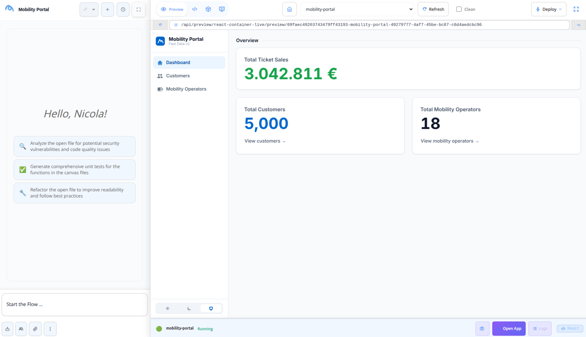
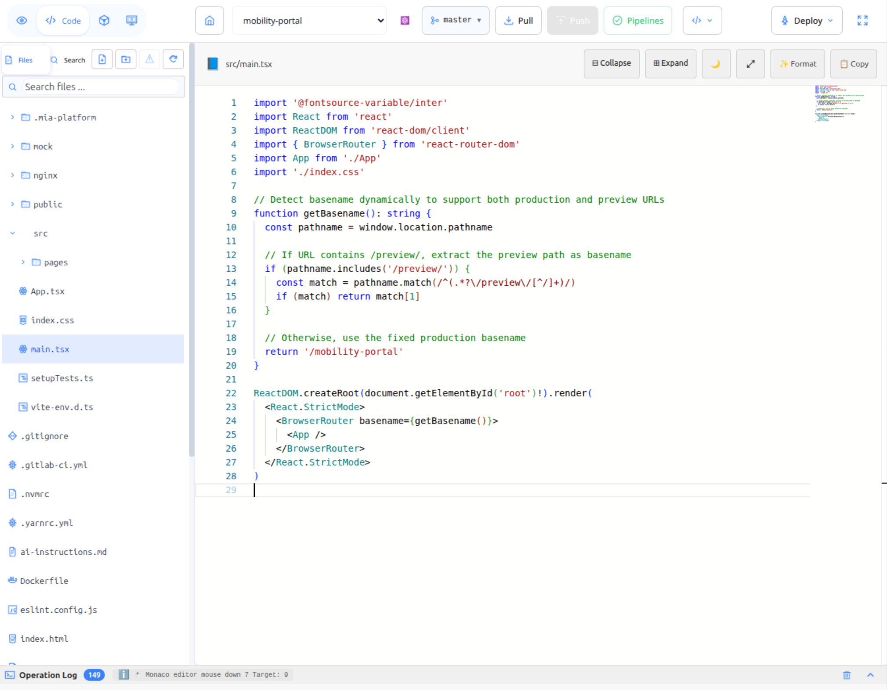
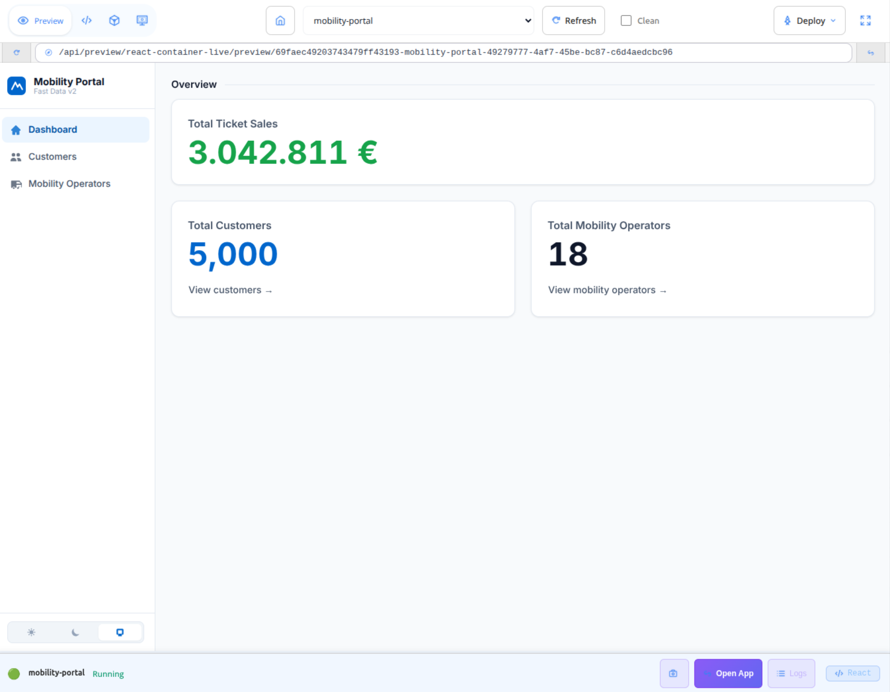

:::caution Beta

Flow is in **beta**. We are actively shaping the product, so things may change as we iterate. Your feedback is welcome.

:::

# Code

When a chat produces code, that code lives in the **Canvas**: the multi-pane workspace on the right side of the application. The Canvas combines a file tree, a code editor, a logs pane, and a live preview of the generated project. This page describes how generated code is organized and what you can do with it.

## The Canvas

The Canvas shows the project's source files alongside an interactive preview. Common actions:

- Open and edit any file directly.
- Add new files, rename, or delete them.
- Restart the preview after a manual change.
- Switch between Editor, Preview, and Logs tabs.

Generated code is owned by a **project** stored in Flow. Multiple conversations can target the same project, and any conversation can be reopened later to continue working on the same files.

## Live preview

Every project gets a live preview that updates as the assistant generates or modifies code:

1. The assistant writes the files into the project.
2. Flow builds the project and starts it.
3. The running application is loaded inside the Canvas, so you can interact with it directly.

You can stop, restart, or refresh the preview from the Canvas at any time. The **Logs** tab streams build output and runtime messages, which is the first place to look if something is not working.

Flow supports a wide range of frontend and backend frameworks. The right runtime is selected automatically based on the project files, so you do not have to configure it.

## Pushing code to Mia-Platform

When the project is ready, the **Deploy** action on the Canvas sends the files to a Mia-Platform project and triggers its CI/CD pipeline. You choose the destination project and environment from the deploy panel.

## Troubleshooting

| Symptom | First thing to check |
|---------|----------------------|
| Blank preview | Open the **Logs** tab: most issues are build or dependency errors. |
| Preview unresponsive | Restart the preview from the Canvas. |
| Session expired | Render the preview again to start a fresh session. |
| Deploy failed | Open the deploy panel to see the error, then check the Mia-Platform project's pipeline for details. |

## See also

- [Chat](/products/flow/basic-concepts/20_chat.md): how a conversation drives the Canvas.
- [Connected tools](/products/flow/basic-concepts/10_connected-tools.md): using MCP tools to seed or modify a project.
- [Agentic AI](/products/flow/basic-concepts/40_agentic-ai.md): picking the right playbook before starting a code session.
