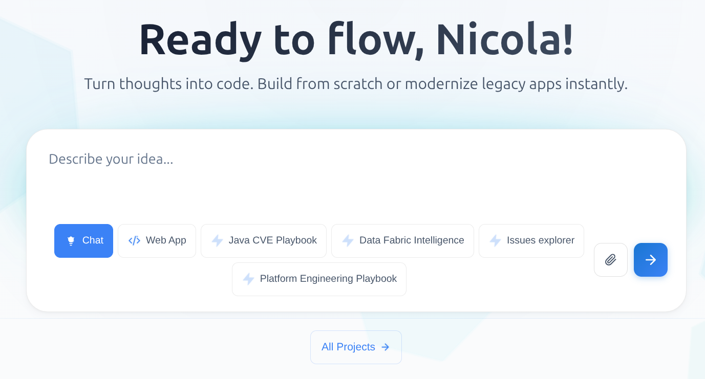

:::caution Beta

Flow is in **beta**. We are actively shaping the product, so things may change as we iterate. Your feedback is welcome.

:::

# Getting started

Flow is a web application: you access it from the browser and start building right away. This page walks you through the first session, from opening the app to deploying your first AI-generated project.

## What you need

- Access to a Flow instance (URL and credentials are provided by your administrator).
- A modern browser.
- (Optional) The credentials of the external systems you want to connect (GitHub, GitLab, Atlassian, Grafana, Google Drive, etc.). You can add them later from the **Connectors** page.

You do not need to install any tool locally: the assistant, the live preview, and the catalog all run inside Flow.

## 1. Sign in

1. Open the Flow URL.
2. Sign in with Mia-Platform credentials.

## 2. Get familiar with the layout

The main areas of the application are:

| Area           | What it is for                                                           |
| -------------- | ------------------------------------------------------------------------ |
| **Home**       | Quick-start omnibar and recent conversations.                            |
| **Chat**       | Conversational interface with the AI assistant.                          |
| **Canvas**     | Code editor and live preview for the project tied to a conversation.     |
| **Connectors** | Authenticate to the external systems Flow can act on.                    |
| **Memories**   | Browse, rename, and reopen past conversations.                           |
| **Settings**   | Defaults, advanced options, and preferences.                             |

## 3. (Optional) Connect external systems

Before your first conversation, it is worth linking the providers you intend to use:

1. Open the **Connectors** page.
2. Click **Connect** next to the providers you need: GitHub, GitLab, Atlassian, Grafana, Google Drive, the Mia-Platform Data Catalog, or any custom MCP server.
3. Complete the authentication flow for each provider. Once linked, the related tools become available to the assistant.

You can come back to this page at any time to add, remove, or refresh a connection.

## 4a. Start a new conversation

1. Click **Chat** in the sidebar.
2. (Optional) Pick a **Playbook** to pre-configure the assistant for a specific use case.
3. Type what you want to build. A good first prompt:

> "Write the requirements for a Todo List app. Tasks should have a title, priority, and due date, and I want to be able to mark them complete, edit, and delete them."

## 4b. Start a canvas session

1. Click **Code** in the sidebar.
2. Give it a name, for example `My Todo App`.
3. (Optional) Pick a **Playbook** to pre-configure the assistant for a specific use case.
4. Type what you want to build. A good first prompt:

> "Create a full-stack Todo List app with a React frontend, a Node.js/Express backend, and MongoDB persistence. Tasks should have a title, priority, and due date, and I want to be able to mark them complete, edit, and delete them."

Flow generates the code, opens the Canvas with the project files, and starts a live preview automatically. Each follow-up message refines the same project: the assistant keeps the conversation context and updates the preview in place.

## 5. Iterate on the result

Use natural-language follow-ups to evolve the project:

- "Add a dark mode toggle to the header."
- "Change the priority badges: low = grey, medium = orange, high = red."
- "Generate unit tests for the task service using Jest."

The Canvas reflects every change in real time. You can also open any file in the editor and make manual edits.

## 6. Deploy to Mia-Platform

When you are happy with the result:

1. Open the **Deploy** action from the Canvas.
2. Select the destination Mia-Platform project and environment.
3. Confirm. Flow pushes the code to the project and triggers its CI/CD pipeline.

The deployment status is reported inside Flow, and you can follow the pipeline directly in the Mia-Platform Console.

## Next steps

- **[Connected tools](./basic-concepts/10_connected-tools.md)**: link GitHub, GitLab, Jira, and other systems so the assistant can read and act on them.
- **[Chat](./basic-concepts/20_chat.md)**: learn how conversations, sessions, and memory work.
- **[Code](./basic-concepts/30_code.md)**: explore the Canvas, supported frameworks, and live preview.
- **[Agentic AI](./basic-concepts/40_agentic-ai.md)**: configure agents, skills, and playbooks for your use case.
