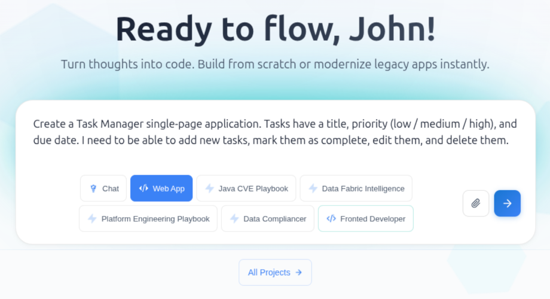
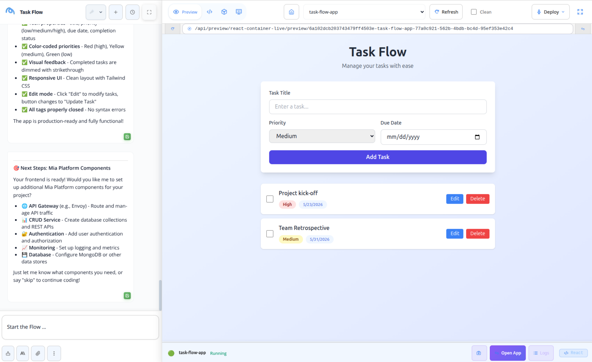
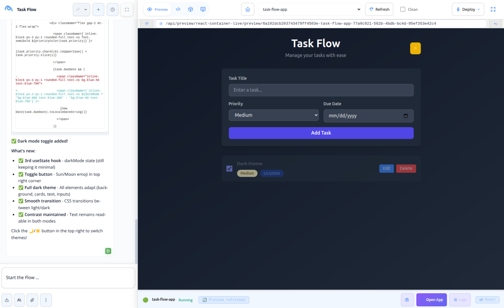

:::caution Beta

Flow is in **beta**. We are actively shaping the product, so things may change as we iterate. Your feedback is welcome.

:::

# Prototype a Frontend Application

This tutorial walks you through the prototyping stage of a simple frontend application using Flow: from the initial prompt to a running deployment on the Mia-Platform Console.

## What you will build

A **Task Manager** single-page application with:

- A list of tasks showing title, priority badge, and due date.
- The ability to add, edit, mark as complete, and delete tasks.

By the end, the application will be generated, previewed live, iterated on, and deployed to a Mia-Platform project.

## Prerequisites

- Access to a Flow instance (URL and credentials provided by your administrator).
- A Mia-Platform Console project with a CI/CD pipeline configured, and the permissions to push a new microservice to it.
- (Optional) A GitHub or GitLab account connected via the **Connectors** page, if you want to push the generated code to your own repository before deploying.

## Step 1: Start a coding session

1. Open Flow and select **Code** in the left sidebar.
2. (Optional) If your team has a frontend playbook in AI Foundry, select it from the **Playbook** dropdown to pre-configure the assistant for your stack. Otherwise, leave the default.
3. In the input area, type the following prompt and send it:

   > Create a Task Manager single-page application. Tasks have a title, priority (low / medium / high), and due date. I need to be able to add new tasks, mark them as complete, edit them, and delete them.

Flow generates the project files, opens the **Canvas** on the right, and starts building a live preview automatically.



## Step 2: Review the live preview

Once the build finishes, the **Preview** tab in the Canvas shows the running application. Interact with it directly:

- Add a sample task to verify the form works.
- Mark a task as complete and check the visual feedback.
- Try editing and deleting a task.

If the preview does not load, switch to the **Logs** tab to read the build output and look for errors.



## Step 3: Iterate with follow-up prompts

Refine the application through natural-language follow-ups in the chat panel. For example:

```
Add a button to toggle between light and dark mode.
```

```
When a task is marked as complete, strike through its title and move it to the bottom of the list.
```

The Canvas updates after each message. You can inspect the changed files in the file tree on the left side of the Canvas, and manually edit any file directly in the editor.



## Step 4: Deploy to the Mia-Platform Console

When you are satisfied with the result:

1. Open the project on the Console, check if the API Gateway was already created and add an endpoint on `/` to expose the Microservice
2. Click the **Deploy** button in the Canvas toolbar on a chosen environment.

Flow pushes the generated code to the selected Mia-Platform project and triggers its CI/CD pipeline. A status indicator in the deploy panel tracks the pipeline progress.

Once the pipeline completes, open the URL associated to the environment you just deployed from the Canvas toolbar.

## Summary

| Step | Action                               | Outcome                                          |
| ---- | ------------------------------------ | ------------------------------------------------ |
| 1    | Start a coding session with a prompt | Project files are generated and the Canvas opens |
| 2    | Review the live preview              | Application is verified interactively            |
| 3    | Iterate with follow-up prompts       | Application is refined through conversation      |
| 4    | Deploy via the deploy panel          | Service is live in the Mia-Platform Console      |

## Next steps

- **[Connected tools](/products/flow/basic-concepts/10_connected-tools.md)**: link GitHub or GitLab to push the generated code to your own repository before or after deploying.
- **[Agentic AI](/products/flow/basic-concepts/40_agentic-ai.md)**: create a custom playbook that pre-configures the assistant for your team's preferred frontend stack, style guide, and deployment target.
- **[Chat](/products/flow/basic-concepts/20_chat.md)**: reopen the conversation later to keep iterating on the same project files.
