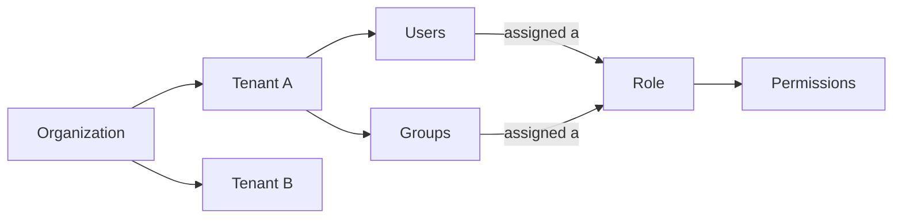

# Mia-Platform Suite

Welcome to the Mia-Platform Suite: the front door to everything you do on Mia-Platform. It's the page you land on right after logging in, and from here you can open every application you have access to, switch between tenants, manage who's allowed to do what, and get help whenever you need it.

## The Components

Everything you build with Mia-Platform lives behind one of these applications, all reachable from the sidebar:

| Components | What it does |
|---|---|
| **Catalog**| Records, classifies, and connects any entity in your organization, giving you a unified, queryable model of your platform's context. |
| **AI Foundry** | Web-based management and orchestration platform for building, managing, and validating AI-powered workflows. |
| **Console** | Platform Builder that lets you build, manage, and simplify your own fully customized Internal Developer Platform. |
| **Flow** | AI-driven development application: describe what you want to build in natural language and it generates, previews, and deploys the code. |
| **Data Fabric** | Configures and manages real-time, enterprise-scale data aggregation pipelines. |
| **P4SaMD** | Compliance governance platform. |

## Finding your way around

The Home Page is your control room: everything you need to get moving is one click away:

- **Sidebar**: always visible on the left; opens any application. At the bottom, next to your account, the gear (⚙️) icon opens **Administration**, where a tenant **Admin** manages users, groups, roles, and permissions. See [Platform Administration](/products/mia-platform-suite/rbac_management.md) for the full picture.
- **Tenant selector**: at the top of the page; switches the tenant you're working in if you belong to more than one. Everything else on the page updates accordingly.
- **AI Assistant**: ask a question in plain language (e.g. "How does the Catalog work?") and get pointed to the right place.
- **Daily launchpad**: the applications you've pinned, for one-click access to what you use most.
- **Helpful resources**: links to Mia-Platform Docs, the Community Hub, Webinars & Events, and the Platform Academy.

## Key Concepts

| Term | What it means for you |
|---|---|
| **Organization** | Your company's overall account on Mia-Platform. |
| **Tenant** | A project or environment inside your organization. Each one has its own content and its own team. |
| **User** | A person who logs into the Suite |
| **Service account** | A non-human identity used by an application or automated process to access Mia-Platform on its own. |
| **Group** | A named set of users, useful for giving the same permissions to several people at once. |
| **Role** | A named set of permissions (e.g. "Admin", "Software Engineer") that says what someone is allowed to do. |
| **Permission** | One specific allowed action, e.g. "view", "create", or "edit" something in a given product. |

In short: your organization has one or more **tenants**; each tenant has its own **users** and **groups**; users or groups get **roles** assigned to them, and each role determines exactly what they can and can't do.

## Understanding Access & Permissions

If you're an admin, this is how access control fits together:

From **Administration** you can manage tenants, users, groups, and roles for your organization. Assigning a role to a user or group grants exactly those permissions, and you can scope it to the whole organization or to a single tenant. See [Platform Administration](/products/mia-platform-suite/rbac_management.md) for the full details.

## Getting Help

- Use the **AI Assistant** for quick, guided answers to "how do I...?" questions.
- Check the **Resources** area at the bottom of the page for documentation and links to further support.
