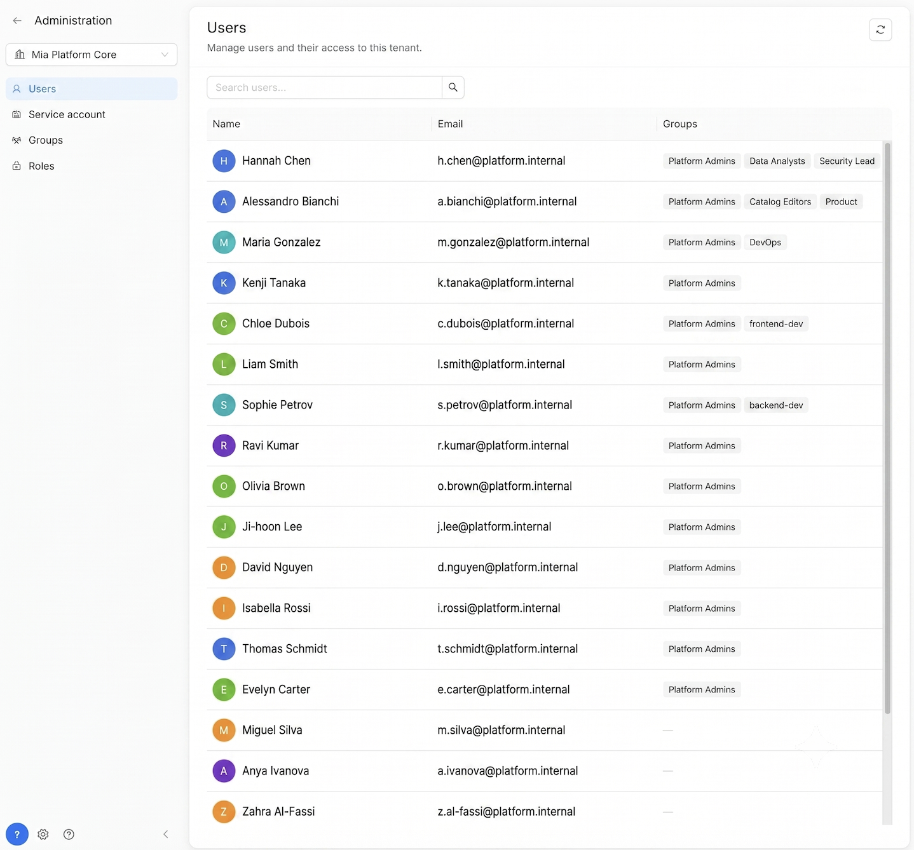
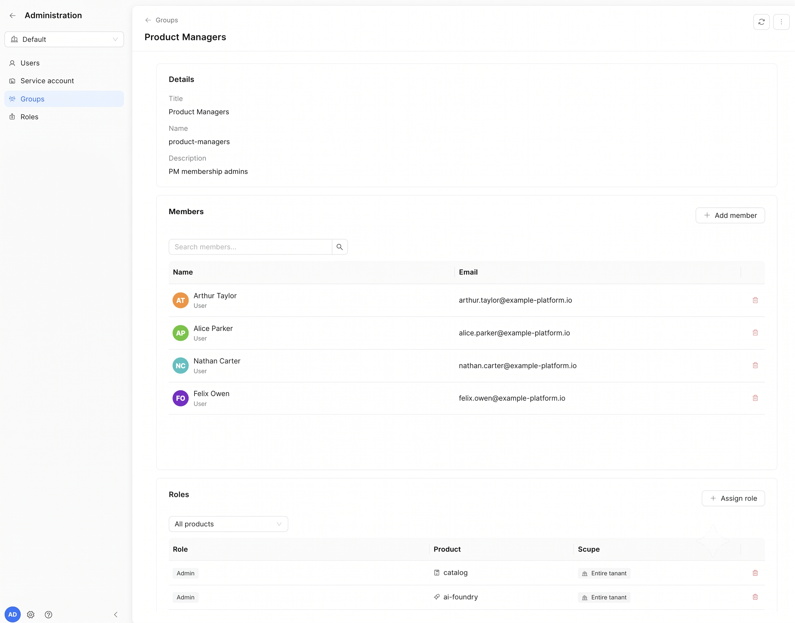
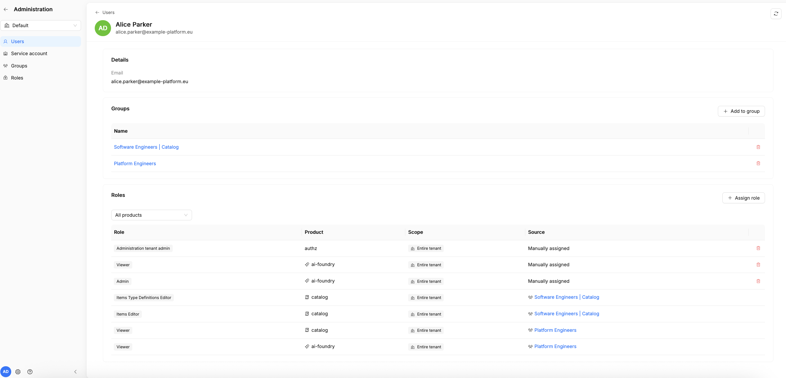

# Platform Administration

This page describes the roles, permissions, and groups model for the whole Mia-Platform Suite. 
RBAC is a cross-product capability, but the specific set of assignable roles/permissions, and the level of granularity, is defined independently for each product (see [Accessing the Administration section](#accessing-the-administration-section) below).



## Technical introduction

Mia-Platform's RBAC system is a centralized service designed for granular access governance. The component exposes both a REST API (documented via OpenAPI) for CRUD operations on resources, and a high-performance gRPC service used by authorization components (e.g., external authorization sidecars) to resolve a principal's context. The system intercepts requests in real time, evaluates whether the principal has the required permissions for the requested action, and then forwards authorized requests to the target service.

### Core concepts

* **Policy package** — a Rego module containing the rules (allow rules) that determine if an action is permitted.
* **actions.json** — a configuration file that maps HTTP paths and methods to specific policy rules, used by the Access Control system to evaluate incoming requests.
* **Input schema** — a JSON Schema file in the *schemas/* directory that defines the structure of *input.rbac*, used for validating and type-checking policy inputs.
* **Super Admin** — a global administrative role (*...authz:Super Admin*) with full privileges to manage the entire platform.
* **Organization Admin** — an administrative role (*...organization-Super Admin:\<org\>*) with full privileges limited to a specific organization.
* **Scope** — defines the extent of a permission: it can be global ('/') or restricted to a specific path (e.g., */\<slug\>*).
* **Decision helper** — a function (*helpers.decision(input)* in *authz/helpers/acl_context.rego*) that evaluates policies and generates the final decision, attaching the *x-mia-acl-context* header.
* **Allowed resource actions** — a list of URN permissions assigned to a principal's role within *input.rbac.roles[]*.

## Architecture and integrations

The architecture is designed to be decentralized, eliminating single points of failure while enabling scalable policy management. Below is a technical comparison between the standard Authorization service and the advanced RBAC service:

| Functionality | Authorization Service | RBAC Service |
| :---- | :---- | :---- |
| ACL on userGroups and clientType | Yes | Yes |
| ACL on request attributes (path, header, query params) | No | Yes |
| Read ACL on rows and columns | No | Yes |

## Accessing the Administration section

The RBAC Administration area is only visible to users who are **Admin of a tenant/organization**. When this condition is met, an **Administration** section becomes available from the gear icon in the bottom of the home page, where the admin can configure roles, permissions, and groups.

Since RBAC is **cross-product**, the admin must first **select the product** they want to manage roles and permissions for:

* For **Catalog** and **AI Foundry**, the set of roles, permissions, and groups is potentially unbounded and offers **maximum granularity**.
* For all **other products**, only a **fixed, predefined list** of roles/permissions is available to choose from.

Below is the specific behavior for each product.

### Console

For Console, roles and permissions are chosen from a **fixed, predefined list**, they cannot be customized or extended. Admins can assign these predefined roles to users, service accounts, or groups.

See organization's detail at [Manage users](/products/console/identity-and-access-management/manage-users.md).

### AI Foundry

Like Catalog, AI Foundry supports a potentially unbounded set of roles, permissions, and groups, with maximum granularity for defining fine-grained access to AI Foundry resources.

## How it works, in practice

* The administrator **assigns** roles to users, service accounts, or groups, optionally limiting their validity to a specific scope. In practice, this means creating a group, adding members to it, and assigning one or more roles to that group.




* When a user or a service attempts to perform an action on the platform (e.g., creating a new role, modifying an organization's configuration), the system:
  * automatically retrieves the roles and permissions associated with the requester;
  * verifies, through authorization rules, if the requested action is permitted.

## Practical example of granularity and access management

The system lets you combine permissions from multiple **Group Memberships**, so a user's effective access is simply the union of everything granted by every group they belong to.

Take **Alice Parker** as an example:



Alice belongs to two groups, each contributing a different set of permissions:

* **Group "Platform Engineers"** — grants the *Viewer* role on **Catalog** and **AI Foundry**, letting her view items and their configuration.
* **Group "Software Engineers | Catalog"** — grants the *Item Editor* and *Item Type Definition Editor* roles on **Catalog**, letting her create, delete, and edit items and item type definitions.

Alice's effective permissions are the combination of these two groups' roles. From the users overview, an admin can open her profile at any time to see the full, resulting list of permissions.

## What can be managed via API

* **Groups**: creation, modification, deletion; member management; role assignment to the group.
* **Users**: creation, modification, deletion, consultation.
* **Roles**: creation, modification, deletion, consultation.
* **Tenant**: creation and edit of tenants, also at the individual organization level.
* **Configuration**: reading and updating an organization's settings.
* **Service accounts**: registration and deletion — see [Registering a service account](#registering-a-service-account) below.

## Permission matrix

Below is a summary of the capabilities enabled, by functional area.

Role assignments can be configured with a global scope ("/") or limited to specific paths/tenants using wildcards, allowing dynamic application of permissions across entire resource hierarchies. Combined permissions (e.g., R/W or R/W/E) indicate that multiple access rights are granted simultaneously.

Access legend:

* **R (Read)**: read-only access. Allows viewing resources without making any changes. For example, the user can consult an item's configuration or view the list of users, but cannot modify them.
* **W (Write)**: write access. Allows creating, modifying, and deleting resources, as well as updating their configuration. For example, the user can create a new configuration, modify an existing setting, or delete an item.
* **E (Execute)**: execute access. Allows executing operations such as launching campaigns, running evaluations, or initiating automated processes. For example, the user can launch a campaign, perform an evaluation, or set up a scorecard.

### Permission matrix for Catalog

| Functional Area | Operational Detail | Super Admin | Admin | Viewer | Item Editor | ITD Editor | Item Publisher | Governor |
| :---- | :---- | :---- | :---- | :---- | :---- | :---- | :---- | :---- |
| **Items** | Management, creation, modification, and deletion of items | **R/W** | **R/W** | **R** | **R/W** | **R** | **W**| **R** |
| **Governance** | Definition of control rules (scorecards and campaigns) | **R/W/E** | **R/W/E** | **R** | **R/W** | **R** | - | **R/W/E** |
| **Configuration** | Configuration of relationships and connectors for items | **R/W** | **R/W** | **R** | **R/W** | **R** | - | **R** |
| **ITD** | Modification of type definitions | **R/W** | **R/W** | **R** | **R** | **R/W** | - | **R** |

### Permission matrix for AI Foundry

| Functional Area | Admin | Viewer | Editor | Observability | Chatbot Usage |
| :--- | :---: | :---: | :---: | :---: | :---: |
| **Playground** | - | - | - | - | R |
| **Playbooks** | R/W | R | R/W | - | - |
| **Agents** | R/W | R | R/W | - | - |
| **Models** | R/W | R | R | - | - |
| **Tools** | R/W | R | R | - | - |
| **MCP Servers** | R/W | R | R | - | - |
| **Skills** | R/W | R | R/W | - | - |
| **Prompts** | R/W | R | R/W | - | - |
| **Spec Templates** | R/W | R | R/W | - | - |
| **Playbook Sessions** | R (personal data) | R (personal data) | R (personal data) | R (all data) | - |
| **AI Traces** | R (personal data) | R (personal data) | R (personal data) | R (all data) | - |
| **Connections (except Apps)** | R | R | R | - | - |
| **Connections/Apps & Plugins** | R/W | R | R | - | - |
| **Data download** | R | R | R | - | - |

## Current limitations (v15.0.0)

In this v15 release, Catalog RBAC management has the following constraints:

* **Roles**: cannot be created, modified, or deleted. The available roles are fixed and correspond to those defined in the [Permission Matrix](#permission-matrix) above.
* **Groups**: can be created. Groups are the only entity that admins can define in this version, to combine users under a shared set of role assignments.
* **Users**: cannot be created. Users can only be **assigned** to existing roles and groups.
* **Permissions**: not yet customizable in this phase — permissions are tied to roles as defined in the matrix and cannot be edited individually.
* **Group scope**: the only scope that can currently be assigned to a group is the **entire tenant**; scoping a group to a specific path or sub-resource is not yet available.

## Detail views

Across all sections of the Administration area, it is possible to open a detail view for individual entities:

* **User detail**: shows which roles, permissions, and groups are assigned to that user.
* **Service account detail**: shows the service account's name and associated client ID. Service accounts cannot be created or deleted from this UI, since they are entirely managed via API — see [Registering a service account](#registering-a-service-account).
* **Group detail**: shows the group's members and the roles/permissions the group grants.
* **Role detail**: shows the role's definition and the users/groups it is assigned to.

## Registering a service account

Service accounts are the non-human identities that let external tools and pipelines authenticate against Mia Platform's RBAC-protected APIs — for example the [`ibdm` connector engine](/products/catalog/connectors/10_overview.md) used by the Catalog, or your own CI/CD automation. Unlike users and groups, they cannot be created from the Administration UI: a **Super Admin** must register them by calling the RBAC service's API directly.

### 1. Reach the API

The registration endpoint is reachable through the api-portal published alongside your Mia Platform Suite instance — typically at `<homepage-url>/documentations/api-portal/` (for example `https://home.<your-domain>/documentations/api-portal/` in a self-hosted deployment). Only a Super Admin can complete the registration.

### 2. Generate a key pair

Service accounts authenticate using the `private_key_jwt` method, so you first need an RSA key pair: a private key kept by the client (`ibdm`, in this example) to sign its authentication assertions, and a public key whose material is registered with the platform.

```sh
openssl genrsa -out ./private.key 4096
openssl rsa -in private.key -pubout -outform PEM -out public.pem
```

### 3. Extract the key modulus

The registration payload expects the public key as a JWK, so extract its base64url-encoded modulus (`n`):

```sh
openssl rsa -pubin -in public.pem -noout -modulus \
  | sed 's/^Modulus=//' \
  | xxd -r -p \
  | openssl base64 -A \
  | tr '+/' '-_' | tr -d '=' ; echo
```

### 4. Compute the key's `kid`

The JWK also needs a key ID (`kid`), computed as the RFC 7638 thumbprint of the public key:

```sh
# your private key
KEY=/path/to/your/private.key

# base64url (no padding) of raw bytes read from hex on stdin
b64url() { xxd -r -p | openssl base64 -A | tr '+/' '-_' | tr -d '='; }

# n: modulus hex, drop "Modulus=" prefix, trim any leading 00 byte(s) (RFC 7638 minimal big-endian)
n_hex=$(openssl rsa -in "$KEY" -noout -modulus | sed 's/^Modulus=//' | sed 's/^\(00\)*//')

# e: public exponent hex, even-length
e_hex=$(openssl rsa -in "$KEY" -noout -text | awk -F'[()]' '/publicExponent/{print $2}' | sed 's/^0x//')
[ $(( ${#e_hex} % 2 )) -eq 1 ] && e_hex="0$e_hex"

n_b64=$(printf '%s' "$n_hex" | b64url)
e_b64=$(printf '%s' "$e_hex" | b64url)

# RFC 7638 canonical JSON -> SHA-256 -> base64url = kid
printf '{"e":"%s","kty":"RSA","n":"%s"}' "$e_b64" "$n_b64" \
  | openssl dgst -sha256 -binary \
  | openssl base64 -A | tr '+/' '-_' | tr -d '=' ; echo
```

### 5. Register the service account

From the api-portal, call `POST /api/service-accounts/register`, providing the service account's identifier together with the JWK (`kty`, `n`, `e`, `kid`) derived in the steps above. Once registered, the client can authenticate to any RBAC-protected API using `private_key_jwt`, signing its assertions with the private key generated in step 2.

To remove a service account later, call `DELETE /api/service-accounts/{client_id}` the same way.

## Advantages of adoption

The integration of RBAC ensures high standards of security and efficiency:

* **Reusability**: use of predefined policy templates to accelerate the setup of organizational roles.
* **Configuration integrity**: drastic reduction of manual errors thanks to centralized governance.
* **Least privilege**: technical guarantee that each principal accesses only the minimum set of necessary resources.
* **Operational efficiency**: reduction of management times by eliminating the need for custom configurations on individual APIs.

Overall, the RBAC model provides a scalable, secure, and maintainable authorization framework, enabling fine-grained access control while simplifying administrative operations across the platform.
