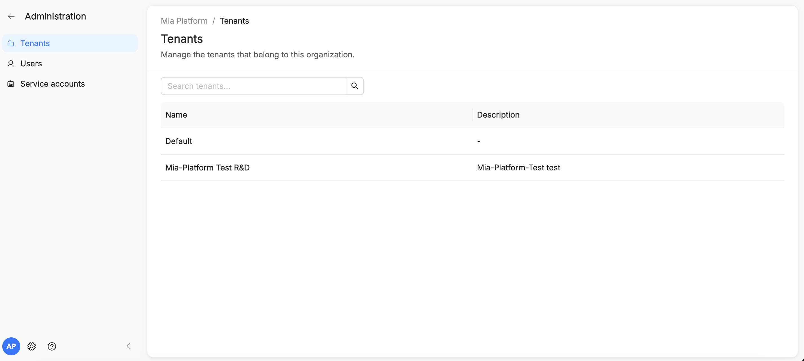
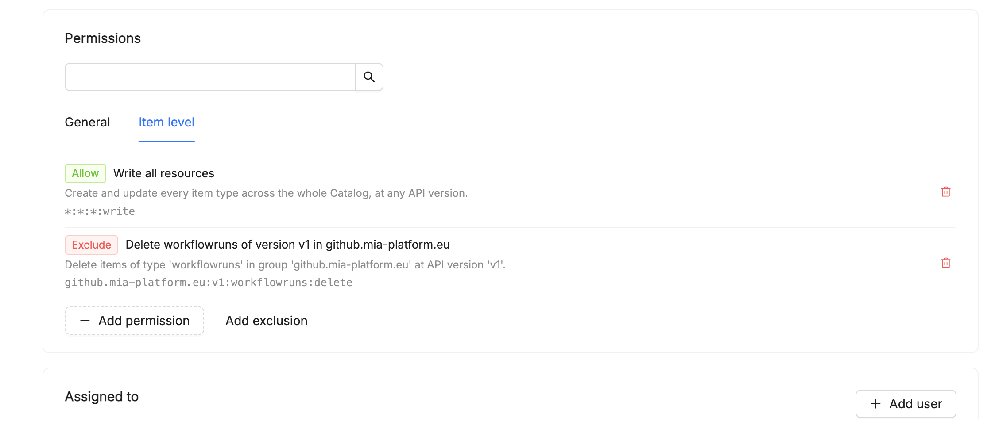
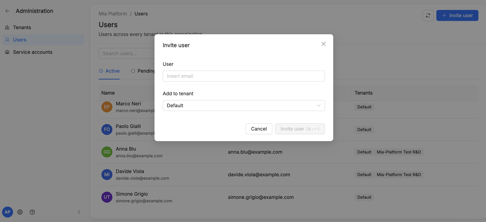
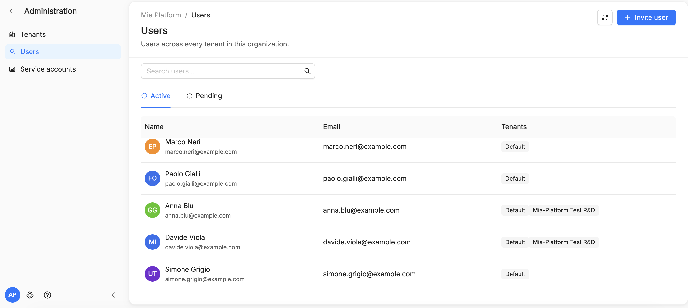

# Platform Administration

This page describes the roles, permissions, and groups model for the whole Mia-Platform Suite.
RBAC is a cross-product capability, but the specific set of assignable roles/permissions, and the level of granularity, is defined independently for each product (see [Accessing the Administration section](#accessing-the-administration-section) below).



## Technical introduction

Mia-Platform's RBAC system is a centralized service designed for granular access governance. The component exposes both a REST API (documented via OpenAPI) for CRUD operations on resources, and a high-performance gRPC service used by authorization components (e.g., external authorization sidecars) to resolve a principal's context. The system intercepts requests in real time, evaluates whether the principal has the required permissions for the requested action, and then forwards authorized requests to the target service.

### Core concepts
- **Super Admin** — a global administrative role (*...authz:Super Admin*) with full privileges to manage the entire suite. In on-prem installation, Super Admin and Organization Admin are the same person.
- **Organization Admin** — an administrative role (*...organization-Super Admin:\<org\>*) with full privileges limited to a specific organization (e.g. add users, tenants or service accounts)
- **Tenant Admin** — an administrative role with full privileges limited to a specific tenant.
- **Keycloak Admin** — an identity-management role, distinct from Super Admin/Organization Admin, that manages users at the organization level directly from the organization's dedicated Keycloak console (e.g., adding or removing users from the organization).
- **Scope** — defines the extent of a permission: it can be global ('/') or restricted to a specific path (e.g., */\<slug\>*).

## Architecture and integrations

The architecture is designed to be decentralized, eliminating single points of failure while enabling scalable policy management. Below is a technical comparison between the standard Authorization service and the advanced RBAC service:

| Functionality | Authorization Service | RBAC Service |
| :---- | :---- | :---- |
| ACL on userGroups and clientType | Yes | Yes |
| ACL on request attributes (path, header, query params) | No | Yes |
| Read ACL on rows and columns | No | Yes |

## Accessing the Administration section

The RBAC Administration area is only visible to users who are **Admin of a tenant/organization**. When this condition is met, an **Administration** section becomes available from the gear icon in the bottom of the home page, where the admin can configure roles, permissions, and groups.

Since RBAC is **cross-product**, the admin must first **select the product** they want to manage roles and permissions for:

- For **Catalog** and **AI Foundry**, the set of roles, permissions, and groups is potentially unbounded and offers **maximum granularity**.
- For all **other products**, only a **fixed, predefined list** of roles/permissions is available to choose from.

Below is the specific behavior for each product.

### Console

For Console, roles and permissions are chosen from a **fixed, predefined list**, they cannot be customized or extended. Admins can assign these predefined roles to users, service accounts, or groups.

Console tenants and the tenants of the new products do not interact with each other: they are managed independently, and RBAC roles assigned in one cannot be managed from the Administration page of the other.

See organization's detail at [Manage users](/products/console/identity-and-access-management/manage-users.md).

### Catalog & AI Foundry

Catalog and AI Foundry support a potentially unbounded set of roles, permissions, and groups, with maximum granularity for defining fine-grained access to resources.

For **Catalog** in particular, when adding a permission to a role, the admin must enhance granularity of the pre-configured roles, choosing between two kinds of permissions:

- **General permissions** — cover generic capabilities such as item type definition management and other non item-specific actions. These are picked by clicking on a **static, predefined list** of possible permissions (available also for AI Foundry).
- **Item-level permissions** — cover specific actions on items, such as viewing, editing, or executing them. Clicking this option opens a **side panel** where the admin specifies the **group**, **version**, **family**, and **operation** the permission applies to. Based on these selections, the UI automatically composes the correct **permission formula**, which is then assigned to the role (and, from there, to the users or groups holding that role).



In the panel above, each item-level permission is expressed as a formula (e.g. `*:*:*:write`) and can be either an **Allow** rule, granting the operation, or an **Exclude** rule, carving out a more specific exception from a broader allow rule (e.g. allowing write access on all resources while excluding delete on a specific item type, group, and API version).

### Organization-wide user visibility

An **Organization Admin** now has access to a dedicated view listing every user across the organization, which tenant(s) each user belongs to, and which role(s) they hold in each. This gives organization admins a single place to audit access across all tenants, instead of checking each tenant's Administration section individually.

A **Tenant Admin**, by contrast, does not see this organization-wide view: they can only see and manage the users of their own tenant.

From the organization-wide view, clicking on a specific tenant opens that **tenant's detail**, where the admin manages the tenant's users, service accounts, and roles/permissions.

## Inviting users

Users can be invited directly from the Administration UI, without going through the RBAC API or provisioning them manually in Keycloak. Onboarding a user is a two-step process: first they are invited to the **organization**, then they are added to one or more **tenants**.



- An **Organization Admin** invites a user to the organization from the organization-wide user management screen, entering the invitee's email, the tenant to add them to, and, optionally, the **role** they should be assigned — assigning it at invitation time, rather than as a separate step afterwards. *(Before v15.2, this optional assignment was a group rather than a role — see [UX improvements (v15.2)](#ux-improvements-v152) above.)*
- A **Tenant Admin** can add users to their own tenant, but only among users who have already been invited to (and accepted into) the organization by an Organization Admin.
- The invited user receives an email invitation and must accept it **within 7 days** to become a member of the organization.



- Until accepted, the user appears in the Administration UI with a **Pending** status; once accepted, their status changes to **Active**.
- From the **Pending** section, the admin can see which users have not yet accepted their invitation, and can **revoke** an invitation at any time (e.g. if it was sent by mistake or expires unused).
- Only after the invitation is accepted can an admin assign roles, permissions, and group memberships to that user.

## How to assign roles and permissions

- The administrator **assigns** roles directly to users or service accounts, optionally limiting their validity to a specific scope. As of **v15.2**, the permission tree in the Administration UI is focused exclusively on **Roles**: group management has been removed (see [UX improvements (v15.2)](#ux-improvements-v152) above).
- Multiple roles can be assigned in **bulk mode**, rather than one at a time, speeding up onboarding.
- Both **Organization Admins** and **Tenant Admins** can assign **broad roles** (the predefined, coarse-grained roles from the [Permission Matrix](#permission-matrix)).
- Only the **Organization Admin** can assign **granular roles**. Granular role assignment is available:
  - For **Catalog**, with the widest granularity: permissions can be scoped to specific groups and users through **filter expressions** (formulas combining fields and logical operators).
  - For **AI Foundry**, with a narrower degree of granularity compared to Catalog — see [AI Foundry](#ai-foundry) above.


- When a user or a service attempts to perform an action on the platform (e.g., creating a new role, modifying an organization's configuration), the system:
  - automatically retrieves the roles and permissions associated with the requester;
  - verifies, through authorization rules, if the requested action is permitted.

## Practical example of granularity and access management

The system lets you combine permissions from multiple **roles**, so a user's effective access is simply the union of everything granted by every role assigned to them.

Take **Alice Parker** as an example:


Alice belonged to two groups, each contributing a different set of permissions:

- **Group "Platform Engineers"** — granted the *Viewer* role on **Catalog** and **AI Foundry**, letting her view items and their configuration.
- **Group "Software Engineers | Catalog"** — granted the *Item Editor* and *Item Type Definition Editor* roles on **Catalog**, letting her create, delete, and edit items and item type definitions.

Alice's effective permissions were the combination of these two groups' roles. From the users overview, an admin can open her profile at any time to see the full, resulting list of permissions, just click on a user menu with links to Profile.

## Profile

Each user's **Profile** page shows their identity, tenant memberships, and — most relevantly for RBAC — every role they have, tenant and group memberships included, 

- **Header** and **Details** — name, email, and user ID.
- **Tenants** — every tenant the user belongs to (name and description).
- **Groups** — the groups the user is a member of, with the tenant each membership applies to; filterable by tenant.
- **Roles** — every role assigned to the user, with the product it applies to, its tenant, its scope (e.g. "Entire tenant"), and its **source**: manually assigned to the user, or inherited from a group membership (with the group named). Filterable by tenant and product.

This is the place to check a user's *effective* permissions — including those inherited from groups, like in the [Alice Parker example](#practical-example-of-granularity-and-access-management) above — without having to reconstruct them by hand.

## What can be managed via API

- **Users**: creation, invitation, modification, deletion, consultation.
- **Groups**: creation, modification, deletion; member management; role assignment to the group.
- **Roles**: creation, modification, deletion, consultation.
- **Tenant**: creation and edit of tenants, also at the individual organization level.
- **Configuration**: reading and updating tenant's settings.
- **Service accounts**: registration and deletion — see [Registering a service account](#registering-a-service-account) below.

## Permission matrix

Below is a summary of the capabilities enabled, by functional area.

Role assignments can be configured with a global scope ("/") or limited to specific paths/tenants using wildcards, allowing dynamic application of permissions across entire resource hierarchies. Combined permissions (e.g., R/W or R/W/E) indicate that multiple access rights are granted simultaneously.

Access legend:

- **R (Read)**: read-only access. Allows viewing resources without making any changes. For example, the user can consult an item's configuration or view the list of users, but cannot modify them.
- **W (Write)**: write access. Allows creating, modifying, and deleting resources, as well as updating their configuration. For example, the user can create a new configuration, modify an existing setting, or delete an item.
- **E (Execute)**: execute access. Allows executing operations such as launching campaigns, running evaluations, or initiating automated processes. For example, the user can launch a campaign, perform an evaluation, or set up a scorecard.


## Complete role mapping (v15.2)

The tables below list every role currently assignable in the Administration Platform, grouped by the product (scope) they apply to.

### Catalog roles

| Role | Description and permissions |
| :---- | :---- |
| **Admin** | Full access to all Catalog resources. |
| **Governance Manager** | Full access to the Governance section; read-only access to all other Catalog resources. |
| **Items Type Definitions Editor** | Read/write access to Item Type Definitions. |
| **Items Editor** | Read/write access to Catalog Items; read-only access to Item Type Definitions. |
| **Items Ingestor** | Write access for ingesting Catalog Items. |
| **Viewer** | Read-only access to all Catalog resources. |
| **Auditor** | Access to audit logs, plus read-only access to all Catalog resources. |

The **Item Ingestor** role is intended for **service accounts**, not human users: it grants the write access needed to create and update items and their relationships, without exposing governance or type-definition capabilities. It is the role typically assigned to the [`ibdm` connector engine](/products/catalog/connectors/10_overview.md) or to other connectors that sync external sources into the Catalog — see [Registering a service account](#registering-a-service-account) below.

### AI Foundry roles

| Role | Description and permissions |
| :---- | :---- |
| **Viewer** | Read access to all AI Foundry sections (items, agentic workflows, guardrails, models, deployment) and to their own observability data; write access limited to their own memory entries. |
| **Editor** | All Viewer permissions, plus write access to non-reserved catalog items and guardrails. Excludes administration and creation of agentic workflows. |
| **Admin** | All Editor permissions, plus write access to reserved items, models, MCP servers/tools, and AI Gateway administration; read access to API Credentials and agentic workflows. |
| **Chatbot Usage** | Playground usage: read access to agents and model/playbook listings, executing agent turns, and managing their own sessions, artifacts, memory entries, and MCP consents. |
| **Observability** | Read access to observability and tracing data for all users. Must be assigned in combination with another role. |
| **Workflow Manager** | Read/write access to agentic workflow definitions and their executions, plus the API Credentials used by workflow steps; read access to related catalog items. |
| **Workflow Trigger** | Management, creation, and rotation of the secret keys associated with a workflow's public webhook triggers. |

### Authorization roles

| Role | Description and permissions |
| :---- | :---- |
| **Administration tenant admin** | Administrator of a specific tenant, with full access to all resources within that tenant. |

## UX improvements (v15.2)

The Administration UI introduces two changes as of v15.2:

- **Role-based permission management** — the permission tree is now focused exclusively on **Roles**: group management has been removed, and roles are assigned directly to users and service accounts (including at invitation time, and in bulk).
- **Tenant and service account creation from the UI** — an Organization Admin can now create tenants and service accounts directly from the Administration UI, rather than only via API (deletion of either still requires the API — see [Current limitations](#current-limitations-v1520) below).

<!-- ### Permission matrix for Catalog

| Functional Area | Operational Detail | Super Admin | Admin | Viewer | Item Editor | ITD Editor | Item Publisher | Governor | Item Ingestor |
| :---- | :---- | :---- | :---- | :---- | :---- | :---- | :---- | :---- | :---- |
| **Items** | Management, creation, modification, and deletion of items | **R/W** | **R/W** | **R** | **R/W** | **R** | **W**| **R** | **R/W** |
| **Governance** | Definition of control rules (scorecards and campaigns) | **R/W/E** | **R/W/E** | **R** | **R/W** | **R** | - | **R/W/E** | - |
| **Configuration** | Configuration of relationships and connectors for items | **R/W** | **R/W** | **R** | **R/W** | **R** | - | **R** | **R/W** |
| **ITD** | Modification of type definitions | **R/W** | **R/W** | **R** | **R** | **R/W** | - | **R** | **R** |


### Permission matrix for AI Foundry

| Functional Area | Admin | Viewer | Editor | Observability | Chatbot Usage |
| :--- | :---: | :---: | :---: | :---: | :---: |
| **Playground** | - | - | - | - | R |
| **Playbooks** | R/W | R | R/W | - | - |
| **Agents** | R/W | R | R/W | - | - |
| **Models** | R/W | R | R | - | - |
| **Tools** | R/W | R | R | - | - |
| **MCP Servers** | R/W | R | R | - | - |
| **Skills** | R/W | R | R/W | - | - |
| **Prompts** | R/W | R | R/W | - | - |
| **Spec Templates** | R/W | R | R/W | - | - |
| **Playbook Sessions** | R (personal data) | R (personal data) | R (personal data) | R (all data) | - |
| **AI Traces** | R (personal data) | R (personal data) | R (personal data) | R (all data) | - |
| **Connections (except Apps)** | R | R | R | - | - |
| **Connections/Apps & Plugins** | R/W | R | R | - | - |
| **Data download** | R | R | R | - | - | -->

## Current limitations (v15.2.0)

In this v15 release, Catalog RBAC management has the following constraints:

- **Group scope**: the only scope that can currently be assigned to a group is the **entire tenant**; scoping a group to a specific path or sub-resource is not yet available.
- **Tenant creation and deletion**: an **Organization Admin** can create tenants directly from the Administration UI, but tenants can never be deleted from there — not even by an Organization Admin.
- **Service account creation and deletion**: an **Organization Admin** can create service accounts from the Administration UI, but deleting a service account is not possible from there — it must be done via API, see [Registering a service account](#registering-a-service-account) below.

## Detail views

Across all sections of the Administration area, it is possible to open a detail view for individual entities:

- **User detail**: shows which roles, permissions, and groups are assigned to that user.
- **Service account detail**: shows the service account's name and associated client ID. Service accounts can be created from this UI by an Organization Admin, but not deleted — deletion is only possible via API, see [Registering a service account](#registering-a-service-account).
- **Group detail**: shows the group's members and the roles/permissions the group grants. *(Legacy, pre-v15.2 model — see [UX improvements (v15.2)](#ux-improvements-v152) above.)*
- **Role detail**: shows the role's definition and the users/groups it is assigned to.

## Registering a service account

Service accounts are the non-human identities that let external tools and pipelines authenticate against Mia Platform's RBAC-protected APIs — for example the [`ibdm` connector engine](/products/catalog/connectors/10_overview.md) used by the Catalog, or your own CI/CD automation. An **Organization Admin** can create a service account directly from the Administration UI; however, deletion is only possible via API, and the full key-pair setup described below is required regardless of how the service account was created, since it cannot be configured from the UI.

### 1. Reach the API

The registration endpoint is reachable through the api-portal published alongside your Mia-Platform Suite Home instance — typically at `<homepage-url>/documentations/api-portal/`. Only a Super Admin can complete the registration of users in tenant by using this tool.

### 2. Generate a key pair

Service accounts authenticate using the `private_key_jwt` method, so you first need an RSA key pair: a private key kept by the client (`ibdm`, in this example) to sign its authentication assertions, and a public key whose material is registered with the platform.

```sh
openssl genrsa -out ./private.key 4096
openssl rsa -in private.key -pubout -outform PEM -out public.pem
```

### 3. Extract the key modulus

The registration payload expects the public key as a JWK, so extract its base64url-encoded modulus (`n`):

```sh
openssl rsa -pubin -in public.pem -noout -modulus \
  | sed 's/^Modulus=//' \
  | xxd -r -p \
  | openssl base64 -A \
  | tr '+/' '-_' | tr -d '=' ; echo
```

### 4. Compute the key's `kid`

The JWK also needs a key ID (`kid`), computed as the RFC 7638 thumbprint of the public key:

```sh
# your private key
KEY=/path/to/your/private.key

# base64url (no padding) of raw bytes read from hex on stdin
b64url() { xxd -r -p | openssl base64 -A | tr '+/' '-_' | tr -d '='; }

# n: modulus hex, drop "Modulus=" prefix, trim any leading 00 byte(s) (RFC 7638 minimal big-endian)
n_hex=$(openssl rsa -in "$KEY" -noout -modulus | sed 's/^Modulus=//' | sed 's/^\(00\)*//')

# e: public exponent hex, even-length
e_hex=$(openssl rsa -in "$KEY" -noout -text | awk -F'[()]' '/publicExponent/{print $2}' | sed 's/^0x//')
[ $(( ${#e_hex} % 2 )) -eq 1 ] && e_hex="0$e_hex"

n_b64=$(printf '%s' "$n_hex" | b64url)
e_b64=$(printf '%s' "$e_hex" | b64url)

# RFC 7638 canonical JSON -> SHA-256 -> base64url = kid
printf '{"e":"%s","kty":"RSA","n":"%s"}' "$e_b64" "$n_b64" \
  | openssl dgst -sha256 -binary \
  | openssl base64 -A | tr '+/' '-_' | tr -d '=' ; echo
```

### 5. Register the service account

From the api-portal, call `POST /api/service-accounts/register`, providing the service account's identifier together with the JWK (`kty`, `n`, `e`, `kid`) derived in the steps above. Once registered, the client can authenticate to any RBAC-protected API using `private_key_jwt`, signing its assertions with the private key generated in step 2.

#### Payload Shape - Example

```json
{
  "client_description": "this-is-a-description",
  "client_name": "this-is-a-name",
  "jwks": {
    "keys": [
      {
        "alg": "RS256",
        "e": "AQAB",
        "kid": "{KID_PLACEHOLDER}",
        "kty": "RSA",
        "n": "{EXPONENT_PLACEHOLDER}",
        "use": "sig"
      }
    ]
  },
  "scope": ""
}
```

To remove a service account later, call `DELETE /api/service-accounts/{client_id}` the same way.

## Requesting an access token

A registered service account has no password or client secret: it proves its identity by signing a JWT with the private key generated in [step 2](#2-generate-a-key-pair) above. This signed JWT (the *client assertion*) is presented, together with a `client_credentials` grant, to the environment's Identity Provider (Keycloak) token endpoint, which verifies the signature against the public key registered via the JWK's `kid` and, if valid, issues an access token.

### 1. Build the client assertion

The client assertion is a `RS256`-signed JWT (RFC 7523) with the following claims:

| Claim | Value |
| :---- | :---- |
| `iss` | the service account's `client_id` |
| `sub` | the service account's `client_id` |
| `aud` | the token endpoint URL (see below) |
| `jti` | a unique request identifier (e.g. a UUID), preventing replay attacks |
| `iat` | the current timestamp |
| `exp` | a short expiry, e.g. `iat + 300` seconds |

The JWT header must carry `alg: RS256` and `kid: <the kid registered in step 4>` — the `kid` must exactly match the one in the registered JWKS, otherwise the token endpoint cannot locate the public key to verify the signature.

### 2. Call the token endpoint

The token endpoint is the environment's Identity Provider (Keycloak), under the relevant realm:

```text
https://<AUTH_HOST>/realms/<AUTH_REALM>/protocol/openid-connect/token
```

```sh
curl -X POST "https://<AUTH_HOST>/realms/<AUTH_REALM>/protocol/openid-connect/token" \
  -H "Content-Type: application/x-www-form-urlencoded" \
  --data-urlencode "grant_type=client_credentials" \
  --data-urlencode "client_id=<client_id>" \
  --data-urlencode "client_assertion_type=urn:ietf:params:oauth:client-assertion-type:jwt-bearer" \
  --data-urlencode "client_assertion=<the signed JWT above>" \
  --data-urlencode "scope=<mia-product-scope>"
```

The requested `scope` must match the product(s) whose APIs the token is meant to call (e.g. `mia:catalog`, or `mia:ai-foundry`, in addition to any product-specific requirement — see each product's API documentation for the exact scopes it expects).

:::info
**On the Mia-Platform PaaS**, the `organization:*` scope must also be included in every token request, in addition to the product-specific `mia:*` scopes (e.g. `scope=mia:catalog organization:*`). Without it, the PaaS token endpoint will not issue a usable token.
:::

A successful response looks like:

```json
{
  "access_token": "eyJ...",
  "token_type": "Bearer",
  "expires_in": 300
}
```

Use the resulting `access_token` in the `Authorization: Bearer <access_token>` header of every API call. Once it expires (`expires_in`), repeat the token request.

## FAQ

### Who is the Organization Admin and how is this role acquired?

- **PaaS**: the Super Admin is designated via Keycloak (during installation but also afterwards). Organization Admin permissions can instead be assigned at a later stage via the front-end, from the Administration panel, but only after the organization has already been created.
- **On-Premise**: the Super Admin is appointed at the creation of the organization in Keycloak. Only one organization is possible, so the Super Admin and the Organization Admin roles coincide.

### How are new users added, and who is authorized to do so?
- **Keycloak Admin/Organization Admin** — adds/invites users to the organization (via their personal Keycloak, or via the organization-wide users view — see [Organization-wide user visibility](#organization-wide-user-visibility) above).
- **Organization Admin** — adds users to a tenant.
- **Tenant Admin** — can add users to their tenant, but only among users already invited to (and accepted into) the organization.

### Is it possible to add users, groups, or roles in "bulk" mode to speed up onboarding?

Roles can be assigned to a group in bulk mode — see [How to assign roles and permissions](#how-to-assign-roles-and-permissions) above. Bulk user addition, however, is not supported yet.

### How does the user offboarding procedure work?

From the interface, the Organization Admin can delete a user directly from the user management page in the organization's dedicated Keycloak instance.

### How does combined permission assignment work when a user belongs to multiple groups?

A user's effective permissions are the union of all roles granted by each group they belong to. For example, if a user belongs to Group A (with Role X) and Group B (with Role Y), they will have both Role X and Role Y — see the [practical example of Alice Parker](#practical-example-of-granularity-and-access-management) above. Role assignment follows a deny-by-default model, meaning permissions must be explicitly granted: nothing is accessible by default.

### How is a service account registered?

An Organization Admin can create it from the Administration UI, or a Super Admin can register it by calling the dedicated API — see [Registering a service account](#registering-a-service-account) above.

### Tenants of new products vs. Console: what is the difference, and how do they interact?

Currently, tenants from new products and Console tenants do not interact with each other. The same limitation applies to RBAC roles: they cannot be managed from the Administration page on the home page for one from the other. See [Accessing the Administration section](#accessing-the-administration-section) above for more details.

