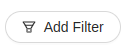

<!--
WARNING:
This file is automatically generated. Please edit the 'README' file of the corresponding component and run `yarn copy:docs`
-->


[loading-data]: /products/microfrontend-composer/back-kit/70_events.md#loading-data
[nested-navigation-state/back]: /products/microfrontend-composer/back-kit/70_events.md#nested-navigation-state---back
[nested-navigation-state/push]: /products/microfrontend-composer/back-kit/70_events.md#nested-navigation-state---push
[filter]: /products/microfrontend-composer/back-kit/70_events.md#filter
[localized-text]: /products/microfrontend-composer/back-kit/40_core_concepts.md#localization-and-i18n


```html
<bk-add-filter-button></bk-add-filter-button>
```

Renders a button. Upon clicking, other components are notified that a filter needs to be created.



<!-- TODO Add link to CRUD flow for filtering data -->

## How to configure

The Add Filter Button does not require any configuration.


```json
{
  "tag": "bk-add-filter-button"
}
```

### Locale

The texts of the Add Filter Button can be customized through the property `customLocale`, which accepts an object shaped like the following:

```typescript
type Locale = {
  content?: LocalizedText
}
```

where [LocalizedText][localized-text] is either a string or an object mapping language acronyms to strings.


## API

### Properties & Attributes

None

### Listens to

| event | action |
|-------|--------|
|[loading-data][loading-data]|sets internal loading state|
|[nested-navigation-state/back][nested-navigation-state/back]|keeps track of navigation steps|
|[nested-navigation-state/push][nested-navigation-state/push]|keeps track of navigation steps|

### Emits

| event | description |
|-------|-------------|
|[filter][filter]|notifies the request for creating a filter|
