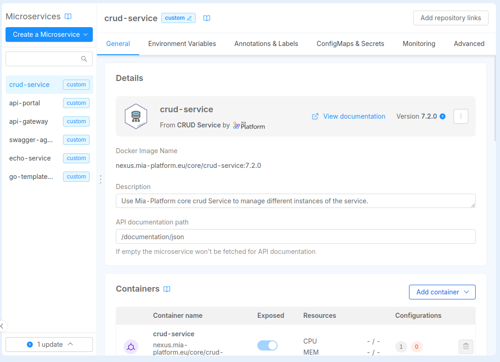

A **version of an item** is a distinct, immutable snapshot of an item that captures a specific state of its configuration, metadata, and resources at a given point in time.

Versioning allows teams to:

- evolve resources over time while maintaining consistency and traceability,
- prevent unintended changes to items already in use, and
- support multiple iterations of the same item simultaneously.

:::caution
Versioning is currently supported by a subset of [well-known item types](/products/software-catalog/basic-concepts/10_items-types.md#well-known-itds). All the information presented below applies **only to items of these types**.

Refer to the [manifest page](/products/software-catalog/items-manifest/overview.md) of an item type to check whether it supports versioning.

For the time being, custom-made [ITDs](/products/software-catalog/basic-concepts/10_items-types.md) **cannot support versioning**.
:::

As [already explained](/products/software-catalog/basic-concepts/05_items-data-structure.md), an item is univocally associated with a combination of its identifier (field `itemId`), and the identified of the Company it belongs to (field `tenantId`). The concept of versioning, however, introduces a scenario where multiple instances of the same item exist together, albeit at diffent versions. Hence, the version (field `version.name`) is part of the **primary key** of an item, meaning that, at a given point in time, there can be only one item with a specific combination of `itemId`, `tenantId`, and `version.name`.

Practically speaking, the `version` field of an item is an object that adheres to the following schema:

```json
{
  "type": "object",
  "properties": {
    "name": {
      "type": "string"
    },
    "releaseNote": {
      "type": "string"
    }
  },
  "required": ["name", "releaseNote"]
}
```

The `name` field is the identifier of the version, and **must follow [Semantic Versioning](https://semver.org/)** rules (e.g. `1.0.0`, `2.1.3`), while the `releaseNote` field should contain a brief description of the changes introduced with the version.

## Editing a versioned item

As we said, versions are meant to be **immutable snapshots** of an item state, therefore there are some limitations regarding which fields can be edited once a version is created.

Namely, the following fields are considered immutable, and **cannot be changed**:

- `itemId`
- `tenantId`
- `version.name`
- `itemTypeDefinitionRef`
- `type`
- `resources`

The first two field (`itemId` and `tenantId`) are what links the version to the actual item, the field `version.name` is the unique identifier of the version, and the field `itemTypeDefinitionRef` is the [ITD reference](/products/software-catalog/basic-concepts/10_items-types.md), which must stay the same across all versions. 

Finally, is the immutability of the field `resources` (which contains the item's assets) what guaranties that the **runtime behavior** of a version doesn't change over time. Attempting to modify the assets of an existing versioned item will result in an error, meaning that each edit must correspond to the explicit publication of a **new version** of the same item.

All the other fields of an item (including `version.releaseNote`) are considered **metadata** and can be [changed at any time](/products/software-catalog/items-management/overview.md).

:::tip
If an item version is at an **unstable [lifecycle stage](/products/software-catalog/basic-concepts/30_items-lifecycle.md)**, the immutability rule presents an exception: the `resources` field of items that are `coming-soon` or `draft` **can be modified in place**, without the need of creating a new version.
:::

## Latest and N/A versions

Technically speaking all items have a version, even the ones of types which does not support versioning. For them - and for the items that support versioning but were created before the its introduction - there exists a special version, called **N/A**.

:::caution
The main caracteristic of versioned items' *N/A* versions is that their `resources` can be **[edited](#editing-a-versioned-item) at any time**, which makes them intrinsically unstable.

This is why the *N/A* version for versioned items is **deprecated**. You cannot create *N/A* versions for new items, and all the existing ones should be [deprecated or archived](/products/software-catalog/basic-concepts/30_items-lifecycle.md) in favour of "named" version.
:::

Among all the versions of an item, there is always one that is considered as **latest** and is used by default when creating new instaces of that item from the Catalog.

The version elected as *latest* is the highest (based on [Semantic Versioning](https://semver.org/) rules) among the [published](/products/software-catalog/basic-concepts/30_items-lifecycle.md) ones. If none is found, the highest version in any other lifecycle stage is used, with `coming-soon` versions having the lowest priority. *N/A* versions are always considered to be lower than any "named" version.

## Versioned items in Console Design area

If any resource attached to a Marketplace item has an available update, the Console will notify you. You can find these updates:

- in the sidebar, at the bottom of your service list, and
- within the detail page of the service that requires updating.

 
