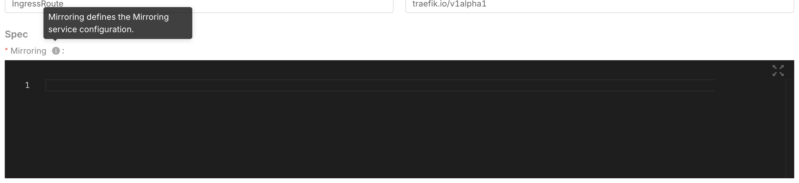
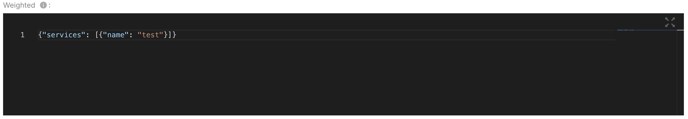
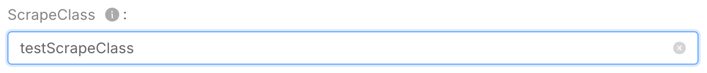

import Tabs from '@theme/Tabs';
import TabItem from '@theme/TabItem';

import { catalogWellKnownItems } from "@mia-platform/console-types";
import SchemaViewer from "../snippets/schema_viewer.mdx";

Infrastructure resources are **custom objects** that are not part of the standard Console supported resources. They can be managed from the [dedicated section](/products/console/design-your-projects/custom-resources/custom-resources.md) of the Console Design area.

To [create or edit](/products/software-catalog/items-management/overview.md) an infrastructure resource, you need to provide a [manifest](/products/software-catalog/items-manifest/overview.md), whose `resources` property should adhere to the following JSON schema.

:::tip
The JSON schemas of the [infrastructure resource resources](https://raw.githubusercontent.com/mia-platform/console-sdk/refs/tags/%40mia-platform/console-types%400.39.2/packages/console-types/schemas/software-catalog/custom-resource.resources.schema.json) and of the [full infrastructure resource manifest](https://raw.githubusercontent.com/mia-platform/console-sdk/refs/tags/%40mia-platform/console-types%400.39.2/packages/console-types/schemas/software-catalog/custom-resource.manifest.schema.json) are available on GitHub.
:::

<SchemaViewer schema={catalogWellKnownItems['custom-resource'].resourcesSchema} />

## Monitor a Custom Kubernetes Resource in the Runtime area

If you've upgraded to Console release `v13.3.0`, you can now view the status of your Current Kubernetes Resources directly in the Runtime section. To enable this feature, [publish a new version](/products/software-catalog/items-management/ui.md#create-a-new-version) of your infrastructure resource that include the fields `runtime`.

## Generate dynamic form to customize validation

If you have upgraded the Console to version `v13.6.1`, you can now generate a dynamic form. This documentation serves as a guide for users to understand and effectively utilize the dynamic form fields generated from a JSON schema. By following the examples and descriptions provided, users can create forms that are both functional and user-friendly, ensuring a smooth data entry experience. 

:::info
In the next versions of the Console we want to add dynamic form generation also in the details section.
:::

The Frontend of the Console generate the Form using the roles below:

### Supported JSON Schema Types

<Tabs groupId="types" queryString>
  <TabItem value="type-object" label="type Object" default>

#### Object field

Visualized as Editor



    ```json
    {
      "jsonSchema": {
        "type": "object",
        "required": ["mirroring"],
        "properties" {
          "mirroring": { "type": "object", "description": "Mirroring defines the Mirroring service configuration" }
        }
      }
    }
    ```

##### Validation

The editor generated from this type can validate with [ajv library](https://ajv.js.org/) the sub schema used to fields


    ```json
    {
      "jsonSchema": {
        "type": "object",
        "required": ["mirroring"],
        "properties" {
          "mirroring": { 
            "type": "object",
            "additionalProperties": false,
            "required": ["name"],
            "properties": {
              "name": { "type": "string" }
            } 
          }
        }
      }
    }
    ```

  </TabItem>
  <TabItem value="type-array" label="type Array">

#### Array field

Visualized as Editor



    ```json
    {
      "jsonSchema": {
        "type": "object",
        "properties": {
          "services": {
            "items": {
              "additionalProperties": false,
              "properties": {
                "healthCheck": {
                  "additionalProperties": false,
                  "properties": {
                    "followRedirects": { "type": "boolean" },
                  }
                }
              }
            }
          }
        }
      }
    }
    ```
    
##### Validation

The editor generated from this type can validate with [ajv library](https://ajv.js.org/) the sub schema used to fields


    ```json
    {
      "jsonSchema": {
        "type": "object",
        "properties": {
          "services": {
            "items": {
              "type": "object",
              "properties": {
                "healthCheck": {
                  "type": "object",
                  "properties": {
                    "followRedirects": { "type": "boolean" },
                  }
                }
              }
            }
          }
        }
      }
    }
    ```

  </TabItem>

  <TabItem value="type-string" label="type String">

#### String type

Used for textual input. It can include various validations such as minimum and maximum length.
When using a string field, ensure that the input meets the specified length requirements.



    ```json
    {
      "jsonSchema": {
        "type": "object",
        "properties": {
          "type": "string",
          "minLength": 5,
          "maxLength": 100,
          "description": "Enter your full name."
        }
      }
    }
    ```


  </TabItem>

  <TabItem value="type-boolean" label="type Boolean">

The boolean type is used for true/false values. This is typically represented as a switch in the form.
    


    ```json
    {
      "jsonSchema": {
        "type": "object",
        "properties": {
          "boolean": {
            "type": "boolean",
            "description": "Do you agree to the terms and conditions?"
          }
        }
      }
    }
    ```

  </TabItem>

  <TabItem value="type-integer" label="type Integer">

#### Integer type

Specifically for whole numbers. It behaves similarly to the number type but restricts input to integers.


    ```json
    {
      "jsonSchema": {
        "type": "object",
        "properties": {
          "integer": {
            "type": "integer",
            "minimum": 1,
            "maximum": 10,
            "description": "Enter an integer between 1 and 10."
          }
        }
      }
    }
    ```

  </TabItem>
  <TabItem value="type-number" label="type Number">

#### Number type

Used for numerical input, which can include both integers and floating-point numbers.


    ```json
    {
      "jsonSchema": {
        "type": "object",
        "properties": {
          "number": {
            "type": "number",
            "minimum": 0,
            "maximum": 100,
            "description": "Enter a value between 0 and 100"
          }
        }
      }
    }
    ```

  </TabItem>
</Tabs>

### Unsupported JSON Schema Features

While our dynamic form fields support a wide range of JSON schema features, there are certain features that are not supported. 
Additionally, being aware of the unsupported features will help users avoid potential issues when designing their schemas.
Below is a list of unsupported features:

- **$ref**: Reference to external schemas
- **oneOf**: Validation against one of the specified schemas
- **allOf**: Validation against all of the specified schemas
- **anyOf**: Validation against any of the specified schemas
- **not**: Validation against the negation of the specified schema
- **string** format: Specific string formats such as email, date, etc
- **number** exclusiveMinimum and exclusiveMaximum: Exclusive range validation for numbers
- **dependencies**: Conditional validation based on the presence of other fields

#### Partially supported JSON Schema Features

- **additionalProperties**: Validation of additional properties work only for types array or object in the schema
- **patternProperties**: Validation of properties matching a specific pattern
