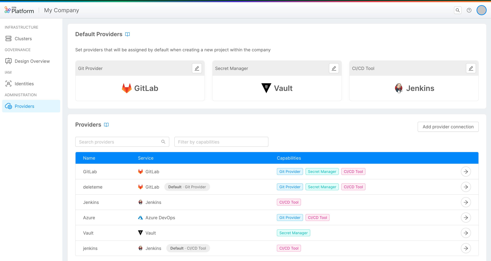
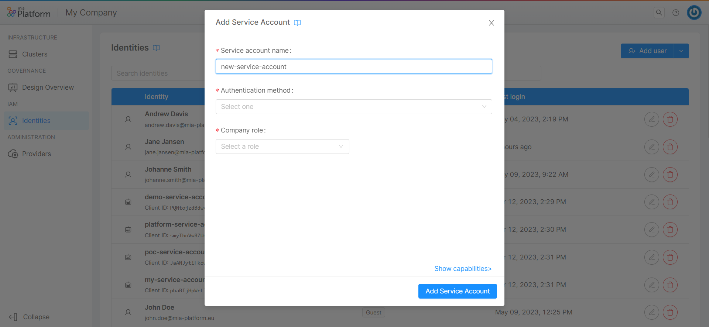
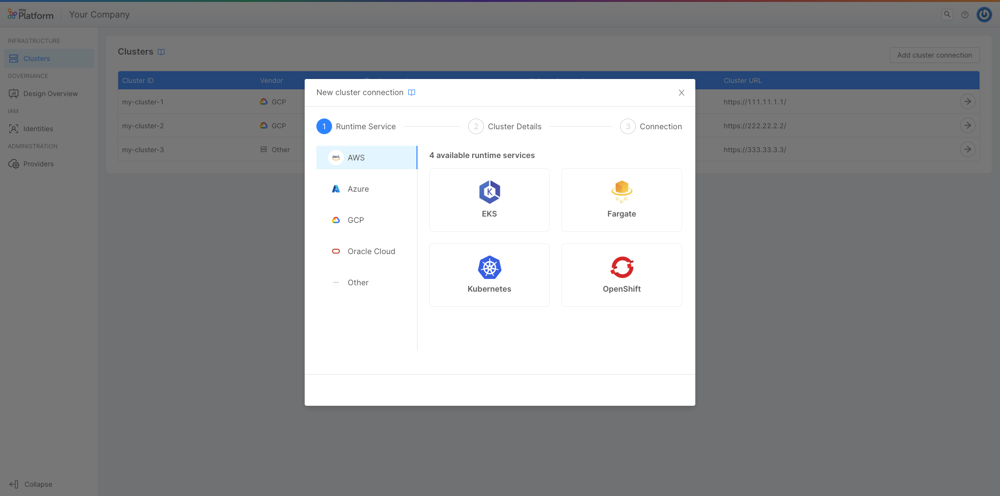
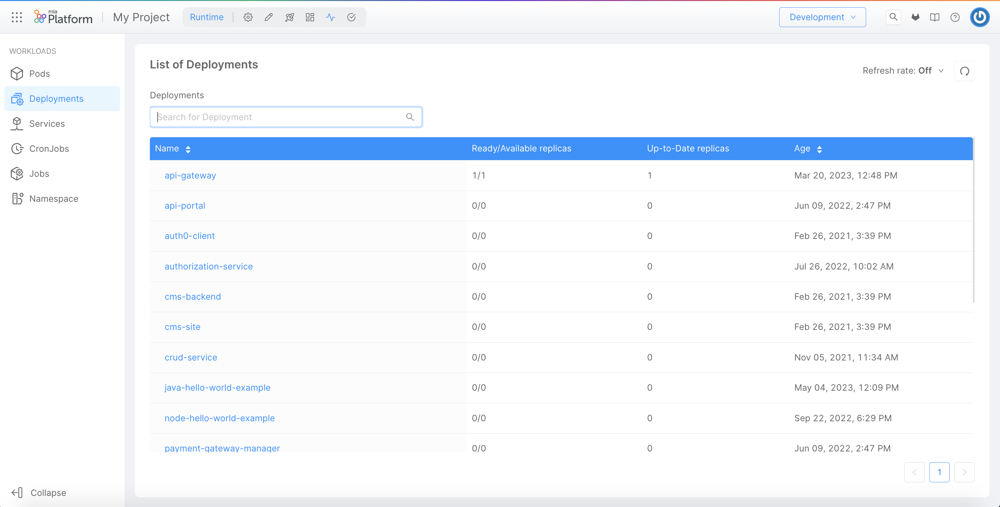
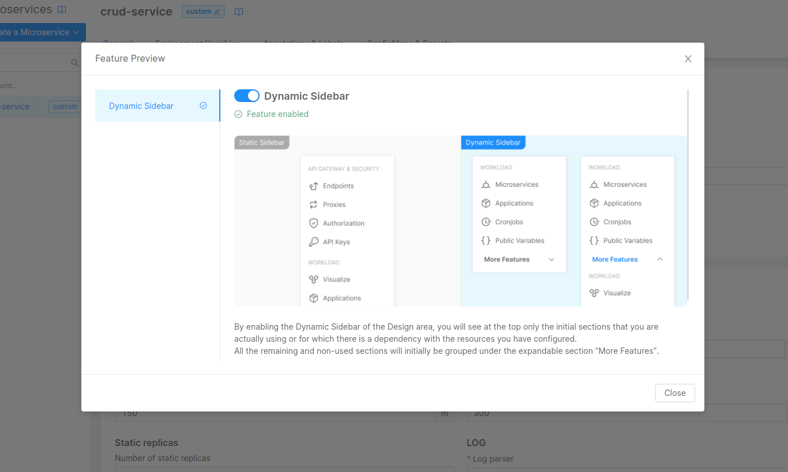
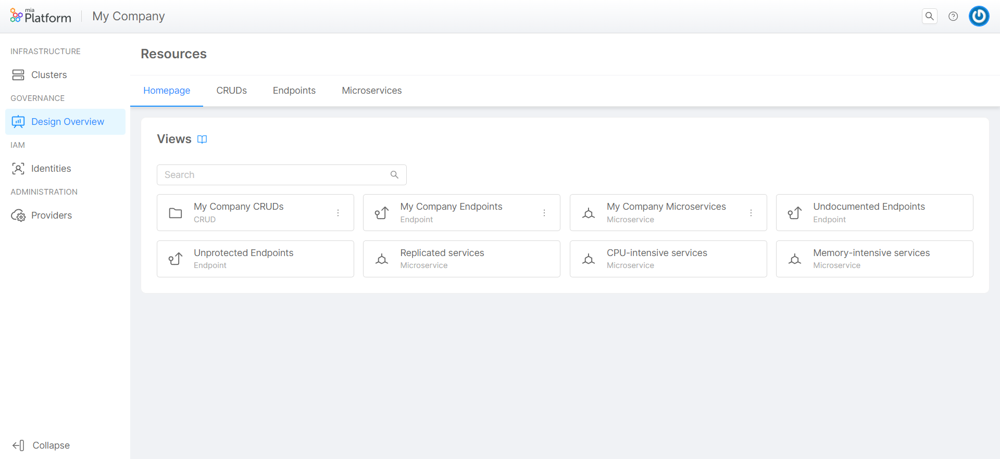
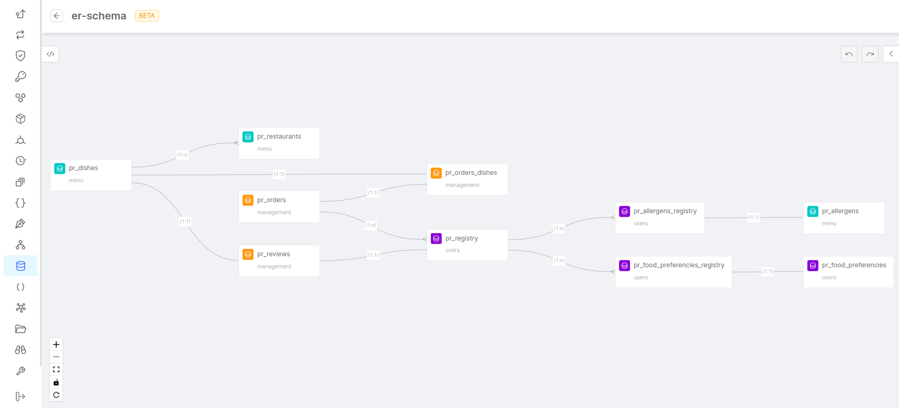
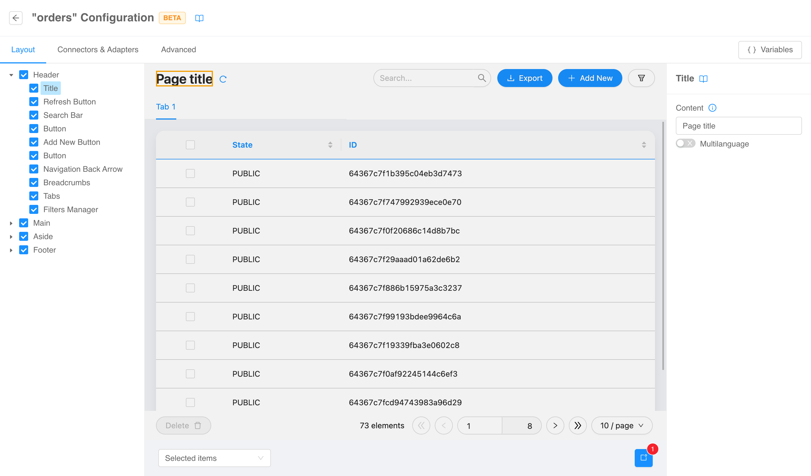

import bannerImageUrl from './img/overview/v11-banner.png'

Welcome to Mia-Platform v11, a major release full of new features and improvements to our Mia-Platform key products: Console, Fast Data, and Backoffice.
This version is designed to provide more advanced and comprehensive solutions in the field of Internal Developer Platforms, Digital Integration Hubs, and Backoffice, with a specific focus on enhancing the Developer Experience.

Don't miss the opportunity to explore all the incredible new features of Mia-Platform v11 and discover how we can help you transform your digital enterprise, providing an optimized development experience centered on developers' needs.

## Console

In Mia-Platform Console, we have introduced new sections for managing clusters, providers, machine-to-machine authentication, and webhooks, as well as support for GitHub Actions and other features.
These enhancements offer more comprehensive control and contribute to improve the overall Developer Experience, making it even more frictionless.

### Providers Management

We have developed Mia-Platform Console so that it can integrate properly with the best and most widely used tools and providers on the market.  
Therefore, to better enhance this integration, we have introduced a proper governance system, and this feature has precisely this goal: to make it easier to keep constantly documented and ordered all the Providers you want the Console to use. 

Through the new dedicated section - named "Providers" - inside Company Overview it will be possible to manage the creation, configuration, and editing of the providers used by Mia-Platform Console (Git Provider, Secret Manager and CI/CD Tools).

Furthermore, always within the same section, it will also be possible to set the default Providers that will be used in all new Projects created in the respective Company. This will enhance the governance of Company Owners on all the Projects of their Companies, granting them better control over the management of company tools.

For more information, [go to the documentation](/console/company-configuration/providers/overview.md).

### Machine-to-Machine Authentication

Service accounts are an essential component of many IT environments, as they allow applications and services to access various resources and perform operations without the need for human intervention.

Assigning roles and permissions to Service accounts lets you improve the speed, reliability, and scalability of your CI/CD workflows.
Service accounts may be suitable for those applications that require continuous monitoring, reporting, and data processing; alternatively, you can use them also to streamline the process of deploying code changes to an application, for instance by assigning them permissions to trigger automatic deploys.  
Moreover, they can also be great for security concerns: using Service accounts promotes the separation of roles and responsibilities, which reduces the risk of credential misuse or theft.

With Mia-Platform Console you can now create and manage Service accounts, and start to implement automated processes with machine-to-machine communication.

For more information, [go to the documentation](/development_suite/identity-and-access-management/manage-service-accounts.md).

### Webhooks Management

Each user has different needs, especially depending on their business. We believe it is essential to give each user the ability to manage additional custom flows when certain events occur in the Console.

For this reason, we have introduced the possibility for the user to subscribe to specific events in Console via HTTP webhooks, through our CMS. With this feature it will be possible to configure custom HTTP calls that will be triggered when the respective events take place in Console.

For now, the supported events are:

* Project Creation  
* Service Creation

For more information, [go to the documentation](/development_suite/webhooks-and-events/webhooks.md).

### New Cluster connection

Mia-Platform v11 supports all the best and most widely used Runtime Services on the market.

Within the Console, the experience of connecting a Cluster has been significantly improved, so that you can choose your configuration from a predefined set of officially supported Runtime Services divided by vendor and have a clearer and more intuitive experience.

For more information, [go to the documentation](/development_suite/clusters-management/cluster-setup.mdx).

### Enhanced Runtime area

The Runtime area has been enriched with several new k8s resources: after the introduction of Pods and Namespaces, we are now welcoming also Deployments, Services, Cronjobs, and Jobs sections!  

You can now monitor all these k8s resources and their related properties directly on Mia-Platform Console.

For more information, [go to the documentation](/development_suite/monitoring/introduction.md).

### Support GitHub Actions

Mia-Platform Console v11 supports a widely used and popular tool in the market: the GitHub Actions!  
From now on, GitHub Actions can be used and configured as a CI/CD tool in Console to deploy your workloads.

For more information, [go to the documentation](/development_suite/deploy/pipeline-based/configure-github-actions.md).

### Feature Preview

We want you to always keep up with our innovation process. For this reason, for our Console SaaS users we have introduced the Feature Preview section: a place inside of Mia-Platform Console where you can decide to try out the Console features available in Preview.  

You can access this section from the Console launchbar: to discover more, just visit the Feature Preview section, try our new features and tell us what you think by providing us precious feedback!

For more information, [go to the documentation](/development_suite/user-settings/feature-preview.md).

### Design Overview

In the Design Overview section – accessible from Company Overview – you can now get a brief overview of your Company, by accessing a rich set of visualization tools that can help you aggregate resources from all Projects across your Company into a single table.
  
From this section you can easily search, sort, and filter Endpoints, Microservices and CRUDs collections of your Company, save them as custom views for easy access and share this data with all Company users.

For more information, [go to the documentation](/development_suite/governance/design-overview.md).

### Console CLI

For all CLI lovers, we have great news: Mia-Platform Console v11 will have its own CLI. So let's give a big welcome to our new `miactl`!  
For now, the CLI will only be available for SaaS users, but more good news will come soon!

The commands supported to date are:

* User authentication
* Context management
* Company list
* Project visualization
* Project deploy and status deploy

We are constantly working to integrate more and more commands, so stay tuned!

For more information, [go to the documentation](/cli/miactl/10_overview.md).

## Fast Data

In Mia-Platform Fast Data, the main innovations include the ability to store data in buckets, No Code configuration, and the introduction of new, ready-to-use connectors.
These features make the product even more versatile and powerful, simplifying data management and integration.

### ER Schema No Code Configuration

We understand the importance of having a user-friendly interface. That's why we have introduced the ER Schema No Code configuration for Mia-Platform Fast Data.

With this new feature, you can easily configure and build your ER Schema directly from the System of Record page.  
The ER Schema section is now more intuitive and easy to use, making it simpler to define relationships between projections and the rules that connect them to one another.

One of the key advantages of this feature is the drag and drop functionality, which allows you to import projections into a canvas quickly.  
From there, you can easily define their relationships and create rules that connect them to one another.

Overall, the ER Schema No Code configuration for Mia-Platform Fast Data is a game-changer in terms of simplifying the process of configuring services from the Console, making it easier than ever to create the ER Schema the user needs to power up any data-driven applications.

Find out more about this functionality in the [official documentation](/fast_data/configuration/config_maps/erSchema.md#use-the-no-code)!

### Fast Data Connectors

We are thrilled to announce one of the most requested feature to Mia-Platform Fast Data, featuring the addition of new plug-and-play connectors that make it easier than ever to connect and manage your data! 

At the heart of Mia-Platform Fast Data product there is a commitment to help our customers unlock the full potential of their data. With these new plug-and-play connectors, we are proud to take another step towards achieving this goal.

With these new connectors, you can seamlessly integrate your data from a wide variety of sources, including databases, bucket storages and more, leveraging on Debezium CDC and other tailored-made connectors.

We understand that managing data can be a complex and time-consuming process, which is why we integrated these connectors to be as easy to use as possible.  
With just a few clicks, you can quickly and easily set up connections to your data sources, and start managing your data in the best way for your business.

Do not miss out the [official documentation](/fast_data/connectors/overview.md)!

### Bucket Storage Support

We value data, and we value the importance of having different ways to store data and their accessibility.

Bucket Storage Support will provide users with a simple and reliable way to store and manage their data.  
Users can now easily store their data to a cloud storage bucket (Google Buckets and S3-like Buckets are supported) and can be sure that their data is securely stored and easily accessible whenever they need it. 

This new feature makes it also easy to restore data according to business needs, thanks to the re-ingestion operation. Users can now easily re-ingest their data into the system, which means they can restore data previously removed with few actions. You just need to call an API to let the re-ingestion flow start.

Lastly, the Bucket Storage Support feature makes it possible to offload the projections storage. This means that users can now offload their projections relying on the data stored in this separate storage bucket, which reduces the amount of storage needed in the main system. This can lead to significant cost savings and improved system performance.

The Bucket Storage Support feature provides users greater control over their data and makes it easier to backup, re-ingest, and manage their data.

Do not miss out the [official documentation](/fast_data/bucket_storage_support/overview.md)!

## Backoffice

In Mia-Platform Backoffice, we have enriched the product with new features, including the ability to configure it in No Code mode.
These updates streamline daily management, allowing for greater control of pages and sections, and increasing operational efficiency.

### Backoffice Low Code / No Code configurator

Our mission is to simplify the Development Experience, and the Backoffice Low Code / No Code Configurator goes towards this direction. 

This powerful feature empowers users to easily configure frontend pages in a No Code manner and configure properties to configure all the back-kit components and micro-lc within the same page.

With this new feature, users can now quickly and easily customize the layout of their Backoffice pages without the need for technical skills or coding knowledge.  
This means that non-tech people can now have more control over their Backoffice design and functionality, resulting in a more streamlined and efficient workflow, and creating pages that are tailored to their specific needs and preferences.

The Backoffice Configurator No Code feature allows users to easily configure properties such as colors, layouts, and all the web components properties in a smart and easy way.

Do not miss out the [official documentation](/business_suite/backoffice-configurator/10_overview.md)!

