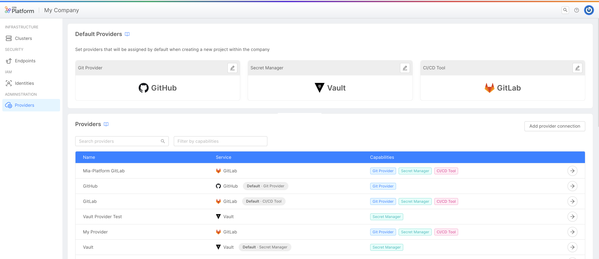

import bannerImageUrl from './img/banner-overview-v11.png'

We are excited to announce the arrival of Mia-Platform V11, a major release that brings numerous new features and improvements to our key products: Console, Fast Data, and Backoffice.
This version is designed to provide more advanced and comprehensive solutions in the field of Internal Developer Platforms, Digital Integration Hubs, and Backoffice, with a specific focus on enhancing the Developer Experience.

In the Console, we have introduced new sections for managing clusters, providers, machine 2 machine authentication, and webhooks, as well as support for GitHub Actions.
These enhancements offer more comprehensive control and a smoother development experience for users, improving the overall Developer Experience.

In Fast Data, the main innovations include the ability to store data in buckets, no-code configuration, and the introduction of new, ready-to-use connectors.
These features make the product even more versatile and powerful, simplifying data management and integration.

For the Backoffice, we have enriched the product with new features, including the ability to configure the entire backoffice in no-code mode.
These updates streamline daily management, allowing for greater control of pages and sections, and increasing operational efficiency.

Don't miss the opportunity to explore all the incredible new features of Mia-Platform V11 and discover how we can help you transform your digital enterprise, providing an optimized development experience centered on developers' needs.
Mia-Platform V11, Simplify Complexity.

## Console

### Providers Management

We have developed the Mia-Platform Console so that it can integrates properly with the best and most widely used tools and providers on the market. 

However, this integration needs a proper governance system, and this feature has just that goal: to make it easier to keep constantly documented and ordered all the Providers you want the console to use. Through the new dedicated section - named "Providers" - inside the "Company Overview" area it will be possible to manage the creation, configuration, and editing of the providers used by Mia-Platform Console (GitProvider, Secret Manager and CI/CD Tools).

Furthermore, again through the same section, it will be possible to set the default Providers that will be used in all new projects created in the respective company. This will enhance the governance of Company Owners on all the Projects of their Companies, granting them better control over the management of company tools.

### Machine-to-Machine Authentication

Service accounts are an essential component of many IT environments, allowing applications and services to access various resources and perform operations without the need for human intervention.
Mia-Platform Console allows to create and manage service accounts, useful for automating processes that previously had to be done by a human user.
Assign roles and permissions to service accounts lets you to improve speed, reliability and scalability of your CI/CD workflows.
For instance, service accounts are useful for applications that require continuous monitoring, reporting, and data processing, or you can give the permission to trigger automatic deploys, which can significantly streamline the process of deploying code changes to an application.
Service accounts are also potentially great for security. Using service accounts promotes the separation of roles and responsibilities, which reduces the risk of credential misuse or theft.

### Webhooks Management

### New Cluster connection

### Enhanced Runtime area

Runtime Area has been enhanced with lots new k8s resources to be monitored directly from Mia-Platform Console.
After Pods and Namespaces, welcome to Deployments, Services, Cronjobs and Jobs sections, wherein it is possible to monitor these k8s resources and their relative properties.

### Support GitHub Actions

### Feature Preview

Keep up with innovation and try new Console Features available in Preview exclusively for our Console SaaS users.
Access the Feature Preview section from Console launchbar, enable them and give us precious feedback!

## Fast Data

### Er Schema No Code Configuration

Simplifying how it is possible to configure the services from the console has been the main focus of the last period. The Er Schema No Code configuration for Fast Data moves in this direction. From the dedicated Er Schema section inside the System of Record page, it is now possible to configure and build your Er Schema with an easy-to-use and user-friendly interface! As you can see from the picture, with the drag&drop functionality, it is possible to import projections inside a canvas, define their relationships, and the rules that connect the projections to each other.

Find out more about this functionality in the official documentation! <!---TODO add link to the documentation-->

<!---TODO: add picture-->

### Connectors

### Bucket Storage

## Marketplace

## Backoffice

### Backoffice Low Code / No Code configurator
