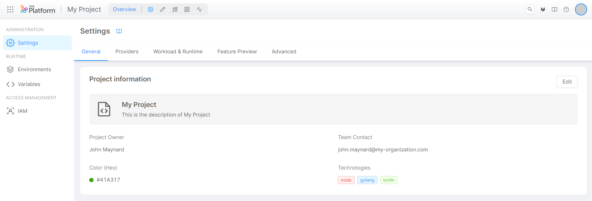

:::info
Mia-Platform Console v12.0.0 is now in Preview and will be generally available on November 30.  
Please read the following [Release Note documentation page](/v12.0.0.md) to discover how to try it out!
:::

Welcome to Mia-Platform v12!  
This latest major release is focused on scaling Developer Experience (DevX), amplifying efficiency and raising the bar of Platform Engineering and Composability.  
Let's take a closer look to all the new features included in Mia-Platform v12.

## Enhanced Project Workflow with GitOps support

Mia-Platform Console offers the opportunity to work on projects with a significantly improved workflow, as well as paving the way for the adoption of previously unavailable opportunities, such as the GitOps deployment strategy.  
From now on, you can leverage the **Enhanced Project Workflow**. Enjoy the significant performance improvement on your Console main workflows in Design Area, thanks to the new configuration management strategy, and unlock the possibility to adopt a pull-based deployment strategy, by integrating your Project with a GitOps tool.  
Start creating your first Project with the Enhanced Workflow, and unlock the potential of GitOps!

:::info
This is a BETA feature and, as such, is currently under active development.
:::

To learn more about all the advantages offered by this feature and its future developments roadmap, take a look at the video below and read the [official documentation](/development_suite/set-up-infrastructure/enhanced-project-workflow.md).

<iframe width="560" height="315" src="https://www.youtube.com/embed/RvEn12wYZi8?si=uAJpkk4NDhwkoktg" title="YouTube video player" frameborder="0" allow="accelerometer; autoplay; clipboard-write; encrypted-media; gyroscope; picture-in-picture; web-share" allowfullscreen></iframe>

## Enriching Fast Data No-Code

We further improved the No-Code functionalities of Mia-Platform Fast Data, and now it will only takes you 1 hour to aggregate a Single View from scratch.
Below you can find a video that shows you how it works.  

To learn more, please refer to the [documentation](/fast_data/configuration/config_maps/aggregation.md#use-the-no-code).

<iframe width="560" height="315" src="https://www.youtube.com/embed/tvjjawZGH9k?si=eefU5TKfMpBLvexv" title="YouTube video player" frameborder="0" allow="accelerometer; autoplay; clipboard-write; encrypted-media; gyroscope; picture-in-picture; web-share" allowfullscreen></iframe>

### Import and export between projects

It is now possible to import and export different assets from one project to another.
The assets that can be imported and exported include:

- Projections;
- Single Views;
- Configurations.

To learn more about this feature, visit the [related documentation](/fast_data/configuration/import_export.md).

### Refactored architecture

We refactored the architecture of Mia-Platform Fast Data to enable the integration of new technologies and services.  
The new architecture has significantly improved overall performance.

For more info, go to the [documentation](/fast_data/architecture.md#event-driven-architecture).

## Internal Company Marketplace

With Mia-Platform v12 it is now possible to configure individual Marketplace services so that they are exclusively accessible to members of your company.  

To learn more about this feature, take a look at the video below and read the [official documentation](/marketplace/add_to_marketplace/contributing_overview.md#public-and-internal-company-marketplace).

<iframe width="560" height="315" src="https://www.youtube.com/embed/YFwTAZmPSsc?si=KQz6LrorFth0GIlo" title="YouTube video player" frameborder="0" allow="accelerometer; autoplay; clipboard-write; encrypted-media; gyroscope; picture-in-picture; web-share" allowfullscreen></iframe>

## Microfrontend Composer (formerly BackOffice)

Mia-Platform Backoffice is now called Microfrontend Composer. You will find all the documentation updated with the new name. 
Thanks to it, you can seamlessly compose complex internal apps using both ready‑to-use and custom libraries and templates.
We improved the development experience to make it as smooth and intuitive as possible by enhancing the No-Code functionality.
Microfrontend Composer still leverages the open-source tool [micro-lc](https://micro-lc.io/docs).  

Take a look at the video below to see its potential.

:::info
This video was recorded before the new name was implemented in production. 
Observed naming differences explained by this timing variance.
:::

<iframe width="560" height="315" src="https://www.youtube.com/embed/ap6BKyWxQpk?si=uqBnS_EvkQnLCVbd" title="YouTube video player" frameborder="0" allow="accelerometer; autoplay; clipboard-write; encrypted-media; gyroscope; picture-in-picture; web-share" allowfullscreen></iframe>

## A New Look and Feel for Console

We renewed the navigation of Mia-Platform Console, to make it even more developer-friendly. The design is engineered to reduce cognitive load, cut distraction points, increase focus and streamline navigation within the Mia-Platform Console.

:::info
This feature is in Preview and is exclusively available for SaaS users. Activate it from [Feature Preview](/development_suite/user-settings/feature-preview.md) section to test it.
:::

## Manage Event Webhook From UI

Create your own custom deployment mechanism with Webhooks.  
Webhooks allow users to create custom logic when specific events occur.

To learn more, take a look at the video below and read the [official documentation](/development_suite/webhooks-and-events/webhooks.md)

<iframe width="560" height="315" src="https://www.youtube.com/embed/_Vq6mYHY728?si=WPpYOWdef6LCo3xt" title="YouTube video player" frameborder="0" allow="accelerometer; autoplay; clipboard-write; encrypted-media; gyroscope; picture-in-picture; web-share" allowfullscreen></iframe>

## Enhanced Settings Management

Inside the 'Overview' Area of a Project, the revised 'Settings' section has been enriched on new functionalities to speed-up and optimize the overall administration of Projects, which – until now – was only possible exclusively via CMS, making it no longer tedious or error-prone!

For more information, [go to the official documentation](/console/project-configuration/project-settings.md).

## Envoy API Gateway Listeners Management

In Projects using Envoy API Gateway, Mia-Platform Console allows you to easily configure endpoint exposure on the desired hosts without having to manually specify it in the YAML file.

For more information, [go to the documentation](/development_suite/api-console/api-design/listeners.md).

## User Groups Management

[IAM section](/development_suite/identity-and-access-management/index.md) has been enriched with User Groups Management.  
Thanks to groups it is possible to simplify and speed-up the management of a multitude of users who have to be assigned the same privileges.  
Users management through groups sits alongside the current individual identities access management, to allow you to better structure access to resources and fit your teams structure, giving you the freedom to choose how to govern access levels of your Company users.

For more information, [go to the documentation](/development_suite/identity-and-access-management/manage-groups.md).

## Manual Launch Of CronJobs

Launch immediate executions of CronJobs directly from the Runtime area of the Console.  
Once launched, you will see the created Job and the relative Pod in the dedicated resource sections of the Runtime area.

For more information, [go to the documentation](/development_suite/monitoring/resources/cronjobs.md#manually-launching-a-cronjob).

## Client Credentials as cluster auth for AKS

Via Mia-Platform Console, it is now possible to add Azure Kubernetes Service (AKS) clusters with client credentials authentication.

For more information, [go to the documentation](link).

<!-- fixme: DOC LINK TO BE ADDED -->

##  Internal Company Marketplace management through miactl

Thanks to *miactl (Mia-Platform CLI)*, you can manage the items of your Internal Company Marketplace without the need to use the CMS!  

Discover more about the power of our CLI and [visit the official miactl documentation](/cli/miactl/10_overview.md).
