export const Highlight = ({children, color}) => (
  
    {children}
  
);

**Welcome to Mia-Platform v13!**

# Compose your Platform
With our latest release, we empower you to "Compose your Platform", offering the freedom to craft it just the way you envision it. Whether you're forging new paths or refining existing strategies, Mia-Platform v13 is here to support you every step of the way, giving you the flexibility and control you need to find a solution that fits you.
Let's take a closer look at all the new features included in Mia-Platform v13!

## Platforge: Enhance Extensibility

In today's fast-paced tech landscape, adaptability is key. That's why Mia-Platform v13 takes extensibility to the next level, making it easier than ever to integrate third-party tools and custom functionalities into your platform.
We welcome **Platforge**, our brand new Extensibility toolkit, to the Mia-Platform eco-system!
The main benefits for the user can be summarized by the following:

- Extend development lifecycle to be aligned with the needs of each team (Extend supported runtimes, dev workflows, application management, etc.).
- Users that already use some specific tools can standardize and simplify their developer workflow, integrating them into Mia-Platform Console.

Let's go in deep with the new Features:

### Extend Mia-Platform Console using... the Console! | <Highlight color="#1890FF">v13 - Fall Release</Highlight>

We have strengthened our Platforge Extensibility Kit by adding the possibility to add extensions from Console UI and enriching the type of supported extensions. You can now extend your Console by embedding iFrames, adding External Links & composing your pages with Microfrontend Composer within a dedicated "Extensions" section, accessible to Company Owners within the Platforge section at Company level.

Customizing your Mia-Platform Console has never been so easy: simply select the type of extension, the desired Area and where to display it from the available options, then choose what you want to show your users!

To discover more about how to manage your Extensions and the types of supported extensions, head to the [Extensions documentation](/console/company-configuration/extensions.md).

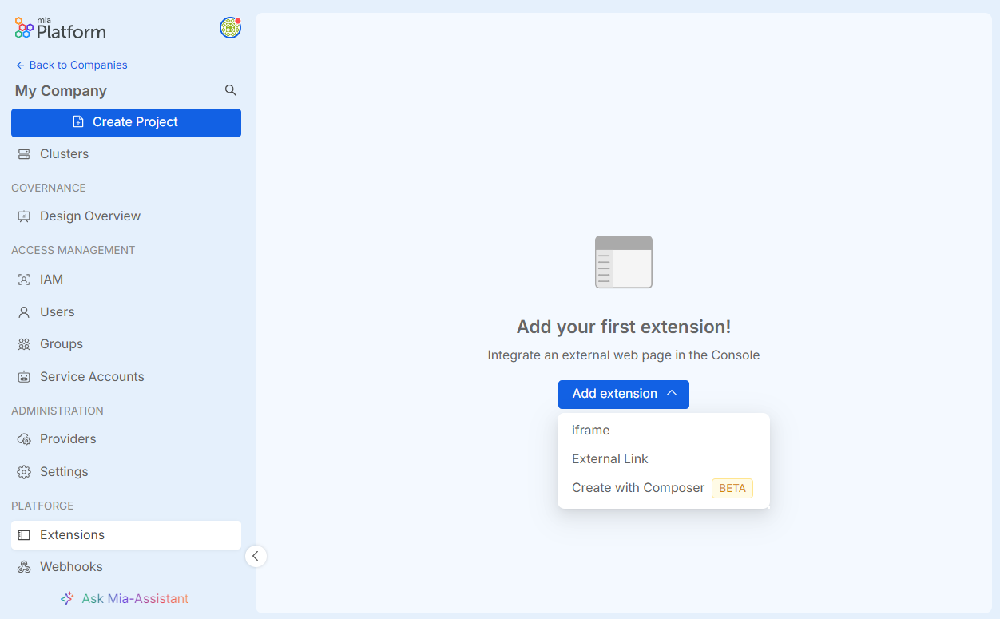

### Extend Frontend of Mia-Platform Console with iFrames

Extend the Console as you like.

From now on, you can seamlessly integrate external web pages within Mia-Platform Console using iFrames.

This empowers Console Users to enrich their experience by effortlessly incorporating tools, dashboards, or external content in our IDP, streamlining development workflows and tailoring the product to suit the business.
This function is now only accessible via Application Programming Interface (API), so it is possible to use the Mia-Platform API portal to integrate the iFrame into different sections of Mia-Platform Console. In future releases, we aim to simplify the integration of iFrame by providing directly a UI.

To learn more, please refer to the [documentation](/console/console-extensibility/overview.md).

### React to Console actions using Webhooks

The variety of Console events suitable for webhook configuration constantly increases, allowing you to react and build custom flows and logic each time the event occurs.

With the introduction of user management events and the introduction of the history of each webhook to facilitate monitoring and debugging, users can now use webhooks to extend Console functionality.

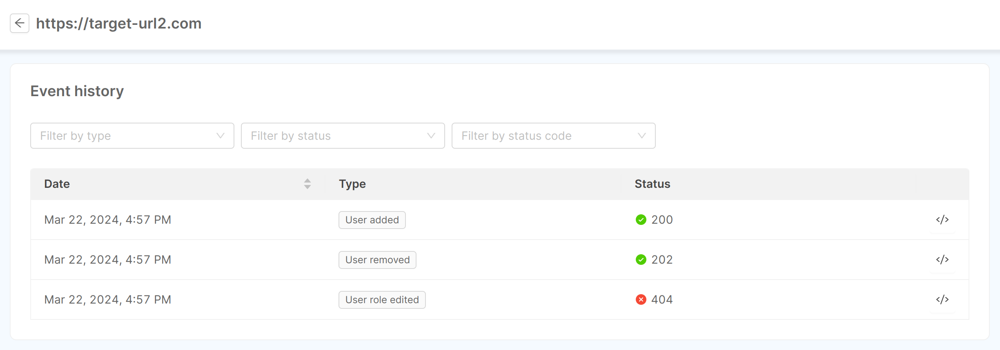

To learn more, please refer to the [documentation](/console/company-configuration/webhooks.md#event-history).

### Connect Backstage portal to Mia-Platform

With Mia-Platform Backstage Plugin is possible to kickstart your Backstage App worry-free, starting from the components already on your Mia-Platform Console.
It keeps your information synchronized effortlessly and gains insights into your Company's domains, Projects, deployment environments, and repository links, all while exploring their interrelations.

You can find the brand new plugin in the [Backstage Marketplace](https://backstage.io/plugins/) looking for Mia-Platform Sync!

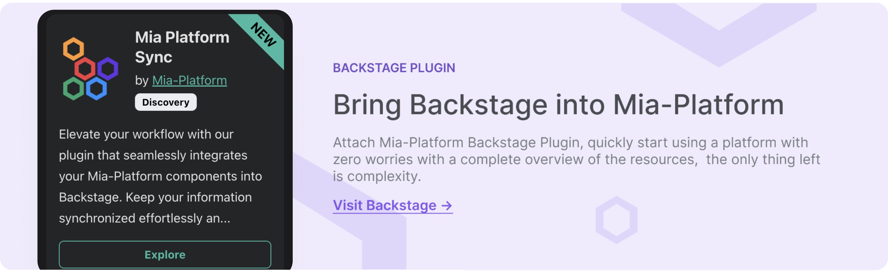

## Infrastructure Management

### Manage Infrastructure Resources through Console 

You can now manage and configure custom objects that are not part of the standard Console supported resources using the classic user interface of the Console. This feature further expands the Console domain over user's entire workloads, enabling greater operability, governance, and control over systems.

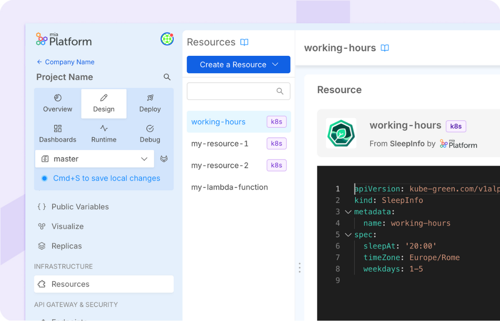

#### Support to all Infrastructure Resources | <Highlight color="#1890FF">v13 - Fall Release</Highlight>

With the Fall release updates we have officially introduced the possibility to manage the provisioning of your infrastructure, configuring - at the Design level - your Infrastructure Resources.  
Within the Design of your Console you can then see a new "Infrastructure" section entirely dedicated to Infrastructure as Code! 

To discover more, please refer to the [documentation page](/console/design-your-projects/custom-resources/custom-resources.md) and check out some useful [use cases](/console/design-your-projects/custom-resources/use-cases.md).

#### Support of Custom Kubernetes Resources in Runtime area | <Highlight color="#1890FF">v13 - Fall Release</Highlight>

We finalized the support for Kubernetes type Resources by introducing the possibility of monitoring such resources at Runtime once deployed.  
For each resource you will be able to access its detail where you will see the respective Describe and Events that are generated, similarly to the other resources in the Runtime Area.

To discover more, you can refer to the [documentation](/console/design-your-projects/custom-resources/custom-resources.md).

## Simplify Composability

Mia-Platform Suite empowers development teams to enhance software composability by facilitating streamlined reuse and embracing scalable approaches. With Mia-Platform v13, software composability is even more NoCode!
The main benefits for the user can be summarized by the following:

- Democratizing access to the IDP's internal tools and utilities
- Providing user-friendly interfaces to facilitate configuration, management, and monitoring of your composable software
- Enhancing already existing No Code tools, taking the Developer Experience to the next level
- Enriching the management of IDP with even more functionalities

Let's go in deep with the new Features:

### Data Catalog Application | <Highlight color="#1890FF">v13 - Fall Release</Highlight>  

Mia-Platform product suite is finally enriched with a new core component, the **Data Catalog** application, an essential tool for performing Data Discovery and Data Governance on your Company data assets.

Mia-Platform Data Catalog serves as a centralized repository of metadata that provides a clear and detailed overview of the Company data assets, reducing time for Data Discovery and empowering Data Governance Teams with powerful metadata management features.

Thanks to Data Catalog, you can reduce Data Discovery time with advanced search capabilities, maintain adherence to numerous data management regulations and laws, such as GDPR in Europe, provide a centralized space for your teams to share data information and knowledge, and improve data quality with powerful metadata enrichment features. In addition, thanks to Data Lineage capabilities, it is possible to understand how data move and transform within your data landscape.

To find out how it works and all the benefits of Mia-Platform Data Catalog, please refer to the related [documentation](/data_catalog/overview.mdx).

### Software Catalog | <Highlight color="#1890FF">v13 - Fall Release</Highlight>

We are excited to announce the launch of the first release of the **Software Catalog**, designed to help you track, manage, and document software across your ecosystem. 
The Software Catalog provides a centralized and reliable way to access software ownership, metadata, lifecycle status, and versions, ensuring accountability throughout the company's software landscape.

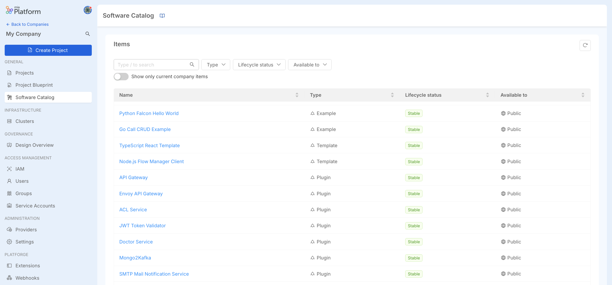

With Mia-Platform Software Catalog, you can:
- Explore available software resources in a centralized location
- View detailed item information, including metadata, lifecycle status, versions, release notes, and availability (Global, Public, or Private)
- Seamlessly navigate between different versions of each item

### Versioning management of Marketplace resources | <Highlight color="#1890FF">v13 - Fall Release</Highlight>

Version control for your Marketplace resources is now available in Mia-Platform Console. Users can manage and access different versions of Plugins and infrastructure Resources, selecting the one that best suits their needs and easily switching between versions. 
If you want to discover more, head to the [dedicated section](/software-catalog/manage-items/overview.md#set-controlled-versions-for-your-marketplace-resources-and-make-them-available-to-users) inside the [Company Marketplace](/software-catalog/manage-items/overview.md) documentation page.

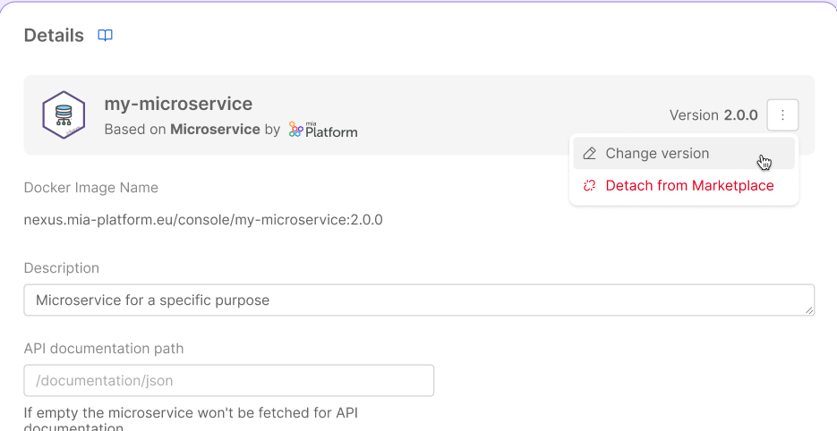

### Seamless Runtime Management with Fast Data Control Plane

Mia-Platform Fast Data has been empowered with a Runtime Management solution, the **Fast Data Control Plane**.

This Fast Data suite component acts as the single central access point for governing the Fast Data Runtime of your entire Company.  
Fast Data Control Plane application provides a general overview of the Fast Data pipelines released on the runtime environment, and allows to monitor and govern the execution of your Fast Data system.  
From its user-friendly web interface, you can pause and resume the consumption of data streams along Fast Data pipelines with just a few clicks to strategically allocate resources consumption and efficiently utilize them during peak demand processes.  

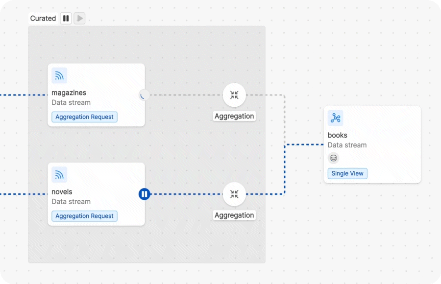

Many are the benefits of adopting the Fast Data control plane in your Fast Data Projects, for example:

- **Optimize Resource Allocation**, by strategically pausing and resuming the consumption of data streams along the Fast Data pipelines
- **[Initial Load and Full Refresh processes management](/fast_data/concepts/data_loading.mdx)**, thanks to a user-friendly interface and without altering the configuration of your workloads deployed in runtime
- **Performance Testing and Simulation**, to simulate different scenarios for performance testing by observing your system behavior under various conditions
- **Enhanced System Reliability**, allowing you to gracefully handle unexpected situations and/or system maintenance periods while minimizing system downtime.

To learn more, please refer to the related [documentation](/fast_data/runtime_management/overview.mdx).

### Streamline how you build your Sagas, now No-Code

Let's welcome a new brand section: the Flow Manager Configurator!

Streamline your workflow with an intuitive graphical interface, designed to simplify the configuration of saga flows for Flow Manager services.
Enjoy No-Code editing and seamless service linking, all compatible with Flow Manager versions 2.0.0 and up.

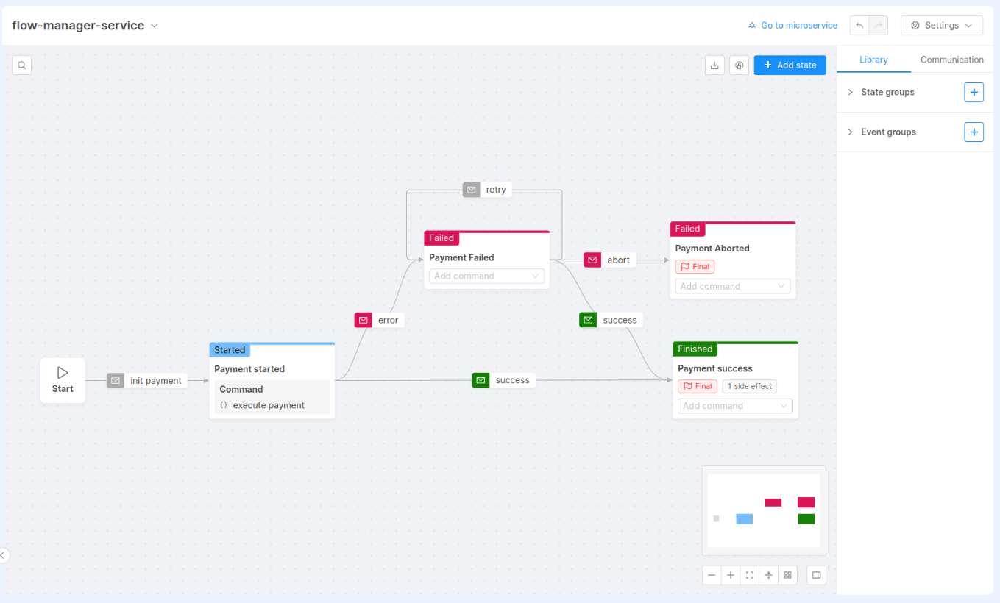

Explore [our documentation](/development_suite/api-console/api-design/flow-manager-configurator/overview.md) for more details.

### Blueprint and Template management via User Interface

Managing Company's Blueprint with their respective Templates and settings is now a child's play: with a dedicated interface, Templates, Environments, and Workload & Runtime settings for all new Company Projects can be created, set up, and modified in just one click.

Forget about using the CMS and use the Console as the star center to manage and govern the entire project lifecycle!

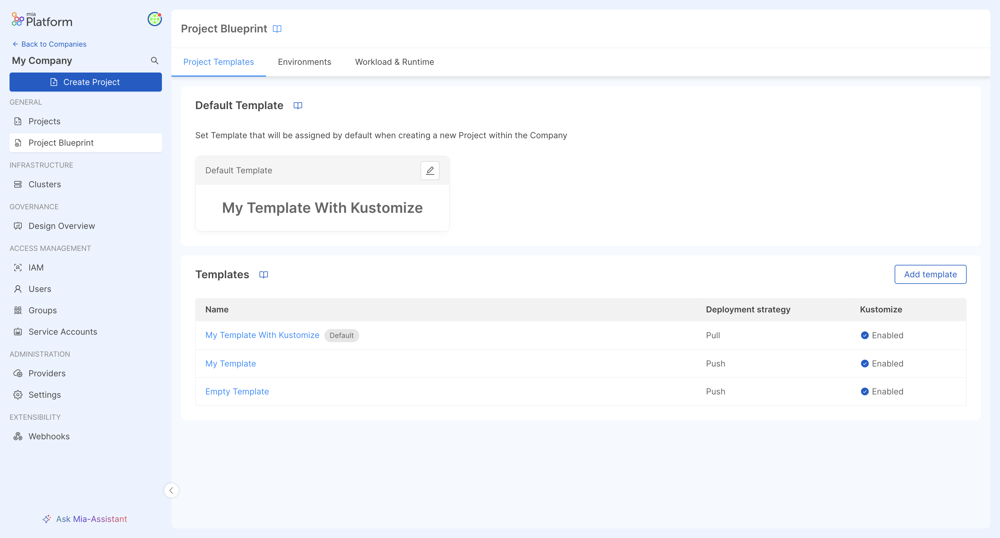

To learn more, please refer to the related [documentation](/console/company-configuration/project-blueprint.md).

### Manage Sidecar containers with Mia-Platform Console

Governing Sidecar containers in your Projects has never been so simple: in the Design area of Mia-Platform Console, we have introduced a brand new `Sidecars` section where you can view and manage all the configurations of your Sidecar containers. You can also manage those Sidecar configurations in the detail page of each of your Microservices.

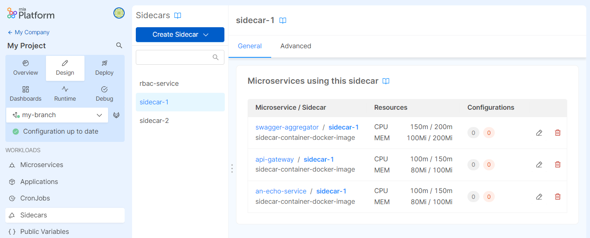

To discover more about how to configure and manage Sidecars, visit the related [documentation page](/console/design-your-projects/sidecars.md).

## Conversational DevX Powered by AI

This version of Mia-Platform Console is the first version powered by Artificial Intelligence! Let's welcome our new **Mia-Assistant**, that will support you in speeding up your onboarding and accelerating your developments when using Mia-Platform Console.

The main benefits for the user can be summarized by the following:

- Speed up the onboarding when discovering Mia-Platform Console
- Facilitate understanding of product features
- Simplify product discoverability
- Speed up the doc search
- Action Advisory
- Simplify access to features

### AI RAG Chat application | <Highlight color="#1890FF">v13 - Fall Release</Highlight>

In this release, we have worked on an application to extend the use of AI assistance with the process of Retrieval-Augmented Generation (RAG) in a simple way. You can then configure a RAG Application chat within your project to easily set up your own chatbot. This application is featuring automatic embeddings generation from website pages.  
For more information on how to configure your custom RAG Application, head to the [related tutorial](/marketplace/tutorials/create-a-rag-application.md).

### Let's welcome Mia-Assistant in Console!

With this release we introduce a first version of our **Mia-Assistant**, an AI-based virtual chat that will make it easier for you to discover our Mia-Platform Console and access its documentation!
Mia-Assistant will answer your questions and provide you the related Mia-Platform documentation reference, to help you retrieve all the information you need and improve your experience with our product!
You can access Mia-Assistant anywhere in Mia-Platform Console, by simply clicking the "Ask Mia-Assistant" button in the bottom left-hand corner of any page.

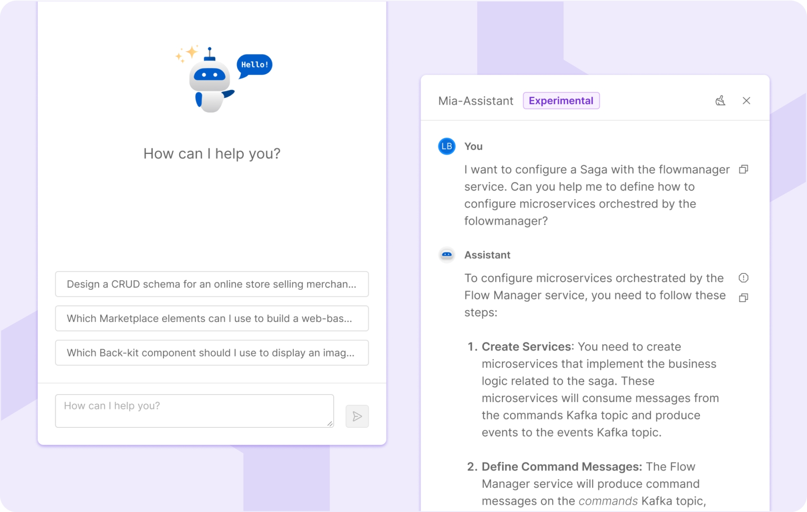

This feature is currently in the **Experimental** phase.

:::info
The **Experimental** status suggests that while the feature is stable, the provided information might not be entirely accurate. We suggest caution in use
:::

We encourage you to give it a try and share your feedback with us. Your input will be invaluable in helping us refine and enhance it!"
