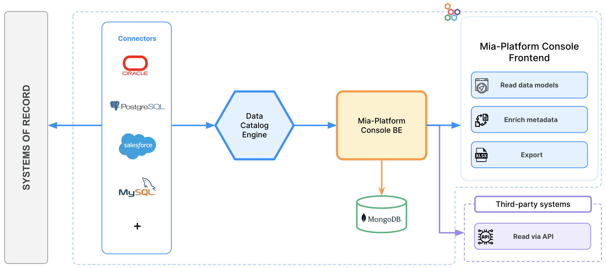

**Welcome to Mia-Platform v13!**

# Compose your Platform
With our latest release we empower you to "Compose your Platform", offering the freedom to craft it just the way you envision it. Whether you're forging new paths or refining existing strategies, Mia-Platform v13 is here to support you every step of the way, giving you the flexibility and control you need to find a solution that fits you.
Let's take a closer look at all the new features included in Mia-Platform v13!

## Platforge: Enhance Extensibility

In today's fast-paced tech landscape, adaptability is key. That's why Mia-Platform v13 takes extensibility to the next level, making it easier than ever to integrate third-party tools and custom functionalities into your platform.  
We welcome **Platforge**, our brand new Extensibility toolkit, in the Mia-Platform eco-system!
The main benefits for the user can be summarized by the following:

- Extend developer lifecycle to be aligned with the needs of each team (Extend supported runtimes, dev workflows, application management, etc.).
- Users that already use some specific tools can standardize and simplify their developer workflow, integrating them into Mia-Platform Console.

Let's go in deep with the new Features:

### Extend Frontend of Mia-Platform Console with iFrames

Extend the Console as you like.

From now on, you can seamlessly integrate external web pages within Mia-Platform Console using iFrames. 

This empowers Console Users to enrich their experience by effortlessly incorporating tools, dashboards, or external content in our IDP, streamlining development workflows and tailoring the product to suit the business.  
This function is now only accessible via Application Programming Interface (API), so it is possible to use the Mia-Platform API portal to integrate the iFrame into different sections of Mia-Platform Console. In future releases, we aim to simplify the integration of iFrame by providing directly a UI.

To learn more, please refer to the [documentation](/console/console-extensibility/overview.md).

### Managing Custom Resources through the Console

You can now manage and configure custom objects that are not part of the standard Console supported resources using the classic user interface of the Console. This feature further expands the Console domain over user's entire workloads, enabling greater operability, governance, and control over systems.

### React to Console actions using Webhooks

The variety of Console events suitable for webhook configuration constantly increases, allowing you to react and build custom flows and logic each time the event occurs. 

With the introduction of user management events and the introduction of the history of each webhook to facilitate monitoring and debugging, users can now use webhooks to extend Console functionality.

To learn more, please refer to the [documentation](/development_suite/webhooks-and-events/webhooks.md#event-history).

### Connect Backstage portal to Mia-Platform

With Mia-Platform Backstage Plugin is possible to kickstart your Backstage App worry-free, starting from the components already on your Mia-Platform Console.
It keeps your information synchronized effortlessly and gains insights into your Company's domains, Projects, deployment environments, and repository links, all while exploring their interrelations.

You can find the brand new plugin in the [Backstage Marketplace](https://backstage.io/plugins/) looking for Mia-Platform Sync!

## Simplify Composability

Mia-Platform Suite empowers development teams to enhance software composability by facilitating streamlined reuse and embracing scalable approaches. With Mia-Platform v13, software composability is even more NoCode! 
The main benefits for the user can be summarized by the following:

- Democratizing access to the IDP's internal tools and utilities
- Providing user-friendly interfaces to facilitate configuration, management, and monitoring of your composable software
- Enhancing already existing No Code tools, taking the Developer Experience to the next level
- Enriching the management of IDP with even more functionalities

Let's go in deep with the new Features:

### Enrich Meta Data and list all your data assets: Data Catalog

Let's welcome our first release of **Data Catalog**, designed to provide the data governance teams and data analysts with a centralized location where all metadata concerning the data assets of an organization are collected.

Set up our Data Catalog Agent, to connect to different external sources, such as Oracle Database, Salesforce, Postgres Database, MySQL Database, Microsoft SQL Server Database, and to extract all metadata existing on your organization's System of Records. 

Through Mia-Platform Console, it is possible to:

- Keep metadata up to date with the external System of Records
- Navigate data models in a centralized place
- Enrich metadata with descriptions and GDPR regulation properties for each table field
- Export your data models in .csv format
- Make metadata usable via Data Catalog API from third-party systems and custom frontends

To learn more, please refer to the [documentation](/runtime_suite_templates/data-catalog/10_overview.md).

### Seamless Runtime Management with Fast Data Control Plane

Mia-Platform Fast Data has been empowered with a Runtime Management solution, the **Fast Data Control Plane**.

This Fast Data suite component provides a general overview of the Fast Data pipelines released on the runtime environment, and allows to monitor and govern the execution of your Fast Data system.  
From its user-friendly web interface, you can pause and resume the consumption of data streams along Fast Data pipelines with just a few clicks to strategically allocate resources consumption and efficiently utilize them during peak demand processes.
Many are the benefits of adopting the Fast Data control plane in your Fast Data Projects, for example:

- **Optimize Resource Allocation**, by strategically pausing and resuming the consumption of data streams along the Fast Data pipelines
- **Initial Load and Full Refresh processes management**, thanks to a user-friendly interface and without altering the configuration of your workloads deployed in runtime 
- **Performance Testing and Simulation**, to simulate different scenarios for performance testing by observing your system behavior under various conditions
- **Enhanced System Reliability**, allowing you to gracefully handle unexpected situations and/or system maintenance periods while minimizing system downtime.

To learn more, please refer to the [documentation](/fast_data/runtime_management/overview.mdx).

### Streamline how you build your Sagas, now No-Code

Let's welcome a new brand section: the Flow Manager Configurator!

Streamline your workflow with an intuitive graphical interface, designed to simplify the configuration of saga flows for Flow Manager services.  
Enjoy No-Code editing and seamless service linking, all compatible with Flow Manager versions 2.0.0 and up.

Explore [our documentation](/development_suite/api-console/api-design/flow-manager-configurator/overview.md) for more details.

### Blueprint and Template management via User Interface

Managing Company's Blueprint with their respective Templates and settings is now a child's play: with a dedicated interface, Templates, Environments, and Workload & Runtime settings for all new Company Projects can be created, set up, and modified in just one click.

Forget about using the CMS and use the Console as the star center to manage and govern the entire project lifecycle!

To learn more, please refer to the related [documentation](/development_suite/company/project-blueprint.md).

### Manage Sidecar containers with Mia-Platform Console

Governing Sidecar containers in your Projects has never been so simple: in the Design area of Mia-Platform Console, we have introduced a brand new `Sidecars` section where you can view and manage all the configurations of your Sidecar containers. You can also manage those Sidecar configurations in the detail page of each of your Microservices.

To discover more about how to configure and manage Sidecars, visit the related [documentation page](/console/design-your-projects/sidecars.md).

## Conversational DevX Powered by AI

This version of Mia-Platform Console is the first version powered by Artificial Intelligence! Let's welcome our new **Mia-Assistant**, that will support you in speeding up your onboarding and accelerating your developments when using Mia-Platform Console.

The main benefits for the user can be summarized by the following:

- Speed up the onboarding when discovering Mia-Platform Console
- Facilitate understanding of product features
- Simplify product discoverability
- Speed up the doc search
- Action Advisory
- Simplify access to features

Let's go in deep with the new Features:

### Mia-Assistant

With this release we introduce a first version of our **Mia-Assistant**, an AI-based virtual chat that will make it easier for you to discover our Mia-Platform Console and access its documentation!
Mia-Assistant will answer your questions and provide you the related Mia-Platform documentation reference, to help you retrieve all the information you need and improve your experience with our product!
You can access Mia-Assistant anywhere in Mia-Platform Console, by simply clicking the "Ask Mia-Assistant" button in the bottom left-hand corner of any page. 

This feature is currently in the **Experimental** phase.

:::info  
The **Experimental** status suggests that while the feature is stable, the provided information might not be entirely accurate. We suggest caution in use
:::

We encourage you to give it a try and share your feedback with us. Your input will be invaluable in helping us refine and enhance it!"
