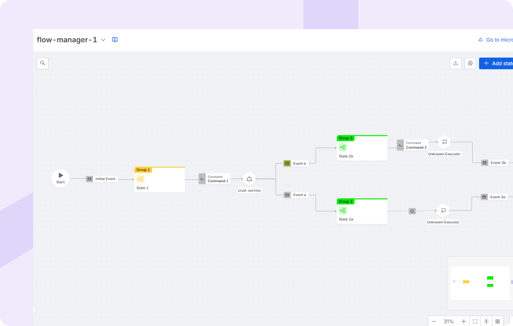

export const Highlight = ({children, color}) => (
  
    {children}
  
);

**Welcome to Mia-Platform v14!**

## AI Native DevX

AI-Native Developer Experience (DevX) focuses on enhancing engineering productivity through the strategic integration of Artificial Intelligence capabilities directly into the developer workflow. A core component of this approach involves leveraging AI-based conversational experiences. These intelligent interfaces are designed to provide immediate, context-aware assistance tailored to individual developer needs and workflows, simplify the discovery and utilization of available services, and surface actionable insights derived from operational data, ultimately fostering a more efficient and empowered development environment.

### Clone Microservice repository via Cursor AI IDE 

Now you can easily clone your Microservice repository into the Cursor AI IDE directly from the Mia-Platform Console. This integration provides an easy way to access your service code, enabling a smoother development experience powered by the intelligence of Cursor AI, with support for both `ssh` and `https` protocols.

## AI Agent Lifecycle

Effective management necessitates comprehensive oversight across the entire operational lifespan of AI agents. The Mia-Platform AI Agent Lifecycle Management framework provides this essential structure. By centralizing control mechanisms and AI Agents Orchestration, this system ensures secure operations and maintains full compliance with established standards at every stage. Concurrently, the framework facilitates seamless interaction and collaboration between diverse agents, contributing to the development of a more reliable, efficient, and efficient AI ecosystem.

### AI Agentic Features for your Company - Debug with Mia-Assistant

Mia-Platform Console now brings the agentic power of AI to your Company and Projects. Just ensure the "AI settings" toggle is active to enable Mia-Assistant access to your resources and start using its features, beginning with **Debug with Mia-Assistant**.  
When inside any Project, simply type `/debug` in the Mia-Assistant chat and start asking insights about your Runtime!

### AI Agents Orchestration with Flow Manager

The Flow Manager now allows for seamless orchestration of **AI Agents** within workflows. This new functionality enables users to integrate and manage multiple AI agents, coordinating their actions to automate complex tasks more efficiently. 
By using the Flow Manager Configurator, organizations can improve operational efficiency, ensuring that AI agents collaborate effectively to deliver faster and more accurate results.

### AI Coder Agent

[...]

### AI Composer Agent

[...]

## Self-service Applications

The Self-Service Application Development paradigm aims to significantly accelerate software delivery timelines. This acceleration is realized through the provision of a Software Catalog, which offers readily available, reusable components, coupled with access to a suite of composable and orchestrated technologies. The entire process operates within a framework of flexible governance, strategically designed to abstract underlying complexities and thereby permit development teams to dedicate their primary focus to the implementation of essential business logic.

### Enhancing Software Catalog and Release Management

In v14, we've significantly enhanced the Software Catalog, improving both management and precision. Key updates include comprehensive item schema reviews, ensuring all definitions are standardized, fully documented, and easily accessible to stakeholders. Addiotionally, the manifests for the public items in the Mia-Platform catalog are now publicly available [here](https://github.com/mia-platform-marketplace/public-catalog), offering greater transparency.

### Software Items Lifecycle renewed

We've also revamped the **release life cycle** with new stages like `Coming soon`,`Draft`,`Published`,`Maintenance`,`Deprecated`,`Archived`, and `Deleted`. These changes provide a more structured and adaptable framework for managing catalog items, from development to retirement, making the process more efficient and reliable.

### Headless Catalog

Furthermore, the marketplace APIs have been optimized and are now officially published on the API portal, ensuring easy access for all users.

## Real time data integration

The Real-Time Data Integration capability is focusing on streamlining data collection processes from various sources, automatically enriching datasets with pertinent metadata for improved context and usability, and establishing governed mechanisms for controlled data access. This suite facilitates real-time decoupling between systems by enabling asynchronous data exchange, thereby providing the continuous, low-latency data flows necessary to fuel the core platform operations and power associated Artificial Intelligence functions.

### Data Lineage

Mia-Platform Data Catalog introduces **Data Lineage**, a powerful tool for understanding, visualizing, and describing the flow and transformations of data within an organization.  
This feature allows users to explore data relationships at two complementary levels: **Table Lineage** and **System of Record (SoR) Lineage**, providing both granular insights and a holistic overview of data flows.  
By offering a detailed visualization of data dependencies and relationships, the **Lineage** view enables users to perform impact analyses, identify potential bottlenecks, and ensure compliance across data workflows.  
Users can enrich the **Lineage** with **virtual assets** and **jobs**, allowing them to complete relationships not yet automatically retrieved and to clearly describe the context and purpose of each data flow.  
If you're using **Fast Data Control Plane**, aggregation processes configured within your **Fast Data Projects** are automatically captured, making **Fast Data jobs** directly visible on the **Lineage** canvas.

To find out how it works and all the benefits of our Data Lineage solution, please refer to the related [documentation](/data_catalog/frontend/data_lineage.mdx).

### Integration Connector Agent

The **Integration Connector Agent** is a modular plugin designed to enable seamless **data integration** between external **sources** and **sinks**.  
It collects data from external systems, processes and normalizes it, and then sends the data to a defined sink. The Agent supports multiple sources, including **webhooks** from services such as **Mia-Platform Console** and **Jira**, and integrates with **MongoDB** as the current supported sink.  
Thanks to its pluggable architecture, it allows easy integration of new sources and sinks with minimal configuration effort.  

By automating data flows and ensuring consistency across platforms, the Integration Connector Agent centralizes data storage, enabling the collection of information from multiple sources and its storage in the target destination. It also facilitates **data synchronization and transformation**, improving data accessibility, streamlining workflows, and supporting more effective reporting and decision-making across systems.

To learn more about all the features and how to configure it, visit the [official documentation](/runtime_suite/integration-connector-agent/10_overview.md).

### New Flow Manager Configurator layout

The Flow Manager Configurator layout has been redesigned to provide enhanced control and visibility. Users can now easily view and manage flows, add external executors, and track commands, events, and state transitions, improving the efficiency and flexibility of self-service application management.

## Platform Engineering enablement

Platform Engineering enablement is fundamentally concerned with establishing clear governance frameworks, which are operationalized through the definition and promotion of standardized 'golden paths' for software delivery processes. This approach empowers development teams by providing structured self-service access to required tools and infrastructure, typically mediated through an Internal Developer Portal (IDP) and managed by a Platform Orchestrator with a significant reduction of cognitive load imposed upon developers, achieved via the effective abstraction of underlying technological and operational complexities.

### Environment centric workflow for Projects (only for Enhanced Projects) <Highlight color="#e5c762">BETA</Highlight>

Mia-Platform Console now features a redesigned environment management system, significantly streamlining your Design workflow. 
The concept of branches in the Design area has been replaced, with the environment now serving as the central element for each area.   
Users will work directly within specific environments across all Mia-Platform Console sections, establishing a consistent and intuitive experience and aligning the Design area with the logical structure of other Mia-Platform Console areas.

### Kubernetes Import via miactl 

You can now perform a more efficient way to bring your existing Kubernetes environments into your Console Projects thanks to the new miactl project import command. This feature allows you to seamlessly onboard Kubernetes workloads by importing your YAML configurations directly into a new Project. This process significantly speeds up integration and reduces the effort of rebuilding your Kubernetes setup from the ground up within the Console.

### iframe extensions support login with Console SSO

Iframe extensions now benefit from a unified and secure authentication framework using Console Single Sign-On (SSO). This enhancement allows iframe extensions to recognize user permissions and manage authentication and authorization seamlessly. By leveraging Console SSO in your extensions, only authorized users can access and interact with specific iframe extensions, enhancing overall security and control across Mia-Platform Console.

### Auto-generated form in Infrastructure Resource Creation 

Creating new Infrastructure Resources in the Design area is now easier than ever.  
For Marketplace resources with defined JSON schemas, the system will automatically generate a user-friendly form. This form clearly displays all required properties along with helpful descriptions, guiding users through the configuration process.

### Centralized management of the Container Registries

You can now manage your container registries more effectively within your Projects. Access a dedicated section in your Project settings to view, create, and delete registries as needed. This provides centralized monitoring and control over your container registry landscape and allows you to specify the desired registry directly at the service level in the Design area.

### Monitor Audit Logs of your Company 

Stay informed and in control with our new Audit Logs feature, designed to provide clear visibility into actions performed across your Company. Effortlessly track and monitor user activities through this powerful and centralized tool. By centralizing these logs, you can significantly enhance security protocols, streamline compliance efforts, and develop a deeper understanding of your Company's operational flow.

bonus ? 
### Compare different revisions
### Configuration Saved webhook 
### Specificy the Rate limit for Endpoints' subroutes
### Support for custom port and HTTP/2 protocol in Endpoints Configuration

## Secure Cloud Ops

Upholding high standards of service reliability and maintaining the comprehensive security posture required for business operations within complex, distributed platform environments is key for IT Organizations. This involves the implementation and management of Infrastructure resources, robust operational controls, cost and resources utilization monitoring, security measures, and resilience strategies.

### Projects for Infrastructure Provisioning  

Take greater control over your infrastructure provisioning with the new dedicated Project category in the Mia-Platform Console. Designed for Operations teams, these specialized Projects facilitate management of infrastructure resources within the Console, aligning with Infrastructure as Code practices. Easily visualize and manage your infrastructure state, and execute provisioning actions with improved efficiency for your infrastructure-related tasks.

