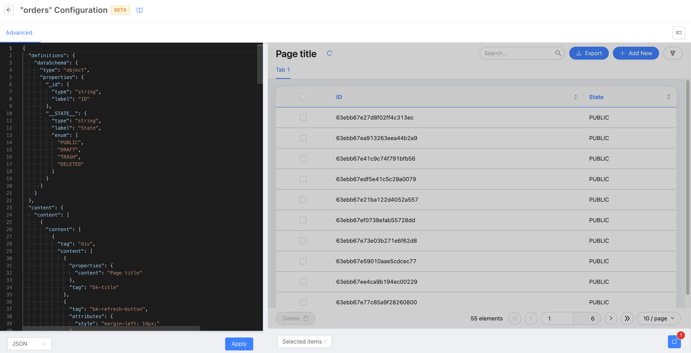
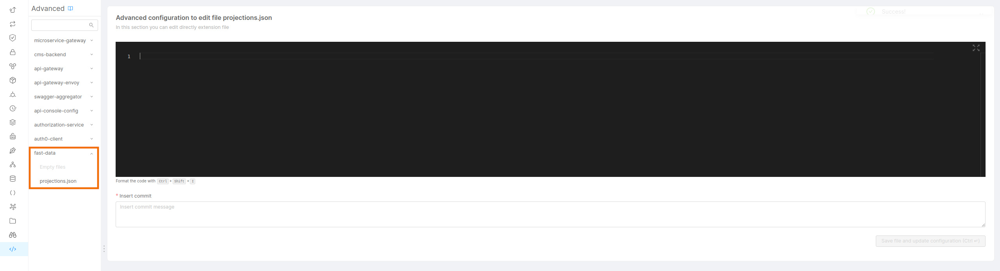

_February 16, 2023_

## Console

### New Features

#### Backoffice Low Code Configuration

:::info
This feature is still in BETA, do not miss out the [official documentation](/business_suite/backoffice_configuration/overview.md) page for further information.
:::

The new Backoffice Low Code Configuration is now generally available for all Console users!
In the Console section dedicated to Backoffice, you can now configure your Backoffice pages and layouts, using a JSON configuration. This section is fitted with a fancy and fully functional preview tool that allows direct interactions with your designed front-end.

[]

Don't miss all the other Backoffice improvements in the [dedicated section](#backoffice---1.3.4)!

### Improvements 

### Bug Fix

This version addressed a few bugs, here is a comprehensive list:

* A bug causing a log out when rapidly opening multiple Console tabs has been fixed
* Now, when opening a Console URL, you are correctly redirected to the specific resource even when you have to login first
* Debug section now appears correctly visible again

## Fast Data

### New Features

#### Automatic generation of Aggregation

A basic Aggregation configuration can be automatically generated starting from an ER Schema. The file is intended to be a basic file that must be modified by the user in order to complete all the needed configurations. Check the [official documentation](/fast_data/configuration/single_view_creator/low_code.md#aggregation) for any further details.

### Improvements

### Deprecations

Starting from this Console release the configuration of Fast Data projections from the Console _Advanced Section_ is considered deprecated.
From now onward we strongly recommend using only the Console pages dedicated to Fast Data in the design section.  
Consequently, please consider verifying whether any of your project is using such section to define Fast Data projections and migrate
them to the supported page. 

Below is reported a screenshot of the section that is going to be deprecated:

[]

#### PR update topics are now editable

The PR update topic table inside each Projection page now allows topics to be updated.
 
### Bug Fix

## Marketplace

### New Marketplace Components

### Marketplace Updates

#### CRUD Service

Our MongoDB CRUD Service is now Open Source! Check out our [Blog Post] (https://blog.mia-platform.eu/en/mia-platform-launches-open-source-mongodb-crud-service), the [How To guide](how_to/crud_service/crud_oss_usage.md) and the [GitHub repository](https://github.com/mia-platform/crud-service). Do not forget to update the Docker image of the already exisiting instances of the CRUD services in the Console, putting the proper link:  http://ghcr.io/mia-platform/crud-service:6.3.0.

## Backoffice - 1.3.4

### New Features

#### Form tooltip

Form components (`bk-form-modal`, `bk-form-drawer`, `bk-form-card`) support `description` field in data-schema, of type either string or internationalized text, which is rendered inside a tooltip next to field label.

#### New component `bk-auto-refresh`

New web component `bk-auto-refresh` is available, which allows for periodic automatic data-refresh. Refer to [the documentation](/business_suite/backoffice/components/misc.md#bk-auto-refresh) for more information.

#### Wildcards in `bk-url-parameters`

Component `bk-url-parameters` supports wildcards in `urlMask` property. Data matched through wildcards is included in event payload with numeric keys, and can be excluded setting property `excludeWildcards` to true.

#### `bk-card` footer supports `template`-`configMap`

`bk-card` support for dynamic configuration has been extended to `template`-`configMap` pair formalism. This allows to set dynamic configurations to the footer and its buttons, based on equality to some data in the card.

#### `bk-card` supports `visualizationOptions`

`bk-card` component makes use of `visualizationOptions` property for each field of data-schema, allowing greater freedom in terms of how the data is visualized in the body of the card.

#### `bk-button` supports `Action` interface

`bk-button` supports `Action`-sdk thorugh property `action`, allowing wider range of configurable actions.
**NOTE**
`clickConfig` is now deprecated and will be removed in future releases in favor of `action`. Please refer to `bk-button` documentation for [migration instructions](/business_suite/backoffice/components/buttons.md#migrating-from-clickConfig-to-action).

#### New component `bk-atlas-dashboard`

New web component `bk-atlas-dashboard` is available, allowing to embed dashboards from [MongoDB Atlas](https://www.mongodb.com/atlas/database).

### Bug Fix

#### Read-only form uses `editorHeight`

Form components (`bk-form-modal`, `bk-form-drawer`, `bk-form-card`) correctly support `editorHeight` property in readonly mode, allowing to set height for monaco-editor fields.

#### `bk-form-modal` nested tables renders date fields

Object/array fields which are rendered as tables in `bk-form-modal` correctly render date fields, using `dateOptions.displayFormat` in their data-schema if specified.

#### `bk-simple-list` header

`bk-simple-list` header style is aligned with `bk-card` and `bk-form-card`, extending its `label` property to also allow icon, badge, subtitle.

#### `bk-gallery` component does not render menu icon if unnecessary

`bk-gallery` component does not render menu icon if the number of actions is two or lower.

#### Lookups are resolved in initial values

Components `bk-form-card` and `bk-filter-drawer` correctly resolve lookups within initial values.

## How to update your Console

For on-premise Console installations, please contact your Mia Platform referent to know how to use the `Helm chart version X.X.X`.
