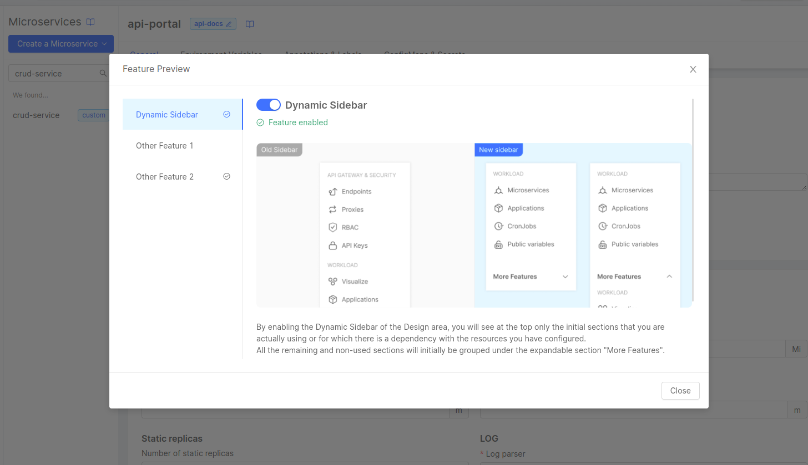
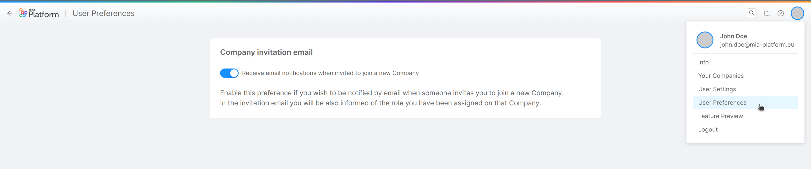

_March 16, 2023_

## Console

### New Features

In this Console release we have brought exciting New Features which are currently available exclusively for PaaS users. 
Here below you can discover all of them!

#### Fast Data No Code Configuration for ER Schema (only available for PaaS users)

:::info This feature is still in BETA, it is under active development. :::

Are you tired of writing ER Schemas manually? The new Fast Data ER Schema No Code Configuration is now generally available!
 
It is now possible to create and generate relationships between Projections using a simple and easy to use No Code configuration.  
This tool is able to generate a JSON that will be used by the Single View Creator. The generated JSON is exactly the same JSON that would have been written manually in the Low Code Configuration.

In order to exploit this functionality you have to open the Projections section and navigate in the new ER Schema tab. You can create a new ER Schema and start designing it!   
When configuring the Single View Creator, in the Single Views section, you just have to select one of the ER Schemas created in the aforementioned section from a dropdown list.

This feature will only be available for PaaS users and it can be activated only for specific projects. If you want to try it out, contact your system administrator!
Do not miss out the official documentation here! (<TODO add documentation link>)
(<TODO add screenshot>)

#### Feature Preview section (only available for PaaS users)

PaaS users can now have visibility of features in Console that are still in preview and decide to try them out and give us precious feedback.  
For instance, once entered in this section, PaaS users can now try the new `Dynamic Sidebar` of the Design Area.   
To discover more, just try this new feature and tell us what you think!
 
This section can be accessed from the Launchbar by clicking on the `Feature Preview` item inside the dropdown menu that appears when hovering over the user avatar. 

#### User Preferences section (only available for PaaS users)

We have introduced a new section named `User Preferences`, in which PaaS users can customize their experience in Console according to their own preferences.  
For instance, inside this section, it is now possible to manage the receipt of an invitation email that is sent when you are added to a Company. This section is accessible from the dropdown menu of the Console Launchbar when hovering over the user avatar.

### Improvements

#### Improved filtering in the Manual Routes table

In the Authorization section, inside the Manual Routes table, you can now filter specifically by Microservice and Policy type thanks to two new appropriate filters that simplify the navigation on that table.

### Bug Fix

This version addressed a few bugs, here is a comprehensive list:

* It has been fixed a bug that prevented users from properly displaying their favorite Console areas in the Launchbar
* We fixed a behavior that, for certain projects, wrongly showed the floppy save icon when selecting a CronJob

## Fast Data

### Improvements

#### Upgraded Real-Time Updater to version v7.4.1 

This newer version come with a revised mechanism for writing projection changes onto underlying database, slightly speeding it up.

#### Added link to the Fast Data Low Code Test Template repository inside the Single Views section 

This repository is used to test and generate configurations for the Single View Creator.

#### `Import from DDL` returns projections and evaluates potential duplicates

The `Import from DDL` feature on the Projections page now returns a list of projections and evaluates potential duplicates. In that case, an error message is displayed.

### Bug Fix

We have fixed some bugs on Fast Data:

* It is now possible to correctly scroll inside the Single View section when the number of Single Views exceeds the browser window height
* A bug on the index creation inside the Single Views section has been fixed. It is now possible to correctly add several fields without having them disappear

## Marketplace

### Marketplace Updates

#### Files Service - v2.7.0

Added support to multi-bucket. The Files Service can now be configured with multiple bucket instances.
Also, the new route `GET - /files/` has been added to get the list of files present in a bucket.

#### Form Service FE - v1.7.1

Fixed a couple of bugs. First, a regression that prevented the correct rendering of a form as a PDF.
Second, warning messages were displayed for HTML content components even when hidden.

#### Messaging Service - v1.2.1

Android `actions` are now configurable via the `androidIntentAction` property.
 
#### API Portal - v1.16.6

The stability of the service has been improved.

#### Swagger Aggregator - v3.4.14

Fixed a bug which caused a malfuncion when a service retrieve failed.

## Backoffice - 1.3.6

### New Features

#### Pathname and search url-mask
`urlMask` properties of components `bk-button` and `bk-url-paramters` allow separate masks for `pathname` and `search` parts of current URL

#### PATCH & PUT support in http actions
Actions of type `http` support REST methods `PATCH` and `PUT`

### Bug Fix

#### `bk-layout-container` forwards headers
Component `bk-layout-container` forwards property `headers` to its content

#### `bk-layout-container` injects headers
Component `bk-layout` adds headers as specified in property `headers` to its http-calls

#### Locales are correctly loaded
Locales are correctly loaded on first plugin render

#### File upload action notifies http-call fail
Actions of type `file-upload` calls `onError` hook if http-call fails

#### Href actions resolve dynamic configurations
Actions of type `href` correctly resolve dynamic configurations

#### `bk-layout-container` does not make unnecessary http-calls
Component `bk-layout-container` does not trigger extra http-calls

#### Fields keep focus in wizard
Fields are correctly put on focus on `bk-form-modal` wizard mode

#### `__STATE__` field is not discarded
Form components do not discard `__STATE__` field on data creation

### Search bar keeps state
Component `bk-search-bar` keeps state on layout change when placed inside `bk-layout-container` component

## How to update your Console

For on-premise Console installations, please contact your Mia Platform referent to know how to use the `Helm chart version X.X.X`.

