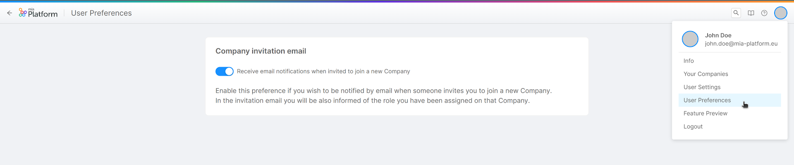

_April 13, 2023_

## Console

### New Features

#### Management of Providers through the Console

Starting from today it will be possible to manage the creation, configuration, and editing of the providers used by Mia-Platform Console (GitProvider, Secret Manager and CI/CD Tools) within a brand new dedicated section - named "Providers" - inside the "Company Overview" area.  

Previously, this was only possible through the use of specific APIs exposed on the API Portal, while now you will be able to do so directly on the Console, in a guided, simple and intuitive way.

To learn more about the providers supported by the Console and for a detailed explanation of the "Providers" section, [go to the official documentation](/development_suite/set-up-infrastructure/configure-provider.mdx).

#### No Code Backoffice Configurator

:::info
This feature is still in BETA, do not miss out the [official documentation](/business_suite/backoffice-configurator/structure.md) page for further information.
:::

The Low Code experience when configuring the Backoffice is now evolving towards a **No Code** Configuration!  
In the Console section dedicated to Backoffice, you can now configure your Backoffice pages and layouts, with a fancy and easy to use UI! It is possible to configure both micro-lc Layout and all the created compose Pages in a No Code fashion. From the left hand side menu, it is possible to choose one of the component in the page, and on the right hand side it is possible to see the drawer with all the properties to be configured. Moreover, the middle section of the page shows the updated preview aligned with all the changes.

Don't miss all the other Backoffice improvements in the [dedicated section](#backoffice---138)!

#### User Preferences section (only available for SaaS users)

We have introduced a new section named `User Preferences`, in which SaaS users can customize their experience in Console according to their own preferences.  
For instance, inside this section, it is now possible to manage the receipt of an invitation email that is sent when you are added to a Company. This section is accessible from the dropdown menu of the Console Launchbar when hovering over the user avatar.

### Bug Fix

This version addressed a few bugs, here is a comprehensive list:

* We fixed a bug that wrongly showed the CronJobs in the list of Microservices inside of the Authorization section
* It has been solved a bug that prevented the correct merge of configurations within a branch including `/` in its name
* We have fixed an issue with paginated identities tables that were changing the list order of some identities each time the page was refreshed

## Fast Data

### New Features

#### CSV Connector

Introducing the CSV Connector! With this new plugin, you can now import data from a CSV source to your Fast Data with ease. Whether your csv files are in a bucket on Mongo, AWS or Google, the new plugin allows you to fetch data from the files in the bucket and import them into Fast Data.

Our CSV Connector also validates each CSV file against your custom JSON Schema. To provide further transparency, Prometheus metrics are provided for users to infer statistics at any time. Our plugin is designed with flexibility in mind, giving you the freedom to personalize fields names, define custom validation rules and head data to the specific Fast Data topics of your choice. The Kafka messages generated through the plugin are in [db2](/fast_data/configuration/realtime_updater/common.md#kafka-adapters:-kafka-messages-format) format.

To utilize the CSV Connector, simply import it as an application directly to your console. The application comes prepackaged with the Files Service in [multi-bucket mode](/runtime_suite/files-service/configuration.mdx) and the Crud Service, both of which are already pre-configured with most of the variables, leaving you with minimal personalization.

The CSV Connector plugin only comes with the core service. In this case, however, the configuration of the other two services is up to the user.

[Go to the official documentation](/runtime_suite/csv-connector/configuration.md) to find out more.

#### Debezium PostgreSQL plugin

The rollout of the supported Debezium Plugins is going on! You can now find in the Marketplace the [Debezium connector plugin for PostgreSQL](/fast_data/connectors/debezium_cdc.md#postgresql) databases with the pre-configured config map for Debezium Server to connect directly to a PostgreSQL Database.

### Improvements

#### Managing Warnings and Errors in a No-Code ER Schema

The Fast Data No Code ER Schema includes improved warning and error management. It provides notifications in case the ER Schema has an invalid structure and warnings related to non-existing fields in conditions. It also validates incomplete or invalid rules.

### Bug Fix

This version addresses a few bugs in the No Code ER Schema. Here is a comprehensive list:

* Fix a bug that prevents rules, which include Mongo query operations, from generating invalid conditions in the ER Schema.
* Improved validation for the rules editor when dealing with nested Mongo queries.

## Marketplace

### New Marketplace Components

#### DICOM Service - v1.0.1

The O3 DICOM Service is a microservice that allows you to interact with a DICOM PACS, in order to manage worklists,
exams and notifications coming from the PACS.

### Marketplace Updates

#### Form Service BE - v1.7.1

Added an Excel compatibility flag to the CSV form export feature.
Fixed a bug which was causing a wrong number of forms returned in a CSV.

## Backoffice - 1.3.8

### Bug Fix

#### `bk-card` correctly visualizes nested cards

`bk-card` component applies `visualizationOptions` to nested objects, which are rendered as nested cards

#### Components update nesting state in `bk-layout-container`

`bk-search-bar` and `bk-breadcrumb` correctly update their nesting state on layout change inside `bk-layout-container`

## How to update your Console

For on-premise Console installations, please contact your Mia Platform referent to know how to use the `Helm chart version X.X.X`.
