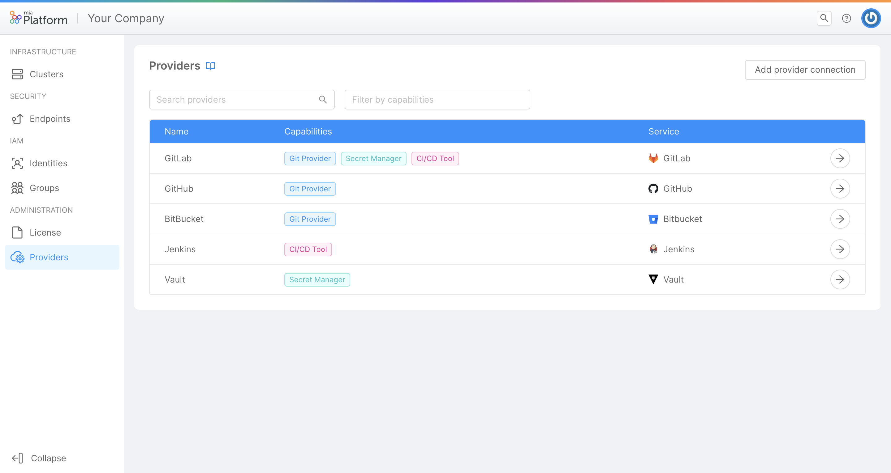

_April 13, 2023_

## Console

### New Features

#### Management of Providers trough the Console

Starting from today it will be possible to manage the creation, configuration and edit of the providers used by the Console (GitProvider, Secret Manager and CI/CD Tool) directly using the respective dedicated section in the "Company Overview" area.

Previously this was possible only through the use of specific APIs exposed on the API Portal, while now using a dedicated front-end on the console it will be possible to do it in a guided, simple and intuitive way.

To learn more about the providers supported by the Console and for a detailed explanation of the Section, [go to the official documentation](/development_suite/set-up-infrastructure/providers-management.md) page for more information.

### Improvements

### Bug Fix

## Fast Data

### New Features

#### CSV Connector

Introducing the CSV Connector! With this new plugin, you can now import data from a CSV source to your Fast Data with ease. Whether your csv files are in a bucket on Mongo, AWS or Google, the new plugin allows you to fetch data from the files in the bucket and import them into Fast Data.

Our CSV Connector also validates each CSV file against your custom JSON Schema. To provide further transparency, Prometheus metrics are provided for users to infer statistics at any time. Our plugin is designed with flexibility in mind, giving you the freedom to personalise fields names, define custom validation rules and head data to the specific Fast Data topics of your choice. The Kafka messages generated through the plugin are in [db2](/docs/fast_data/configuration/realtime_updater/common.md#kafka-adapters:-kafka-messages-format) format.

To utilize the CSV Connector, simply import it as an application directly to your console. The application comes prepackaged with the Files Service in [multi-bucket mode](/docs/runtime_suite/files-service/configuration.mdx) and the Crud Service, both of which are already pre-configured with most of the variables, leaving you with minimal personalization.

The CSV Connector plugin only comes with the core service. In this case, however, the configuration of the other two services is up to the user.

[Go to the official documentation](/docs/runtime_suite/csv-connector/configuration.md) to find out more.

#### Debezium PostgreSQL plugin

You can now find in the Marketplace the [Debezium connector plugin for PostgreSQL](/fast_data/connectors/debezium_cdc.md#postgresql) databases.

### Improvements

#### Managing Warnings and Errors in a No-Code ER Schema

The Fast Data No Code ER Schema includes improved warning and error management. It provides notifications in case the ER Schema has an invalid structure and warnings related to non-existing fields in conditions. It also validates incomplete or invalid rules.

### Bug Fix

This version addresses a few bugs in the No Code ER Schema. Here is a comprehensive list:

- Fix a bug that prevents rules, which include Mongo query operations, from generating invalid conditions in the ER Schema.
- Improved validation for the rules editor when dealing with nested Mongo queries.

## Marketplace

### Marketplace Updates

## Backoffice - 1.3.8

### Bug Fix

#### `bk-card` correctly visualizes nested cards

`bk-card` component applies `visualizationOptions` to nested objects, which are rendered as nested cards

#### Components update nesting state in `bk-layout-container`

`bk-search-bar` and `bk-breadcrumb` correctly update their nesting state on layout change inside `bk-layout-container`

## How to update your Console

For on-premise Console installations, please contact your Mia Platform referent to know how to use the `Helm chart version X.X.X`.
