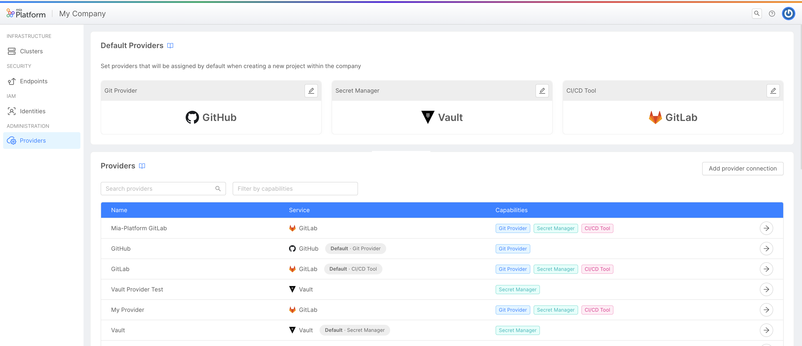

_May 04, 2023_

## Console

### New Features

#### Selection of default Providers for the Company's Projects

In the Company Overview area, inside the Providers section, it is now possible to find a new feature that allows the user with Company Owner permissions to be able to set the Default Providers that will be used in all the new Projects created in the respective Company.

This will enhance the governance of Company Owners on all the Projects of their Companies, granting them better control over the management of company tools.
The Provider for each capability (Git Provider, CI/CD and Secret Manager) can always be changed at any moment via CMS.

For more information, [go to the documentation](/development_suite/set-up-infrastructure/configure-provider.mdx).

#### GitHub Actions as CI/CD tool in Console

Starting with this version, Mia-Platform Console supports GitHub Actions as a CI/CD tool.

Within the Providers section, accessible through the Company Overview area, you can now configure a GitHub provider as a CI/CD tool and use it for the deployment of your workload.

For more information, [go to the documentation](/development_suite/deploy/deploy.mdx).

#### Managing Service Accounts at Console level

It is possible to create Company-independent service accounts in case you need to give them privileges to perform [root-level operations](/development_suite/identity-and-access-management/console-levels-and-permission-management.md).

:::info
Only Console Super Users can add or delete Company independent service accounts, manageable exclusively at back-office level.
:::

#### Backoffice No Code Configurator now supports `guard` and `oneOf` properties

From now on, it is possible to configure directly from the Backoffice No Code Configurator two type of properties: `guard` and `oneOf` properties. 

Do not forget to checkout the [Backoffice](#backoffice---139) back-kit component library news!

### Bug Fix

This version addressed a few bugs, here is a comprehensive list:

* We fixed an issue in the creation of a template/example that prevented the Git repository owner name from being filled in with special characters
* The `index.html` dom parser in the Backoffice Configurator now use `getAttribute` instead of reaching `src` on script elements
* The Property modal container of the Backoffice Configurator behaves well with nested object with the same keys
* The CRUD endpoints in the Backoffice Configurator are now prefixed with `/v2`

## Fast Data

### Breaking Changes

#### Revamped Single View Trigger Generator

We're thrilled to announce the release of v2.0.1 of the Single View Trigger Generator, one of the Fast Data component. In this release, we've given the component a complete overhaul to optimize its performance and streamline its functionality.

However, there are a few breaking changes to be aware of when migrating to this new version. In particular, the following environment variables have been renamed to better clarify their purpose:

- `STRATEGIES_FOLDER` → `MANUAL_STRATEGIES_FOLDER`
- `CUSTOM_FUNCTIONS_FOLDER` → `TRIGGER_CUSTOM_FUNCTIONS_FOLDER`

We have also removed the `USE_AUTOMATIC` variable since the feature is now enabled in all the service configurations.  
Furthermore, the following environment variables are now required:

- `SINGLE_VIEW_NAME`
- `ER_SCHEMA_FOLDER`
- `PROJECTION_CHANGES_SCHEMA_FOLDER`

For more details on the service and its behavior, please check out the official [documentation](/fast_data/single_view_trigger_generator.md).

### New Features

The file picker of the Projection DDL modal import, that can be used in the System of Record section, now supports `.sql` file. 

### Improvements

The Console automatic aggregation generation now represents one-to-one relationship configuration as an object.

### Bug Fix

This version addressed a few bugs, here is a comprehensive list:

* The Projections and the SoR are now deleted from the No-Code ERSchema if deleted from their Console sections
* The Single View Creator can be now attachable to only one Single View
* Mongo operators are now properly interpolated in aggregations executed by the Single View Creator. This fix has been addressed in version 5.6.6 of the Single View Creator.

## Marketplace

### Marketplace Updates

#### CRUD Service - v6.5.1

CRUD Service collection definition has been revised, so that now it possible to configure it through a JSON schema definition.
This new feature for the moment does not supersede the previous collection definition, albeit it is recommended to transition to the latter one.
To tap into this new functionality it is necessary to define a new property in the collections definition, which is `schema`.
This new property expects to receive a JSON schema as representation of the collection data model. Previous property `field` is still accepted, though
it has a lower priority with respect to the newer one.

Furthermore, the following MongoDB operators for `PATCH` action were introduced:

- [`$addToSet`](https://www.mongodb.com/docs/manual/reference/operator/update/addToSet/) (v6.4.0)
- [`$pull`](https://www.mongodb.com/docs/manual/reference/operator/update/pull/) (v6.5.0)

The full [changelog](/runtime_suite/crud-service/changelog.md) can be found in the plugin detail page.

#### User Manager Service - v1.4.0

Added a user expiration date feature via Timer Service and a user soft delete endpoint.

## Backoffice - 1.3.9

### New Features

#### `bk-crud-client` allows to disable url writing

New property `reflectToUrl` allows to control whether `bk-crud-client` reflects its state to the URL with a `window.history.pushState`.

#### New component `bk-layout-swap`

New component [`bk-layout-swap`](/business_suite/backoffice/components/misc.md#bk-layout-swap) is available. It performs a layout change listening to `layout/change` event. The payload of the event is the layout rendered by the component. It is bundled separately.

### Bug Fix

#### Form components resolve lookups on creation

Form components correctly resolve lookups in initial values from `add-new` event payload.

## How to update your Console

For on-premise Console installations, please contact your Mia-Platform referent to know how to use the `Helm chart version X.X.X`.
