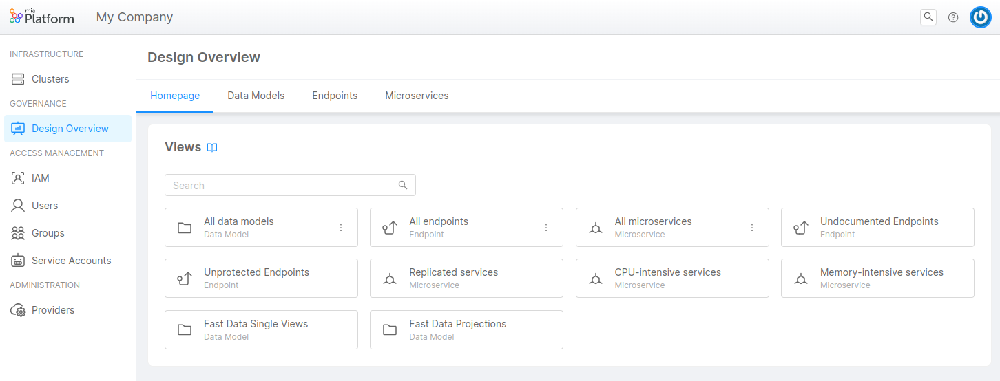

_June 22th, 2023_

## Console

### New Features

#### Manage and configure Webhooks directly via Console UI

Starting from today, it will be possible to view, create, edit and delete custom Console Webhooks directly through the user interface.
Whereas before today this was only possible through Console CMS, now the user can enter the "Company Overview" area and under the "Webhooks" section can easily and intuitively manage all the respective hooks.

[da inserire link doc]

### Improvements

#### Design Overview

We have updated the Design Overview section with the following features:
- CRUDs tab becomes **Data Models** and includes also Single Views and Projections collections
- **contains** operator to allow case insensitive free search on text fields
- **not set** operator to filter null values
- fix graphic issues

For more information, [go to the documentation](/development_suite/governance/design-overview.md).

## Fast Data

### New Features

#### Fast Data No Code Configuration for Aggregation

It is with great pleasure to inform you that it is now possible to generate an Aggregation configuration without writing a line of code!

The new feature will allow you to see a list of Single View fields, taken from the Single View Data Model, and to easily map them to their related Base Projection fields with point-and-click actions. You will only need to select a dependency, an automatically generated path to reach this dependency, and, eventually, a field in order to set the mapping.

This tool will then create a JSON file containing the newly set Aggregation config map, which will be then used by the Single View Creator service. The generated JSON is exactly the same JSON that would have been written manually in the Low Code Configuration. If you still wish to configure your JSON manually, an Advanced Mode toggle will allow you to switch between the No Code and the manual mode.

To access the new feature, please navigate to the Single Views section, open a Single View, then its related Single View Creator and click on the updated Aggregation tab, where you will be able to create a new configuration or edit the existing one.

This feature is available only for SaaS users and it can be activated only for specific projects. If you want to try it out, contact your system administrator!
Do not miss out the [official documentation](/fast-data/configuration/config_maps/aggregation.md#use-the-no-code).

#### Fast Data No Code Configuration for Single View Key and other settings

Each Single View Creator detail page now includes a Settings tab, which replaces the existing Single View Key tab.

The new tab includes the following sections:

- Single View Key, where it is possible to configure and edit a Single View Key configuration in a No Code mode. The new feature will allow you to easily map a Single View field to a Base Projection field (or to a Projection Changes identifier) and to automatically generate a configuration JSON file. As it is for the No Code ER Schema and for the newly introduced Aggregation, it will still be possible to manually configure the Single View Key by using the Advanced mode
- General Settings, where it is possible to access and edit data about the selected ER Schema and Base Projection
- Generate Aggregation, where it is possible to generate an Aggregation JSON configuration by automatically matching the fields of the Single View with those of the projections, based on the information in the selected ER Schema

## Backoffice

### Backoffice Configurator

#### New Features

Starting from this new version the Backoffice Configurator provides some new features listed below!

- Shared Property page is available, allowing to define shared properties and interact with them.
For more information, [go to the documentation](/business_suite/backoffice-configurator/compose-pages#shared-properties)
- `dynamic-icon` manifest schema hint allows the dynamic selection of icons
- `mia/endpoints/data-source` manifest schema hint allows selecting single-view, mongo-view, and projections endpoints in no code interface
- Field `entry` of Micro Frontend pages can be created through the no-code interface
- Support for external assets via configuration of a service worker which acts as a reverse proxy is available.
For more information, [go to the documentation](/business_suite/backoffice-configurator/external-components/overview).

#### Improvements

Some improvements on the Backoffice Configurator provided with this version are listed below!

- Select input in the components props editing menu can now be cleared
- Preview Status bar filters out info notifications from count total
- Primary color is chosen for superscripts of badges (Variables and Service-Worker buttons)
- Configuration parsing errors are now notified and no longer break the editor
- Test variables are trimmed on the creation

#### Bug Fix

This version addressed a few bugs listed below.

- Values of properties with the same name in different components are no longer bound
- Fixed references resolution in the preview
- When the compose application is removed, its metadata are deleted

### Backoffice Library - 1.3.15

#### New Features

##### `bk-expanded-filters` parse URL
`bk-expanded-filters` optionally performs bootstrap, applying filters that are read from URL

##### New component `bk-file-picker-modal`

New component [bk-file-picker-modal](/business_suite/backoffice/components/data_manipulation#bk-file-picker-modal) is available, analogous to `bk-file-picker-drawer`.

##### File metadata can be added

File fields support `dataSchema` and `items` properties, allowing to specify meta-data. Form components interact with `bk-file-picker-drawer` and `bk-file-picker-modal` to edit files with metadata.

#### Bug Fix

##### Form components correctly edit nested data when opened with `customActions`

Nested objects/arrays are correctly updated when editing form is spawned through `customActions` property of `bk-table`

##### `bk-button` is temporarily disabled on file download/upload
`disbaleOnAction` property of `bk-button` correctly interacts with `bk-file-client`

## Marketplace

### New Marketplace Components

### Marketplace Updates

#### CRUD Service

##### New Features

Version 6.6.1 of CRUD service is now available. In particular, we added an option to enable tracing (added in version 6.6.0). This capability provides valuable insights into the execution flow, making debugging and performance optimization a breeze.

##### Improvements

Furthermore, version 6.6.1, brings a host of enhancements.

Let's dive into the changes we have made:

- improved support for dot (.) notation with `$set` operator: we have diligently addressed an issue related to the dot (.) notation when used in conjunction with the `$set` operator. Now, you can confidently leverage this powerful feature, knowing that it is fully supported and functioning correctly.

- extended support for `$addToSet` and `$pull` Operators on AdditionalProperties JSON Schema Definition: we have expanded the capabilities of our software by enabling the usage of `$addToSet` and `$pull` operators on properties added through the additionalProperties JSON schema definition. This enhancement empowers you to manage your data more efficiently and effectively.

- streamlined collection definition validation: in order to optimize performance, we have refined the collection definition validation process, ensuring a smoother and faster experience for you and your team.

- we have upgraded to the latest versions of lc39 (v7), which includes fastify (v4), further enhancing the speed, performance, and overall stability of our software (available since version 6.6.0).

- updated configuration documentation: to eliminate any ambiguity, we have updated the documentation pertaining to service configuration. Specifically, we have provided additional clarification regarding the database name in the connection string. This improvement ensures a seamless setup process, allowing you to effortlessly configure your software to meet your specific requirements.

- concurrent configuration of MongoDB calls and collection configuration validation: in order to boost efficiency, we have made modifications to enable concurrent configuration of MongoDB calls. Furthermore, our development team has undertaken a comprehensive refactoring of the JSON Schema Generator, by reducing duplicated operations.

##### Bug Fix

With version 6.6.1, we also addressed some bugs, furtherly improving the overall user experience. 

Here below the bugs we addressed:

- fixed broken links in CRUD documentation: our dedicated team has rectified broken links within the software's documentation. Now, you can seamlessly access all the necessary resources and references to maximize your productivity.

- corrected Swagger configuration: we have resolved an issue related to the Swagger configuration, ensuring that it functions flawlessly. This fix guarantees a seamless integration of your software with Swagger, facilitating efficient API documentation and development.

## How to update your Console

For on-premise installations, please contact your Mia-Platform referent and upgrade your _Console Helm Chart_ to `v9.X.X`.
