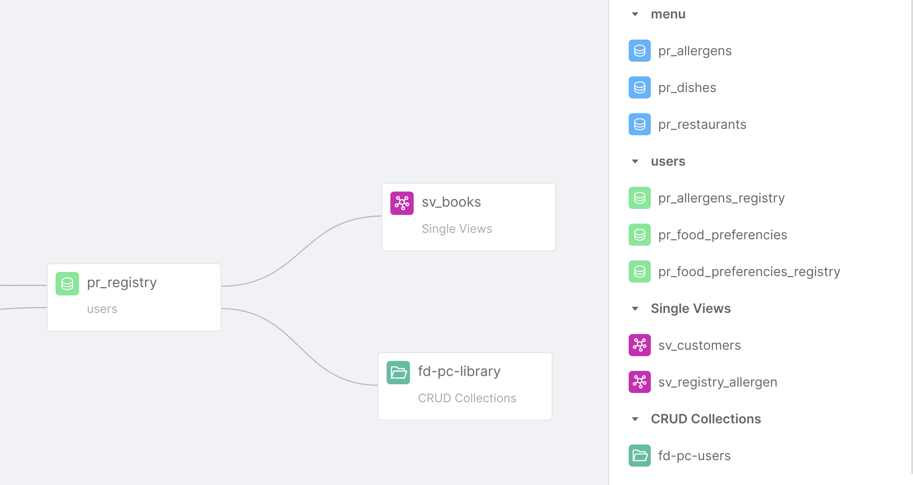

_July 06th, 2023_

## Console

### New Features

#### What's new section

A big welcome to [What's new section](/development_suite/overview-dev-suite#whats-new.md), that will keep up to date with the latest product news!  
You can access this Console section by clicking on the question mark icon located in the top bar of the Console interface.
In case there is unread news, a notification symbol will appear so that you do not miss the latest updates that can improve your experience on Mia-Platform Console.

### Improvements

### Bug Fix

This version addressed the following bugs:

- It has been fixed a bug that prevented the correct retrievals of markdown service documentation for some specific providers

## Fast Data

### New Features

#### Single Views and CRUD Collections available as sources inside the No Code ER Schema

Single Views and CRUD Collections can now be used as an input for the No Code ER Schema. The new sources will be available in the right panel of the canvas and can be easily added to the canvas with a simple drag-and-drop, just as it is already possible with Projections. When added to the ER Schema, Single Views and CRUD Collections are then included as available dependencies inside the No Code Aggregation.

#### Index autogeneration for projections creates indexes for `__internal_counter` and `__internal_counterType`

The Console can now automatically generate the `__internal_counter` and `__internal_counterType` indexes, which have been introduced from `v7.5.0` of the Real-Time Updater in the update Projection queries.

#### Aggregation ConfigMap automatically handled inside the Single View Creator microservice

When attaching a Single View Creator to a Single View, the Aggregation ConfigMap is now automatically handled by Fast Data. The ConfigMap will be editable from the No Code Aggregation screen, without needing to access the Microservice section and the related Single View Creator. Thus, the ConfigMap will be displayed as read-only inside this section.

#### Projection changes on Mongo with Single View Trigger Generator

Starting from the `v3.0.2`, Single View Trigger Generator now supports projection changes to Mongo. Previously, the SVTG could only trigger the generation of new Single Views by sending messages onto Kafka following the `sv-trigger` format. Now, Projections Changes are generated onto the MongoDB database.

#### Improvements

* the UX has been improved inside the Dependency editor modal in the No Code Aggregation page with improved warnings and placeholders
* the Single View Creator column inside the Single Views page now includes links to each Single View Creator detail page instead of redirecting to the Microservices section

### Bug Fix

This version addresses a bug inside the Dependency editor modal in the No Code Aggregation, which allowed the selection of Source Projections with one-to-Many condition from every configuration and not only from their parent.

Some bugs are fixed in the @mia-platform-internal/single-view-creator-lib. When Kafka fails for a faulty message, the healthiness and readiness routes now return KO; also, error logging has been fixed.

Real-Time Updater now properly supports Debezium CDC change events with and without the change schema. 

## Backoffice

### Backoffice Configurator

#### New Features

#### Improvements

#### Bug Fix

### Backoffice Library - X.X.X

#### New Features

#### Bug Fix

## Marketplace

### Marketplace Updates

#### CRUD Service

##### New Features

With the `v6.7.0` of the CRUD service it is now easier for the client to interact with MongoDB Views. Users can now configure the `enableLookup` flag and follow specific pipeline requirements to obtain data from _lookup_ collections, simplifying interaction with views and improving support for collections with _one-to-one_ or _many-to-one_ relationships.

## How to update your Console

For on-premise installations, please contact your Mia-Platform referent and upgrade your _Console Helm Chart_ to `vX.X.X`.
