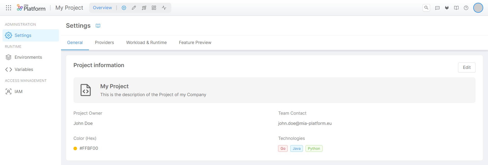

_Aug 31st, 2023_

## Console

### New Features

#### Project Settings 

Inside the 'Overview' area of a Project, you can now access a brand new section called 'Settings', where users with enough administrative permissions can view and manage the settings of their Project. This will speed-up and optimize the overall administration of Projects, which – until now – was only possible exclusively via CMS, making it no longer tedious or error-prone!

For more information about Project Settings, [go to the official documentation](/development_suite/set-up-infrastructure/project-settings.md).

### Improvements

#### User Profile section 

We have enhanced the viewing and management of user profile settings and preferences, combining them into a single section always accessible from the Console launchbar. As a matter of fact, by clicking on the new `Profile` option from the dropdown menu, you will be presented with a section containing two tabs: `Personal info` and `Preferences`.  
In the `Personal info` tab, you will find a brief summary of your profile and an external link for managing your profile settings on the identity provider.  
Within the "Preferences" tab, you can view and manage user's specific preferences.

### Bug Fix

This version addressed the following bugs:

* When configuring a _Single View Creator Service_ inside the `Single Views` section, creating a new _Validator_ will generate a file with an empty function to avoid to automatically save an empty file that might cause a crash of the Single View Creator Service configured.

## Fast Data

### Fast Data Configurator

#### New Features

##### Mongo Collections and Views support multiple tags

The collections configured in the section `MongoDB CRUD` and the views configured in the `MongoDB Views` section can have more than one tag. These tags will be then included in the configuration files passed to the `CRUD Service` to have the collections grouped by said tags, in order to simplify the use of the service.

Please note that it is possible to create multiple tags only if the `CRUD Service` configured in the project has version `6.8.0` or superior. In case there are different versions per environment, all the versions defined must be equal or superior to `6.8.0` to configure these tags.

##### Support of Lookup in CRUD Views

In the `MongoDB Views` section, it is possible to enable _lookup_, following specific pipeline requirements to obtain data from _lookup_ collections, simplifying interaction with views and improving support for collections with _one-to-one_ or _many-to-one_ relationships.

More information can be found in the [official documentation](/runtime_suite/crud-service/50_writable_views.md).

Please note that it is possible to enable lookups only if the `CRUD Service` configured in the project has version `6.9.0` or superior. In case there are different versions per environment, all the versions defined must be equal or superior to `6.8.0` to enable lookups.

#### Bug Fix

This version addressed a few bugs in the No-Code Aggregation, here is a comprehensive list:

* It is now possible to correctly see fields with the same name prefix inside the field explorer.
* Errors for `Array of Objects` type fields are no more producing crashes when opening the Aggregation No-Code.
* Error handling has been improved when using `joinDependency`.
* The `Cast Functions` section has been moved from its dedicated space in the sidebar to a tab inside the Projections section.
* Some boilerplate code has been added inside the Validator tab of each Single View Creator page if the Validator code has not been already created.

### Fast Data Services

#### Real Time Updater

The new version `v7.5.5` of the `realtime-updater` is available!

##### Improvements

* `db2` value can now be used as an alias of `basic` when setting the message adapter format.
* Service now exposes Prometheus metrics to keep track of Kafka consumer lag.

#### Single View Trigger Generator

The new version `v3.0.3` of the `single-view-trigger-generator` is available!

##### Improvements

* Service now exposes Prometheus metrics to keep track of Kafka consumer lag.

For more information check out the service [changelog](/runtime_suite/single-view-trigger-generator/changelog.md)

#### Ingestion Storer

The new version `v1.5.0` of the `ingestion-storer` is available!

##### New Features

* Messages are now cached until they reach a tunable size before they are uploaded to the bucket. In any case, cached messages are always uploaded after a tunable timeout, so that it is guaranteed to reach a consumer lag of on topics.
* introduced the following config keys:
  * `bss.cache-upload-timeout` controls the timeout after which cached messages are uploaded to the bucket when no new messages arrive (default 1 minute).
  * `bss.max-bytes-per-file` establishes the average file size to upload (default 8MB). Setting this value to `0` recovers v1.4.0 service behavior.
  * `bss.max-cache-size` maximum cache size that can be reached for each single file. It should be sufficiently larger than `bss.max-bytes-per-file` (default 10MB).

**Note:** The caching mechanism creates a cache space for each combination of topic-partition. For this reason, we recommend fine-tuning service memory _request_ and _limit_ depending on the value set for `bss.max-bytes-per-file` and the total number of partitions the service is going to consume from.

##### Bug Fix

This version addressed a few bugs, here is a comprehensive list:

* Reviewed shutdown logic to actually terminate the service in case of errors.
* Kafka deserializer is set to `ByteArrayDeserializer` to reduce memory consumption. This can be achieved because the service does not need to know the message key and payload contents.
* Log levels of internal libraries have been lifted to WARN to reduce logging.

#### Ingestion Reloader

The new version `v1.4.1` of the `ingestion-reloader` is available!

##### Bug Fix

This version addressed a few bugs, here is a comprehensive list:

* Removed the requirement on the S3 endpoint, so that now the service can correctly connect to AWS S3 when using _virtual-hosted style_ connections.

## Backoffice

### Backoffice Configurator

#### Bug Fix

##### Fixed navigation to other Console sections when the revision name contains a slash

Internal navigation to other sections of the Console now works correctly even if the dynamic parts of the URL contain some characters that need escaping (e.g., `/`).

### Backoffice Library - 1.3.18

#### Bug Fix

##### `phosphor` icons render tags

`phosphor` icons render tags such as `rect` or `circle` via `@micro-lc/iconic@1.3.1`

### 1.4.0

#### New Features

##### Import data feature
Support for `CRUD Service` import functionality is available through components `bk-import-modal` and `bk-crud-client`.

##### Lookup fields are handled with CRUD Service views
Support for `CRUD Service` [writable views](../runtime_suite/crud-service/50_writable_views.md) is available in components that handle lookup fields. Previous lookup field handling, through `bk-crud-lookup-client` and `lookupOptions` data-schema key, is now deprecated.

##### New form components are available
New components [`bk-dynamic-form-modal`](../business_suite/backoffice/60_components/40_data_manipulation.md#bk-dynamic-form-modal), [`bk-dynamic-form-drawer`](../business_suite/backoffice/60_components/40_data_manipulation.md#bk-dynamic-form-drawer), [`bk-dynamic-form-card`](../business_suite/backoffice/60_components/40_data_manipulation.md#bk-dynamic-form-card), [`bk-form-wizard`](../business_suite/backoffice/60_components/40_data_manipulation.md#bk-form-wizard)  are available.
These extend the functionalities of `bk-form-modal`, `bk-form-drawer`, `bk-form-card`, which are now deprecated.

#### Bug Fix

##### `bk-layout` handles absent names in the user menu
Component `bk-layout` shows the user menu when the `user` context is defined (when the fetch request to API is successful).
This fix will show an empty user `name` if not provided.

#### Deprecated

- The `bk-crud-lookup-client` component is deprecated in favor of backend handling of lookup fields using the `CRUD Service`'s [writable views](../runtime_suite/crud-service/50_writable_views.md) functionalities.
- Component `bk-form-modal` is no longer supported. It is recommended to transition to component
  - `bk-form-wizard`, if property `wizard` is defined in `bk-form-modal`,
  - `bk-dynamic-form-modal` otherwise.
- The `bk-form-drawer` component is no longer supported. Transitioning to `bk-dynamic-form-drawer` is recommended.
- The `bk-form-card` component is no longer supported. Transitioning to `bk-dynamic-form-card` is recommended.

## Marketplace

### Marketplace Updates

#### CRUD Service

The new version `v6.9.0` of the CRUD Service is available!

##### New Features

###### Import Route

A new endpoint `/<collection-name>/import` has been exposed, so that it is possible to upload new records for selected collections from a file.
The supported file types are:

* `application/json`
* `application/x-ndjson`
* `text/csv`

This endpoint can be called using either the `POST` method to perform an insert operation or the `PATCH` method to upsert new and existing documents.

More details on this feature can be found in the dedicated [section](/runtime_suite/crud-service/overview_and_usage#import) of the Overview and Usage documentation page.

###### Export Route

The existing `/<collection-name>/export` endpoint can now export collections in formats different from `ndjson`. In fact, now `text/csv` type is also supported.

##### Improvements

###### Best Practice Document

The documentation has been extended to further clarify how the CRUD Service and its features can be employed in different scenarios.

###### Performance Improvements

This new service version increases API requests throughput while maintaining all the new features

##### Bug Fix

This version addressed a few bugs, here is a comprehensive list:

* add missing `enableLookup` property from service configuration JSON Schema
* solve startup performance issues when many collection definitions were configured

:::warn
With the release of version `v6.9.0`, we highly recommend users update their CRUD Service instances to this new one, especially in the case the current adopted version is between `v6.6.x` and `v6.8.x` since those CRUD Service versions suffered some performance issues that have been resolved.
:::

For more information check out the service [changelog](/runtime_suite/crud-service/changelog.md)

## How to update your Console

For on-premise installations, please contact your Mia-Platform referent and upgrade your _Console Helm Chart_ to `vX.X.X`.
