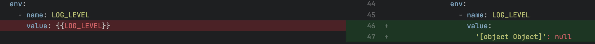

_Sep 18th, 2023_

## Console

### Hotfix: CronJob and Advanced service configuration upgrade

This version ships the hotfix for CronJob and Advanced service content migration bug that was introduced with `v11.6.0`.

When saving in Design with `v11.6.0` CronJob and Advanced Service with interpolated variables will produce an invalid configuration that cannot be deployed.

#### How to resolve the issue if I've already saved

:::warning

Unfortunately for those who saved the configuration, this fix only prevents new configuration save from breaking these kind of workloads; it does not fix configuration that were already saved and produced an invalid configuration.

:::

To fix those project either:

 - revert the commit and save again
 - manually resolve the problem within the Console file properly setting the file content to the previous value.

:::info

If you are still working with v11.6.0 be assured that the process that breaks the configuration is only executed once per-Project, therefore manually fixing the configuration allows you to keep working with the Console without any further issue.

:::

## Fast Data

### Fast Data Configurator

#### Bug Fix

This version addressed few bugs, here a comprehensive list:

* list here all the bug fix
* but do not highlight them so much
* just put a short description 

### Fast Data Services

#### Single View Trigger Generator

The new version `v3,0,4` of the _Single View Trigger Generator_ is available!

#### Bug Fix

This version addressed few bugs, here a comprehensive list:

* list here all the bug fix
* but do not highlight them so much
* just put a short description 

For more information check out the service changelog (add link to the changelog)

## Backoffice

### Backoffice Configurator

#### Bug Fix

This version addressed few bugs, here a comprehensive list:

* list here all the bug fix
* but do not highlight them so much
* just put a short description 

### Backoffice Library

The new version `v1.4.1` of the Backoffice library (back-kit) is available!

#### New Features

##### Put here the title of the feature

Put here the description of the feature. Remember to add the documentation link

#### Improvements

##### Put here the title of the improvement

Put here the description of the improvement

##### Put here the title of another improvement

Put here the description of another improvement

#### Bug Fix

This version addressed few bugs, here a comprehensive list:

* list here all the bug fix
* but do not highlight them so much
* just put a short description 

## Marketplace

### Marketplace Updates

## How to update your Console

For on-premise installations, please contact your Mia-Platform referent and upgrade your _Console Helm Chart_ to `v9.5.7`.
