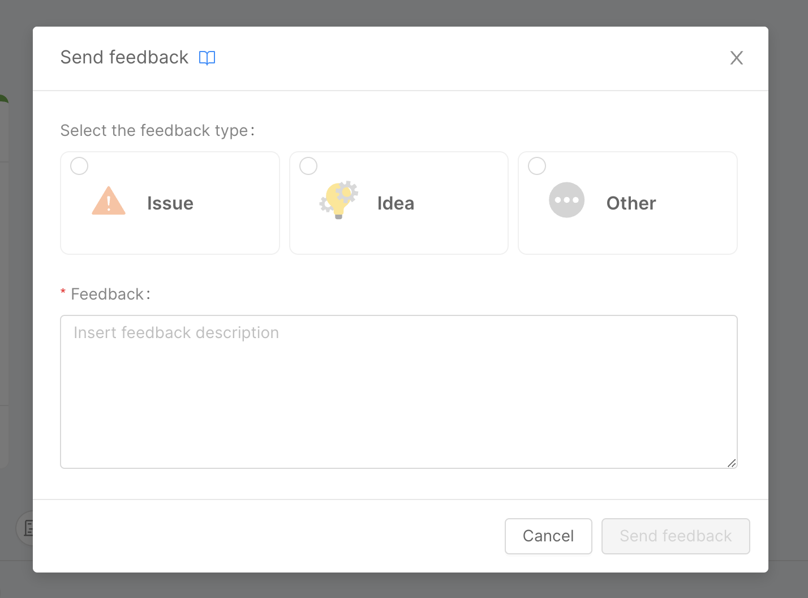
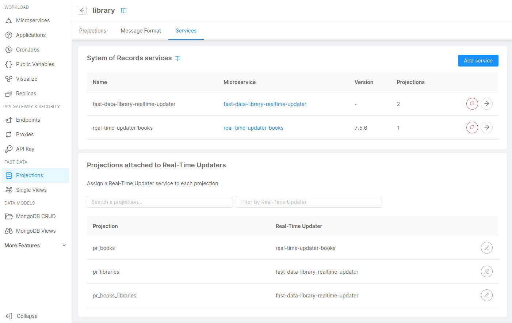

_Oct 12th, 2023_

## Console

### New Features

#### User feedback in Console

From now on, you can share feedback and propose ideas to help Product teams improve the Product experience directly in Console, without the need to change your webpage.  
You can leave precious feedback by clicking on the related Feedback icon, which is available from the Console Launchbar. 

All the collected feedback will be addressed to the Console maintenance teams, who will manage and process it within a dedicated section of the CMS.

For more details, [go to the official documentation](./development_suite/user-feedback/give-feedback.md).

#### New runtime commands for Mia-Platform miactl CLI 

With this release, new runtime commands are now available on miactl CLI.

More specifically, the following commands have been introduced on the command line:

* Visualization of all Environments of a Console Project;
* List of Pods/Cronjobs/Jobs of an Environment of a Console Project;
* Visualization of all the Events of a specific resource in the current workload of an Environments of a Console Project;
* Manually launch a CronJob as a Job.

For more details, [go to the official miactl documentation](./cli/miactl/commands#runtime.md).

### Improvements

### Bug Fix

This version addressed the following bugs concerning the creation of a new Project:

* It has been fixed a bug that prevented the creation of a Project in case the user had returned from step 2 (or subsequent) to step 1 to change some data;
* A problem on the length of the description of a new Project that caused its creation to fail has been corrected;
* It has been fixed an bug that caused `jobId` interpolation within `environments.deploy.jobId` to fail.

## Fast Data

### Fast Data Configurator

#### New Features

##### Support for multiple Real-Time Updaters

It is now possible to link multiple Real-Time Updaters to a single System of Records choosing which projections are handled by which service. Moreover, Real-Time Updaters are no longer automatically created on commit, but need to be created from Marketplace and then linked manually to a System of Records.

For more information, visit the related [documentation page](/fast_data/configuration/realtime_updater.md).

#### Improvements

##### Added search on projection fields

Projection fields can now be searched by name from the projection details page.

#### Bug Fix

This version addressed a few bugs, here is a comprehensive list:
- the creation of projections having the same id of an existing one is now blocked
- the application will no longer break in case of errors in the Er Schema canvas

### Fast Data Services

#### Single View Trigger Generator

The new version `v3.1.2` of the `single-view-trigger-generator` is available!

##### Improvements

###### Support for `pr-update` v2

This version introduces the support for reading _projection record update events_ that are using the schema version 2, which
can be employed either as drop in or alongside the current _projection record update events_ in version v1.

##### Bug Fix

This version addressed a few bugs, here is a comprehensive list:

* support for custom CA certificate in the Kafka Producer client
* projection record update events with operation type `DELETE` and the `after` property set to `null` are now processed correctly, avoiding service restart.

For more information please check out the service [changelog](/runtime_suite/single-view-trigger-generator/changelog.md).

#### Ingestion Storer

The new version `v1.5.1` of the `ingestion-storer` is available!

##### Bug Fix

This version addressed a few bugs, here is a comprehensive list:

* ingestion messages with an empty or null key are now processed correctly as all the other messages. The service now does not restart in case it consumes them. 

## Backoffice

### Backoffice Configurator

#### New Features

##### Added support for ACL Expression

The special property `aclExpression` of components is now configurable in a no-code fashion. The property allows to control whether entire components or components properties are included on the configuration based on user's groups and permissions.

For more information, visit the related [documentation page](/business_suite/backoffice-configurator/20_structure.md#acl-expression).

### Backoffice Library - 1.4.2

#### Bug Fix

##### Fixed manifests

Fixes to `bk-tabs`, `bk-layout`, `dataSchema` manifests.

##### The Calendar renders correctly

`bk-calendar` component correctly sets style on first render. This fixes the `bk-calendar` styling when is not visible when mounted to DOM, for instance if used within a `bk-layout-swap`.

#### New Features

##### Geopoint fields can be edited

Form components allow to edit fields of format `geopoint` through text fields placed below the map.

## Marketplace

### Marketplace Updates

#### Appointment Manager - v2.3.0

Integration with the next Messaging Service major release for event communication.

#### Form Service FE - v1.9.2 

Templates retrieval fixed.

#### Messaging Service - v1.5.0

Api `POST /saga/send` added to accept Flow Manager command as input body.
Support for custom metadata added to push notifications using the `pushData` template field.

#### Teleconsultation Service BE - v1.5.0 and v1.5.1

Added `TELECONSULTATION_DELETE_UPLOADS` environment variable to enable deletion of files uploaded in a room.
Added `DELETE /teleconsultation/:idRoomToDelete/uploads` to delete files uploaded in a room.

#### Teleconsultation Service FE - v1.4.0

New feature to delete uploaded files when the call ends (to be enabled via env var). 

#### User Manager Service - v1.4.2 and v1.4.3

Fixed `getAllUsers` from the Auth0 client when `acl_rows` is in the headers.
The `GET /users/` now resolves additional properties from auth0 when a configuration file is given.

## How to update your Console

For on-premise installations, please contact your Mia-Platform referent and upgrade your _Console Helm Chart_ to `v9.5.12`.
