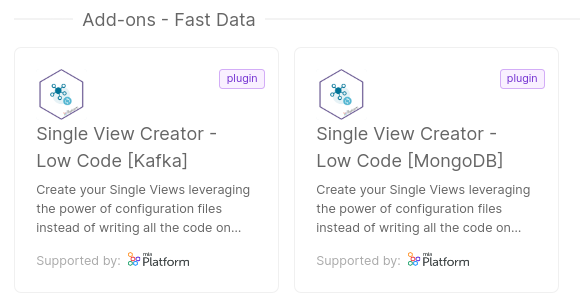

_February 15th, 2024_

:::info
Mia-Platform Console v12.2.1 is **now in Preview!**

Console SaaS users can try out v12.2.1 latest improvements in Preview! Open a Service Request to ask for the creation of a sandbox Company in case you do not have access to any Company.

For self-hosted installations, please read the [following guidelines](#how-to-update-your-console).
:::

## Console

### Revision History for Projects with Enhanced Workflow

We have introduced the possibility to view the history of revisions for projects using the Enhanced Workflow.

Now, you can get a quick overview of all the saves made within a specific revision, including additional information such as the date & time, author, and the message associated with the revision save.

You can access this feature by clicking on the "History" button inside the revision action popover: a modal will show up, will all the afore-mentioned information.

### Improvements

#### Telepresence v2 support in Debug area

Support for telepresence v2 has been added within the Debug area of the console. The commands that are displayed via the appropriate modal are now supported with the latest version of the tool.

For more information [go to the documentation](/development_suite/debugging/telepresence.md).

## Fast Data

### Fast Data Configurator

#### New Features

##### Entities renaming when importing as a resource

When importing entities as resource it is now possible to rename them inside of the import modal.

#### Improvements

##### Improved ER Schemas and Single Views consultation

Added pagination and search functionalities to ER Schemas and Single Views table lists.

##### Improved no-code ER Schema feedback

Both warnings and errors in no-code ER Schemas are now displayed more clearly.

### Fast Data Services

#### Single View Trigger Generator

The new version `v3.1.5` of the _Single View Creator_ is available!

##### Bug Fix

This version addressed a few bugs, here is a comprehensive list:

* in case of one-to-many relationships, the service does not crash anymore when it executes an automatic strategy over a record whose primary key fields have a value set to `null`

For more information check out the service [changelog](/runtime_suite/single-view-trigger-generator/changelog.md).

#### Single View Creator

In order to simplify the creation of Single View Creator plugins depending on the selected Fast Data Architecture, the original marketplace plugin has been split into two. The Mongo based plugin is preconfigured for the [Standard architecture](/fast_data/architecture.md#standard-architecture), while the Kafka based is preconfigured for the [Event-Driven architecture](/fast_data/architecture.md#event-driven-architecture).

## Data Catalog

#### Data Catalog Agent Template

The new version `v0.4.0` of the _Data Catalog Agent_ template is available!

##### New Features

Mia-Platform CRUD Service (`v6.10.0` or later) has been added among the supported Data Sources, so that it is possible to configure the Agent to gather metadata from the ones deployed in your projects environments.

:::info
In order to get access to this new feature, please remember to rebuild your Data Catalog Agent image against the newer Agent template version.
:::

## Microfrontend Composer

### Configurator

#### Bug Fix

This version addressed a few bugs, here is a comprehensive list:

* fixed "edit page" modal title copy

### Back-Kit Library

The new version `v1.4.15` of the back-kit library is available!

Refer to back-kit [changelog](/microfrontend-composer/back-kit/changelog.md) for finer-grained details of new versions.

#### Bug Fix

This version addressed a few bugs, here is a comprehensive list:

* dynamic values may include new line characters in all components
* `bk-expanded-filters` now allows to customize date picker locale

## Marketplace

#### CRUD Service

_CRUD Service_ version 6.x.x has just received the last update with version `v6.10.0`

##### New Features

- the `GET /<collection>/count` endpoint, which compute the total number of documents contained within selected collection, now accepts a new query parameter `_useEstimate` that instructs the underlying logic to retrieve an approximated count, regardless of any filter (hence `__STATE__` filter is not honored when this parameter is configured to `true`)
- the general `/-/schemas` endpoint and the collection specific `/<collection>/schema` endpoint have been added, so that it is possible to introspect the collections and obtain their data model as JSON schemas

##### Bug Fix

This version addressed a few bugs, here is a comprehensive list:

* support for querying nested fields whose type is `Date` has been fixed, so that the input type is properly converted to the stored type before performing the comparison between values

---

Furthermore, the new version `v7.0.0` of the _CRUD Service_ is available!

##### Breaking Changes

- introduce support to MongoDB `v7.0.0` and drop support for MongoDB `v4.2.0`
- to better clarify the error response, when inserting a new document in a collection and a duplicated unique key error is raised, the service now replies with a _409 Conflict_ HTTP Error, instead of _422 Unprocessable Entity_ HTTP Error
- to better clarify the error response, when requesting a document `__STATE__` to transition to an invalid value, a _400 Bad Request_ HTTP Error is returned, rather than a _404 Not Found_ HTTP Error
- querying documents with fields not specified in the collection data model now yields a _400 Bad Request_ HTTP Error to enforce data model access. Similarly, documents fields not defined in the collection data model are not returned in the response

##### New Features

- introduced `defaultSorting` as a new collection configuration property. This allows to define a set of fields with their sorting direction to be employed as sorting operation to all the GET queries whenever the `_s` parameter is not specified. In the case `_s` query parameter is set, it takes precedence over the default sorting assigned to the collection config.
By default, the property is not set, so that the default behavior with respect to previous service versions remains unchanged.

A migration guide is available [here](/runtime_suite/crud-service/guides/10_migration-guide-v7.md) to aid you in migrating your existing CRUD services to version `v7.0.0`.

For more information please check out the service [changelog](/runtime_suite/crud-service/changelog.md).

## How to update your Console

For self-hosted installations, please head to the [self hosted upgrade guide](/infrastructure/self-hosted/installation-chart/100-how-to-upgrade.md#v12---version-upgrades) or contact your Mia-Platform referent and upgrade to _Console Helm Chart_ `v12.X.X`.
