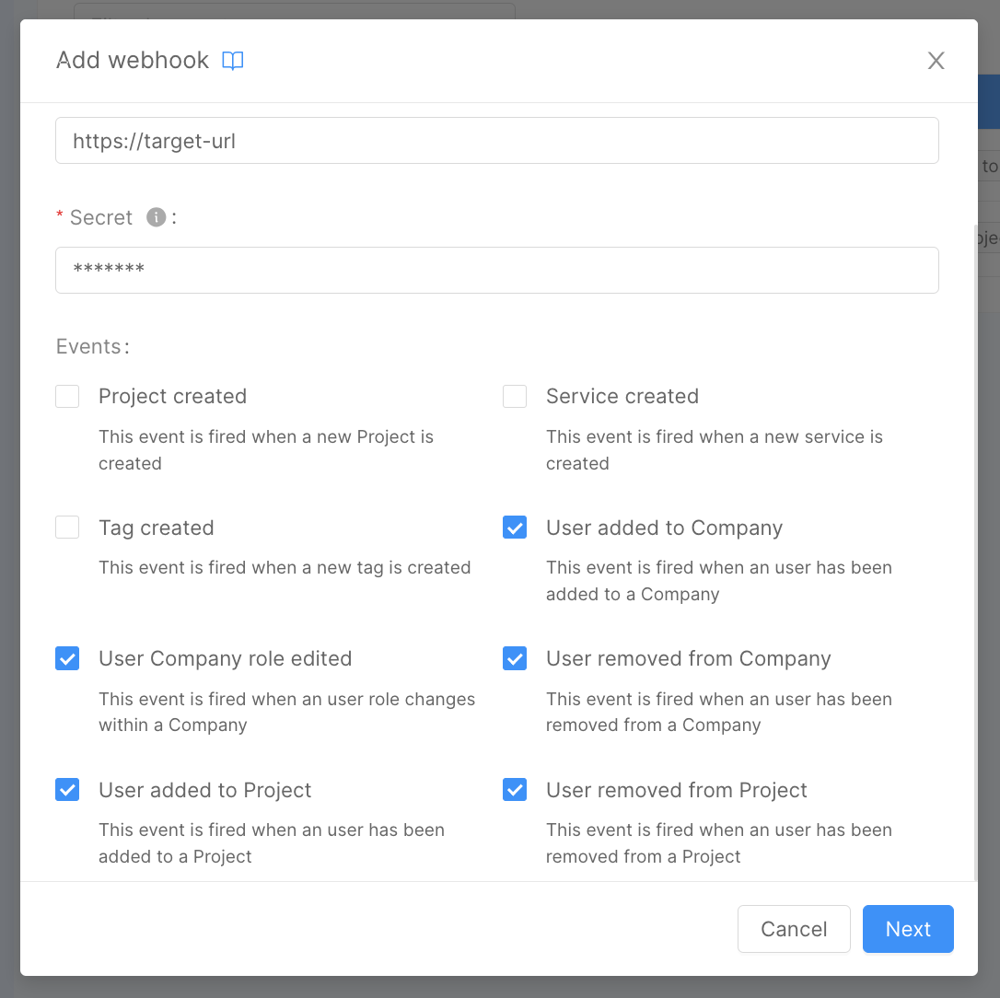

_February 29th, 2024_

## Console

### New User events for the Webhook section

New user management events are now available in webhooks section. This will allow a Company Owner to configure and trigger specific webhooks when changes to user access management occur.

Listed below are the events that have been added with this release:
* User added
* User edited
* User removed

  
 

  

For more information regarding individual events, please [go to the documentation](/development_suite/webhooks-and-events/events.mdx#user-added).

### Compare changes between a revision save and the previous one

On Projects with the Enhanced Workflow, you can now make a comparison of the changes between a saved revision and the previous one. This can be done by simply going inside the revision History section – accessible from the related icon on the revision action popover – and clicking on the button on the side of each saved revision: a diff modal will show up, highlighting the changes between the selected revision save and the previous one.

### Custom error message in External Orchestrator Generator

When using the [External Orchestrator Generator](/console/company-configuration/providers/extensions/orchestrator-generator.mdx) you can now provide a custom error message to the final user to let them know what went wrong during the configuration generation process.

### Bug Fix

This version addressed the following bug:

* fixed a bug that sent the user back to the Settings section instead of Homepage upon clicking on the Overview area of the project.

## Fast Data

### Fast Data Services

#### Real-Time Updater

The new version `v7.5.8` of the _Real-Time Updater_ is available!

##### Improvements

###### Support for events compression

Starting from this version, the service can now produce events using the supported compression algorithms, that are:

- `gzip`
- `snappy`

This yields an improvement over the storage usage on the Kafka broker, since less space is necessary to store the events
generated by Fast Data service. To configure such feature, please add the new environment variable `PRODUCER_COMPRESSION`
with the necessary value.

For more information check out the service [changelog](/runtime_suite/real-time-updater/changelog.md).

#### Single View Trigger Generator

The new version `v3.1.6` of the _Single View Creator_ is available!

##### Improvements

###### Support for events compression

##### Bug Fix

This version addressed a few bugs, here is a comprehensive list:

- tmp

For more information check out the service [changelog](/runtime_suite/single-view-trigger-generator/changelog.md).

#### Single View Creator

The new version `v6.4.1` of the _Single View Creator_ is available!

##### New Features

For more information check out the service [changelog](/runtime_suite/single-view-creator/changelog.md).

##### Improvements

###### Support for events compression

## Microfrontend Composer

## Marketplace

## How to update your Console

For self-hosted installations, please head to the [self hosted upgrade guide](/infrastructure/self-hosted/installation-chart/100-how-to-upgrade.md#v12---version-upgrades) or contact your Mia-Platform referent and upgrade to _Console Helm Chart_ `v12.0.3`.
