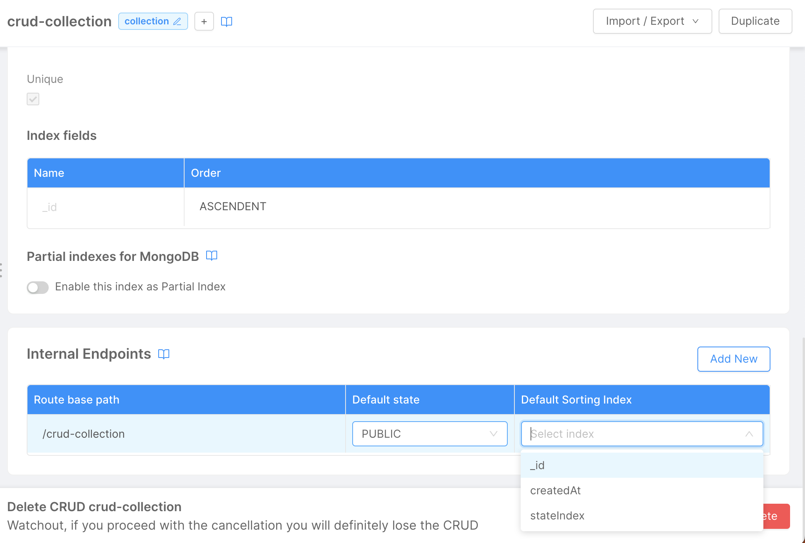

_March 07th, 2024_

## Console

### New User events for the Webhook section

New user management events are now available in Webhooks section. This will allow a Company Owner to configure and trigger specific webhooks when changes to user access management occur.

Listed below are the events that have been added with this release:
* User added
* User edited
* User removed

  
 

  

For more information regarding individual events, please [go to the documentation](/development_suite/webhooks-and-events/events.mdx#user-added).

### The New Look and Feel is officially released!

The new look on the console is now stable, with a new, more modern look that will allow you to navigate between sections even more effectively. 
Other features have also been added to enrich it and make it more functional, such as the "Dynamic Sidebar" feature, expansion and contraction of the sidebar for more workspace, search by Project and Company in their respective sections, and many other small graphical and user experience improvements that will enrich your work!

### Compare changes between a revision save and the previous one

On Projects with the Enhanced Workflow, you can now make a comparison of the changes between a saved revision and the previous one. This can be done by simply going inside the revision History section – accessible from the related icon on the revision action popover – and clicking on the button on the side of each saved revision: a diff modal will show up, highlighting the changes between the selected revision save and the previous one.  
For more information, visit the [related documentation](/development_suite/set-up-infrastructure/enhanced-project-workflow.md#revision-history).

### Custom error message in External Orchestrator Generator

When using the [External Orchestrator Generator](/console/company-configuration/providers/extensions/orchestrator-generator.mdx) you can now provide a custom error message to the final user to let them know what went wrong during the configuration generation process.

### Default Sorting Index for CRUD Collections

When defining [an internal endpoint](/docs/development_suite/api-console/api-design/crud_advanced.md#crud-service-exposed-routes) to your CRUD collection, it is possible to pick an index that will be used to sort the results of your CRUD requests (if no explicit `_s` parameter is provided).

:::info
This field will be displayed only if the `crud-service` version is greater than `v7.0.0`.
:::

### Bug Fix

This version addressed the following bugs:

* fixed a bug that sent the user back to the Settings section instead of Homepage upon clicking on the Overview area of the project;
* fixed a bug that caused webhooks to malfunction for events of type "project_created" and "service_created";
* fixed a bug that caused an unintended change in the content-type webhook for some event types;
* fixed a bug that prevented the Swagger Aggregator to correctly expose the endpoint configuration on a specific listener;
* miactl: a bug causing a malfunction on the deploy command has been fixed;
* miactl: a bug on opening the browser during login has been fixed.

## Fast Data

### Fast Data Configurator

#### Improvements

##### Default Sorting Index for Single Views

The [default sorting index feature](#default-sorting-index-for-crud-collections) added to CRUD Collections is also available for Single View collections.

##### Better error handling inside Aggregation No Code for Single View key fields

The No Code Aggregation section has been revamped to display only fields that are already mapped or Single View key fields, reducing clutter and improving clarity. This is especially useful for Single Views with lots of fields in their Data Model. When needed, a new button will allow to add unmapped fields inside the section.

### Fast Data Services

#### Real-Time Updater

The new version `v7.5.8` of the _Real-Time Updater_ is available!

##### Improvements

###### Support for events compression

Starting from this version, the service can now produce events using the supported compression algorithms, that are:

- `gzip`
- `snappy`

This yields an improvement over the storage usage on the Kafka broker, since less space is necessary to store the events
generated by Fast Data service. To configure such feature, please add the new environment variable `PRODUCER_COMPRESSION`
with the necessary value.

:::info
Real-Time updater consumer already supported compression on the consumer component, so that change events sent from your System Of Record systems can be compressed too.
:::

For more information check out the service [changelog](/runtime_suite/real-time-updater/changelog.md).

#### Single View Trigger Generator

The new version `v3.1.6` of the _Single View Creator_ is available!

##### Improvements

###### Support for events compression

Starting from this version, the service can now consume and produce events using the supported compression algorithms, that are:

- `gzip`
- `snappy`

This yields an improvement over the storage usage on the Kafka broker, since less space is necessary to store the events generated by Fast Data service. To configure such feature on the producer side, please add the `compressionName` property with needed value to the Event Store _producer_ configuration. On the contrary, the consumer component is automatically enabled to read events that have been compressed.

##### Bug Fix

This version addressed the following bug:

- fixed a runtime error that happened when the service tried to parse a projection update message having a key field with `null` value  

For more information check out the service [changelog](/runtime_suite/single-view-trigger-generator/changelog.md).

#### Single View Creator

The new version `v6.4.1` of the _Single View Creator_ is available!

##### Improvements

###### Support for events compression

Starting from this version, the service can now consume and produce events using the supported compression algorithms, that are:

- `gzip`
- `snappy`

This yields an improvement over the storage usage on the Kafka broker, since less space is necessary to store the events
generated by Fast Data service. To configure such feature, please add the new environment variable `KAFKA_PRODUCER_COMPRESSION`
with the necessary value. On the contrary, the consumer component is automatically enabled to read events that have been compressed.

For more information check out the service [changelog](/runtime_suite/single-view-creator/changelog.md).

## Microfrontend Composer

### Back-Kit Library

The new version `v1.4.16` of the back-kit library is available!

Refer to back-kit [changelog](/microfrontend-composer/back-kit/changelog.md) for finer-grained details of new versions.

#### Bug Fix

This version addressed a few bugs, here is a comprehensive list:

* `bk-expanded-filters` supports `lookupDeps` option

## Marketplace

### Marketplace new plugins

#### CRUD SQL

The CRUD SQL exposes an HTTP Interface to perform CRUD operations on a RDBMS over DB tables defined via JSON Schema. It is shipped as two different plugins depending on the supported vendor: `CRUD PostgreSQL` and `CRUD MSSQL` .

For more information please check out the plugins [documentation](/runtime_suite/crud-sql-postgresql/overview.md).

## How to update your Console

For self-hosted installations, please head to the [self hosted upgrade guide](/infrastructure/self-hosted/installation-chart/100-how-to-upgrade.md#v12---version-upgrades) or contact your Mia-Platform referent and upgrade to _Console Helm Chart_ `v12.0.3`.
