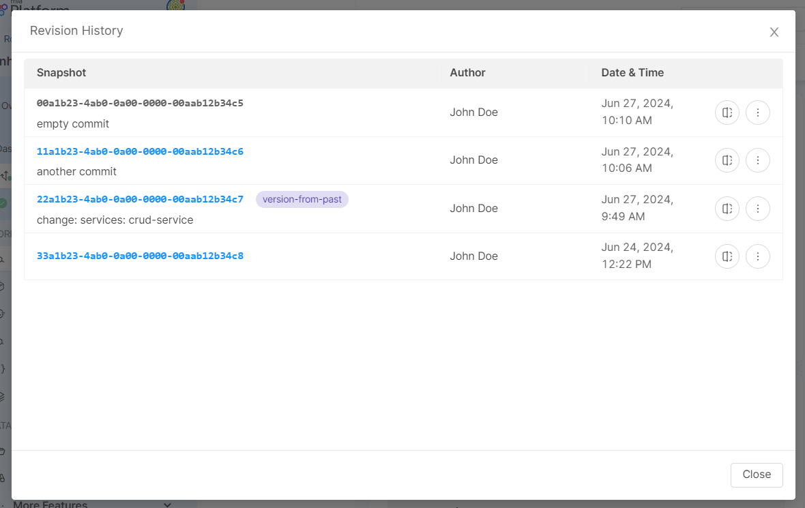

_July 18th, 2024_

:::info
Mia-Platform Console v13.0.5 is **now in Preview** and will be generally available on July 18th.

Console SaaS users can try out v13.0.5 latest improvements in Preview! Open a Service Request to ask for the creation of a sandbox Company in case you do not have access to any Company.

For self-hosted installations, please read the [following guidelines](#how-to-update-your-console).
:::

## Console

### Configure environment variables from Configmap

Public variables can now also be used inside microservices' configmap configurations. Inside the microservice card, you can now select or create a new configuration of type configmap.

After creating a configmap, create or select a configuration file and use public variables by including interpolated keys. Just create an object, add a field, and set the interpolated value.

For more information, visit the related [documentation page](/development_suite/api-console/api-design/public_variables.md#how-to-use-a-public-variable-in-a-configmap-configuration).

### Load a previous snapshot on Projects with the enhanced workflow

From now on, you can load a previous snapshot on Projects using the enhanced workflow. Once loaded, you can edit such configuration and save on a new revision, create a new version or exit such snapshot and return to the latest.  

If you want to load a previous snapshot, you only have to open the revision action popover, click on the `History` button and head to the clickable snapshots from the revision history modal. 

### Improvements

#### Design Overview visible to Guest role

The Design Overview section, accessible at Company level, is now visible also to users with `Guest` role.  

### Bug Fix

This version addressed the following bugs:

* Fixed a bug that caused the Design Overview data and filter to not show all the available information when there were Projects within a Company having large configuration files
* We better addressed the warning returned to users when they have an instance of an application whose original resource has been deleted from the Marketplace
* We fixed a misconfiguration that prevented the correct refresh of Console pages with active iFrame extensions

## Fast Data

### Fast Data Configurator

#### Bug Fix

This version addressed the following bug:

* Fixed a bug that did not allow switching the Single View Key format from JSON to JavaScript and vice versa directly from the dedicated configuration section. Now, in the Single View Key configuration modal, when activating the Advanced mode toggle, user can now choose whether to use the JSON format or the JavaScript format. For more information on how to configure the Single View Key, visit the [related documentation](/fast_data/configuration/config_maps/singleViewKey.md#choose-between-json-and-javascript-format-in-advanced-mode).

## Microfrontend Composer

### Configurator

#### Bug Fix

This version addressed the following bugs:

* 

### Back-Kit Library

#### Bug Fix

This version addresses the following bugs:

* 

## Marketplace

### Marketplace Updates

##### Bug Fix

##### New features

* Added support for localization of interpolated data in message templates

##### New features

* 

##### Bug Fix

* Fixed a bug causing errors when sending attachments via email using both the Messaging and Event API

## How to update your Console

For self-hosted installations, please head to the [self hosted upgrade guide](/infrastructure/self-hosted/installation-chart/100_how-to-upgrade.md) or contact your Mia-Platform referent and upgrade to _Console Helm Chart_ ``.
