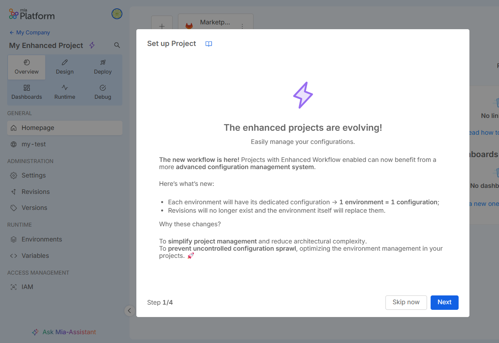
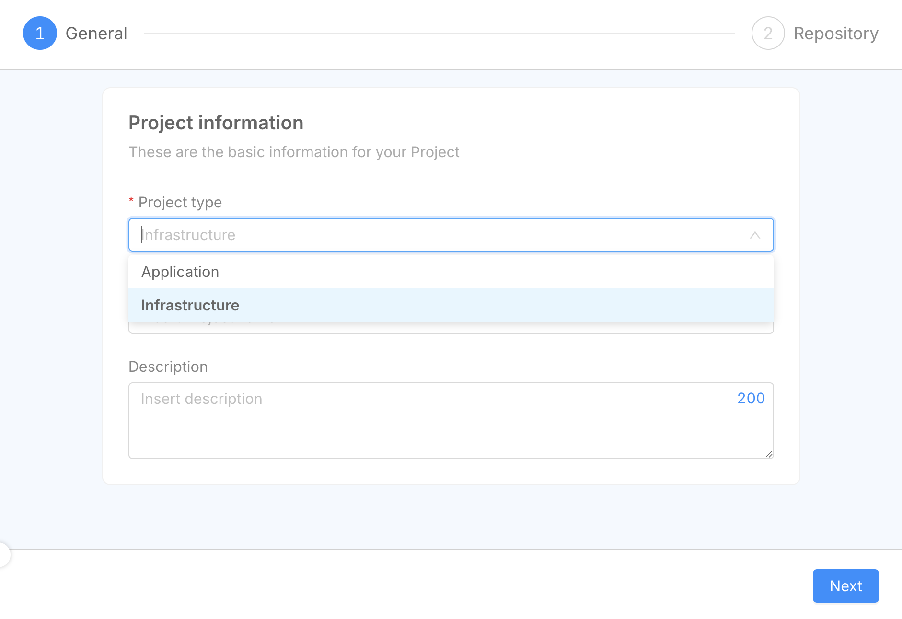
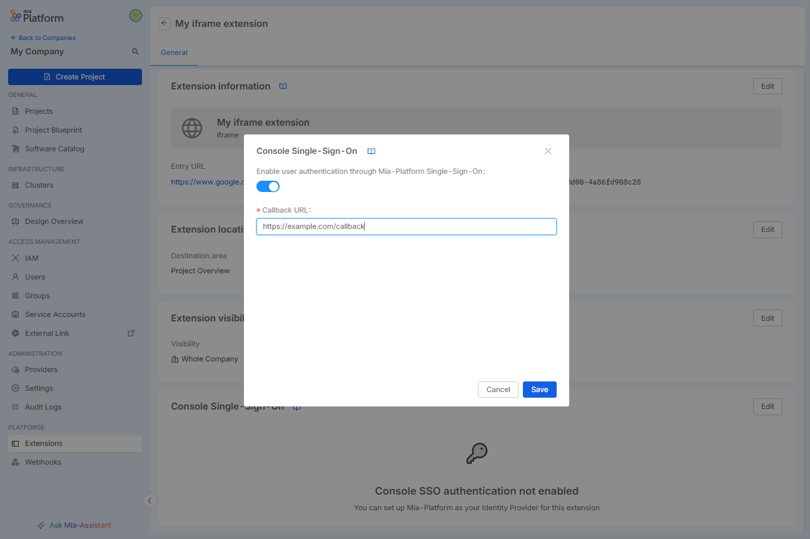
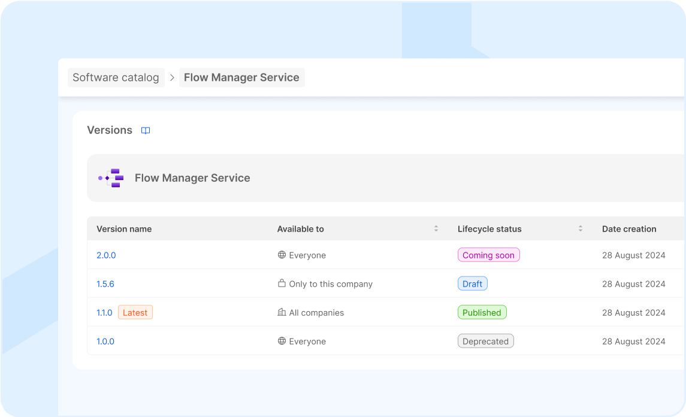

export const Highlight = ({children, color}) => (
  
    {children}
  
);

_April 23rd, 2025_

:::info

Mia-Platform Console v14.0.0 is **now in Preview** and will be generally available on May 22nd.

Console SaaS users can try out v14.0.0 latest improvements in Preview! Open a Service Request to ask for the creation of a sandbox Company in case you do not have access to any Company.

For self-hosted installations, please read the [following guidelines](#how-to-update-your-console).
:::

## Environment centric workflow for Projects (only for Enhanced Projects) <Highlight color="#e5c762">BETA</Highlight>

We've redesigned environment management in Console, significantly simplifying your Design workflow. The environment is now central, replacing branches. You'll work directly within specific environments across all Console sections, ensuring a consistent and intuitive experience.

For more information, go to the [documentation](/development_suite/set-up-infrastructure/env-based-management.md) and visit [Mia-Platform Console v14 Overview](/release-notes/mia-platform-v14.mdx#environment-centric-workflow-for-projects-only-for-enhanced-projects-beta).

## Projects for Infrastructure Provisioning

We've introduced Infrastructure Projects, a new Project type for greater control over infrastructure provisioning in Console. Designed for Operations teams, these new type of Projects let you manage infrastructure resources directly, aligning with Infrastructure as Code. You can now easily visualize, manage, and efficiently execute provisioning actions.
Just create an Infrastructure Project and start provisioning infrastructure to your Developers!

For more information, go to the [documentation](/console/project-configuration/infrastructure-project.md) and visit [Mia-Platform Console v14 Overview](/release-notes/mia-platform-v14.mdx#projects-for-infrastructure-provisioning).

## Iframe extensions support login with Console SSO

We've enhanced iframe extensions with unified and secure authentication using Console SSO. Your extensions can now recognize user permissions and manage authentication seamlessly, ensuring only authorized users can access them and improving overall security.

For more information, go to the [documentation](/console/console-extensibility/sso.md) and visit [Mia-Platform Console v14 Overview](/release-notes/mia-platform-v14.mdx#iframe-extensions-support-login-with-console-sso).

## Composer extensions can fetch data from Console APIs

Extensions created with the Microfrontend Composer can now retrieve data from the Console via API.
This makes these Extensions seamlessly integrated with the Console, enabling better customization and fully leveraging the power of the Microfrontend Composer.
You can already take advantage of this new capability with the new Infrastructure Projects, where these Extensions can be used to display Runtime data of the infrastructure you have deployed.

## Enhancing Software Catalog and Release Management

With v14, the **Software Catalog** gets a powerful upgrade. We’ve refined how items are managed and introduced clearer, standardized schemas — fully documented and easily accessible for all through our [official documentation](/software-catalog/overview.md).

To boost transparency, manifests for public items in the Mia-Platform catalog are now available [here](https://github.com/mia-platform-marketplace/public-catalog).
Additionally, each item's manifest can be downloaded directly from its detail page within the Software Catalog.

We’ve also redesigned the release life cycle, adding new stages: `Coming soon`, `Draft`, `Published`, `Maintenance`, `Deprecated`, `Archived`, and `Deleted`. This new structure makes it easier to track and manage catalog items across their entire lifecycle.

## Marketplace API Deprecation

As of v14, the Marketplace APIs with the `/api/backend/marketplace` prefix are now deprecated.
We recommend updating any existing integrations to align with the [latest APIs](/software-catalog/items-management/api.md) to ensure long-term compatibility and support.

Additionally, it is no longer possible to manage the Marketplace items from the Console CMS, and the `marketplace_CMS` group has been removed.

## Console

### Improvements

#### Download Microservices Environment Variables

You can now download as `.env` file the Environment Variables of your Microservices directly on the related section within the detail of a Microservice!

#### See Project Template's description when creating a Project

From now on, when creating a Project, you can read the description of the Project Template you are selecting.

#### See Project Template used in a Project

Starting from now, newly created Projects of traditional type Application will show to the user the name of the Project Template from which the Project has been created. This information will be visible in the Settings of the Project, inside the General tab.

## Fast Data

### Fast Data Services

#### Single View Trigger Generator

The new version `v3.4.1` of the _Single View Trigger Generator_ is available!

##### Fixed

- The service now correctly handles message processing from topics not managed by the control plane, maintaining a resume state and avoiding malfunctioning.

For more information check out the service [changelog](/runtime_suite/single-view-trigger-generator/changelog.md).

## Data Catalog

### MongoDB Connection support in Data Catalog

[Support for MongoDB](/data_catalog/frontend/data_catalog_connections.mdx#mongodb) as a new connection provider has been introduced in Data Catalog. Users can now define a connection string to connect directly to a MongoDB instance. When collections include a MongoDB JSON Schema validation, the agent is able to automatically detect field structures and types.  
Retrieval of databases and collections can be managed through multiple configuration modes.  
Check the full list of available options in the [official documentation](/data_catalog/frontend/data_catalog_connections.mdx#mongodb-databases-settings) to configure the behavior according to your needs.

## Marketplace

### Marketplace Updates

#### Teleconsultation Service Backend

The new version `2.1.0` of the Teleconsultation Service Backend is available!

This version adds support for [Kaleyra transcription](https://developers.kaleyra.io/reference/video-recording), which allows you to obtain a transcription of the teleconsultation session. 

## How to update your Console

For self-hosted installations, please head to the [self hosted upgrade guide](/infrastructure/self-hosted/installation-chart/100_how-to-upgrade.md) or contact your Mia-Platform referent and upgrade to _Console Helm Chart_ `v14.2.0-beta.1`.
