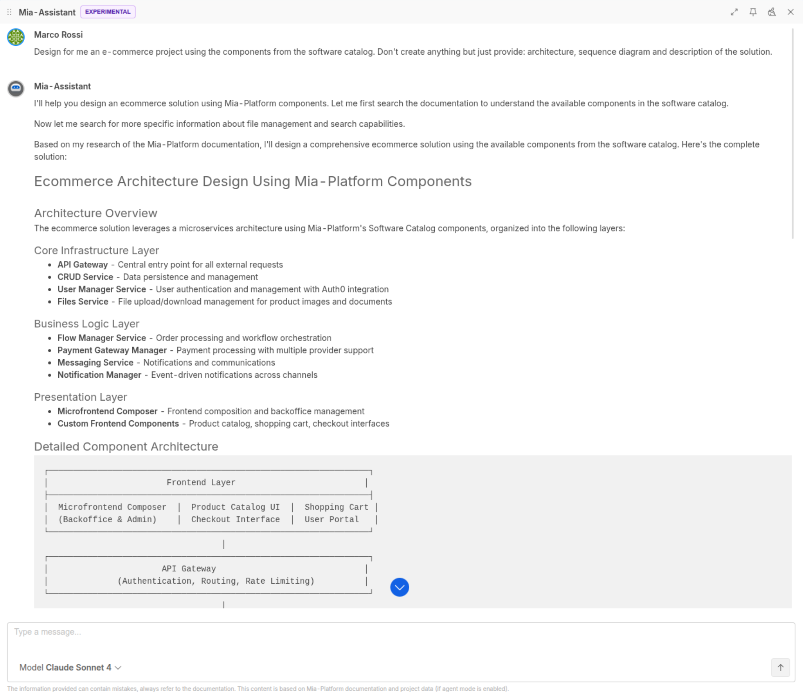

_July 24th, 2025_

:::info

Mia-Platform Console v14.1.0 is **now in Preview** and will be generally available on September 4th.

Console SaaS users can try out v14.1.0 latest improvements in Preview! Open a Service Request to ask for the creation of a sandbox Company in case you do not have access to any Company.

For self-hosted installations, please read the [following guidelines](#how-to-update-your-console).
:::

## Mia-Assistant gets smarter with real-time Console data via Console MCP Server

Mia-Assistant is now a fully operational agent that uses the [Mia-Platform Console MCP Server](https://github.com/mia-platform/console-mcp-server) to access the Console APIs. This enables to retrieve information about your Company, check the Marketplace, debug your services, fix problems, and automatically perform deployments, all simply by chatting.

As always, it will continue to be your helpful assistant, explaining concepts and planning strategies based on best practices and examples from the official documentation.

To discover more, visit the [Mia-Assistant documentation page](/console/assistant/overview.md).

## Pin Mia-Assistant and keep it always available by your side

You can now pin the Mia-Assistant chat to keep it open by your side while working in Console.  
This allows you to interact with AI without interrupting your workflow, making it a constant companion ready to support you throughout your daily tasks!

## Console

### Environment Based Configuration Management as Closed Preview

The Environment Based Configuration Management feature, introduced in Beta with **v14.0.0**, will now be available as **Closed Preview** only.
This will allow us to focus on gathering feedback and improving the final user experience before a wider rollout. As a result, automatic migration of Enhanced projects is temporarily disabled, and existing migrated projects will be reverted.

In the meantime, if you are interested in trying out this beta feature, you can reach out to your Mia-Platform referent.

### Improvements

#### Azure DevOps now supported for Infrastructure Projects

Infrastructure Projects now support Azure DevOps as a Git provider.  
This addition allows you to manage your infrastructure configurations directly through Azure DevOps repositories, extending the flexibility of your Git provider integrations.

To discover more, visit the related [documentation page](/console/project-configuration/infrastructure-project.md).

### Back-Lit Library

The new version `v1.5.20` of the back-kit library is available!

Refer to back-kit [changelog](/microfrontend-composer/back-kit/changelog.md) for finer-grained details of new versions.

#### Bug Fix

* Fixed partial date format on `bk-form-wizard` component

## Marketplace

### Marketplace Updates

#### Integration Connector Agent 0.4.0

The Integration Connector Agent received new updates to enable:

- aggregating information from Cloud Vendors (specifically GCP, AWS and Azure)
- receiving events from GitHub webhooks
- build custom processors with Golang code, thanks to the new `rpc-plugin` processors and the [Integration Connector Agent Processor Template](https://github.com/mia-platform-marketplace/integration-connector-agent-processor)

To learn more about all the features and how to configure it, visit the [official documentation](/runtime_suite/integration-connector-agent/10_overview.md).
## How to update your Console

For self-hosted installations, please head to the [self hosted upgrade guide](/infrastructure/self-hosted/installation-chart/100_how-to-upgrade.md) or contact your Mia-Platform referent and upgrade to _Console Helm Chart_ `v15.0.0-beta.1`.
