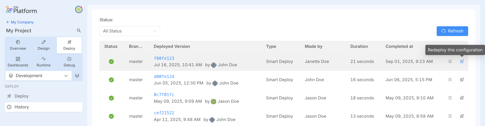

_September 4th, 2025_

:::info

Mia-Platform Console v14.2.0 is **now in Preview** and will be generally available on September 18th.

Console SaaS users can try out v14.2.0 latest improvements in Preview! Open a Service Request to ask for the creation of a sandbox Company in case you do not have access to any Company.

For self-hosted installations, please read the [following guidelines](#how-to-update-your-console).
:::

## Manage Projects locally with `miactl` (new Describe & Apply commands)

It is now possible to **manage your Project configurations locally** using our `miactl` CLI.  
With the new `miactl project describe` and `miactl project apply` commands, you can export the configuration of a Project, edit it on your machine, and then apply it back to update the Project.  

This enables new workflows such as troubleshooting misconfigurations, migrating Projects between Companies, creating reusable templates, or leveraging AI tools to refine configurations.  

For detailed usage examples, please refer to the [documentation](/development_suite/api-console/api-design/miactl-commands.md) and the [miactl project commands](/cli/miactl/30_commands.md#project).

## New Webhook event: Tag Deleted

A new webhook event is now available: **`Tag Deleted`**.  
This event is fired whenever a tag/version is deleted, allowing you to trigger custom automations or integrations in response.

## Redeploy a configuration from Deploy History

It is now possible to **redeploy a previously deployed configuration** directly from the **Deploy History**.  
From the Deploy area, in the Deploy History section, simply click the rocket icon in the table of the deployments to trigger a new deploy of that specific configuration.

## Console

### Improvements

#### Project list improved with table view

The **Project list** is now displayed in a **table view** instead of cards.  
This change improves performance, simplifies search, and makes navigation in Console more efficient when working with multiple Projects.

## How to update your Console

For self-hosted installations, please head to the [self hosted upgrade guide](/infrastructure/self-hosted/installation-chart/100_how-to-upgrade.md) or contact your Mia-Platform referent and upgrade to _Console Helm Chart_ `v15.0.1-beta.0`.
