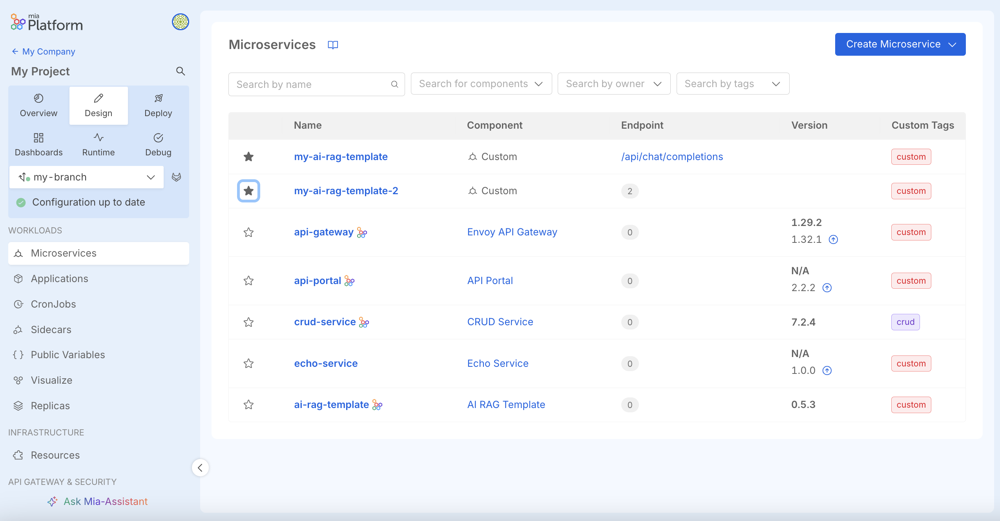

_October 2nd, 2025_

## New Microservice experience as a Feature Preview

We’ve introduced a **new tabular view** for Microservices, designed to make navigation between resources more intuitive.  
From this view, you can quickly see any **related endpoints**, mark Microservices as **favorites**, add **multiple custom tags**, and then filter by them to better organize your workflows.

You can enable this new experience from the Feature Preview tab on the Settings section of your Project.  

## Export conversations with Mia-Assistant in PDF format

Conversations with **Mia-Assistant** can now be exported also in **PDF format**, in addition to the traditional `.txt`.  
You only need to click on the format you prefer from the download button available on the top of the Mia-Assistant chatbot.  
This makes it easier to choose the better option to archive, share, and review your assistant interactions whenever you need.  

## Console

### Improvements

#### Improved visibility of production environments status  

We’ve enhanced the way production environment information is displayed on the new Projects list: the **status of your production environment** is now directly visible from the **Projects table**.  
This gives you an immediate overview of any issues or confirmations about the health of your production environments when looking at your Company's Projects.

## Fast Data

### Fast Data Services

#### Single View Trigger Generator

The new version `v3.5.0` of the _Single View Trigger Generator_ is available!

##### Fixed

- The service now correctly supports the `null` condition in ER-Schema. Previously, such condition, if present in the ER-Schema, would cause an error when loading a strategy.

For more information check out the service [changelog](/runtime-components/plugins/single-view-trigger-generator/changelog.md).

## How to update your Console

For self-hosted installations, please head to the [self hosted upgrade guide](/infrastructure/self-hosted/installation-chart/100_how-to-upgrade.md) or contact your Mia-Platform referent and upgrade to _Console Helm Chart_ `v15.0.2`.
