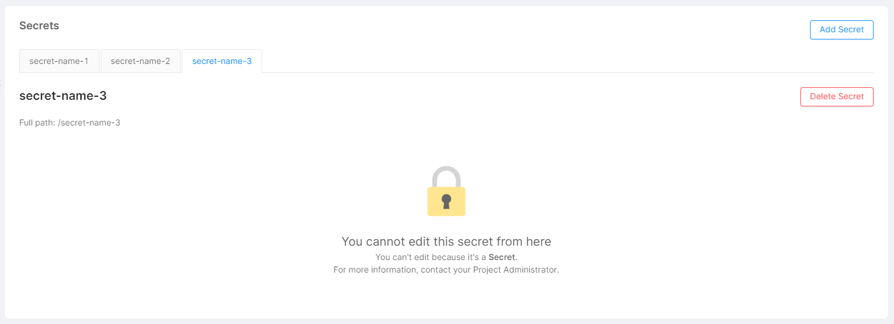

_October 6th, 2022_

## Console

### Improvements

#### Improved management of Config Maps and Secrets in Cronjobs and Services sections

In Cronjobs and Services sections, the long list of Config Maps and Secrets cards has been replaced with two simple cards that allow to manage the two types of configurations.




#### Removed the redirection to Endpoint section also for RBAC and Fast Data Sections

When saving the branch configuration in the sections of RBAC and Fast Data in the Design Area, the browser remains on the same section.

## Marketplace

### New Marketplace Components

#### Auth0 + ApiGateway application

This application contains all the required resources to protect a generic front-end employing Auth0 services.
For more information refer to [Auth0 + ApiGateway documentation](../../runtime_suite/auth0-+-api-gateway/overview)

#### Auth0 + Backoffice application

This application contains all the required resources to deploy an Auth0 protected instance of Backoffice.
For more information refer to [Backoffice + Auth0 documentation](../../runtime_suite/auth0-+-backoffice/overview)

### Updates

#### HTTP Proxy Manager - 1.5.1

Update AccessToken.ExpiresIn to handle both strings and numbers. This resolve the issue raised by [this public discussion](https://github.com/mia-platform/community/discussions/10).

### Bug Fix

#### Broken configurations

A bug  that caused the break of the configurations while saving, due to the import of extensions even in non-root locations, has been fixed.

#### Secret update with vault

A bug that caused a malfunction in updating secret variables using Vault as secret manager has been fixed.

## Backoffice - 1.0.10

### Bug Fix

#### Format currency works correctly on it-IT locale

Formatting and parsing errors relative to it-IT locale in fields with `currency` format inside forms have been fixed

#### Readonly object and array fields are correctly displayed in forms

Read-only fields of type `object` or `array` without nested `dataSchema` are no longer navigable from forms, and editor is correctly shown

## Backoffice - 1.0.11

### Bug Fix

#### Data custom actions sends correct payload

data-actions of `bk-form-drawer` sends events with correct payload

#### Form modal correctly support wizard mode

`bk-form-modal` correctly supports wizard mode even when property `extraEndpoint` is set

### New Features

#### Filters support case insensitive equality

`ignoreCase` field is available in `filtersOptions`, controlling whether equality filters on string fields should be evaluated ignoring case

## Backoffice - 1.1.0

### Breaking Changes

#### Back-kit docker image

The docker image that serves back-kit components is now: `nexus.mia-platform.eu/back-kit/bk-web-components:{{BACK-KIT-VERSION}}`, with `{{BACK-KIT-VERSION}}` being the desired version of back-kit, such as `1.1.0`.

#### Calendar uses filters to handle data filtering

`bk-calendar` component now uses `addFilter` events to fetch data to visualize. `bk-filters-manager` should thus be included in the configuration together with `bk-calendar`, for instance:

```json
  ...
  {
    "type": "element",
    "tag": "bk-filters-manager",
    ...
  },
  ...
  {
    "type": "element",
    "tag": "bk-calendar",
    ...
  }
  ...
```

#### New modal and drawer components

Interfaces of components `bk-modal` and `bk-drawer` have been updated. Previous interfaces are still available in components `bk-old-modal` and `bk-old-drawer`.

- replace `bk-modal` with `bk-old-modal` in configurations
- replace `bk-drawer` with `bk-old-drawer` in configurations

### Bug Fix

#### Regex queries escape special characters

Special characters inserted by the user are escaped in queries with `regex` operators

#### Submit button is enabled on fields change

Fixed behavior that prevents `bk-form-drawer` from correctly enabling save button when a field with `lookupOptions.lookupDeps` is included in `data-schema`

#### File fields are correctly updated in nested objects

Fields with format `file` are correctly updated in nested objects/arrays

#### Search queries number fields

Search queries are not performed for fields of type `number` if these have property `excludedFromSearch` set to true in `data-schema`

#### Filter drawer correctly updates value

Fixed bahaviour that prevents `bk-filter-drawer` from correctly clearing the "value" input field upon changing the operator

### New Features

#### Table columns can be blocked

Added the possibility to block an arbitrary number of external columns in `bk-form-table` against horizontal scrolling

#### Custom button icon in nested tables

custom icons can be specified in `bk-table` row actions in nested fields

#### complex date manipulation on `bk-tabs` filters

`bk-tabs` allows to filter data by performing data manipulation and comparison, allowing to specify an `offset` in filters value.

## How to update your Console

For on-premise Console installations, please contact your Mia Platform referent to know how to use the `Helm chart version 8.0.21`.
