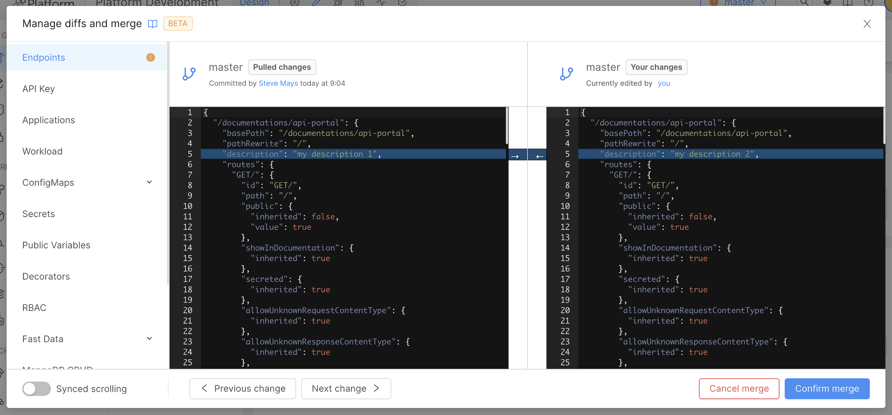
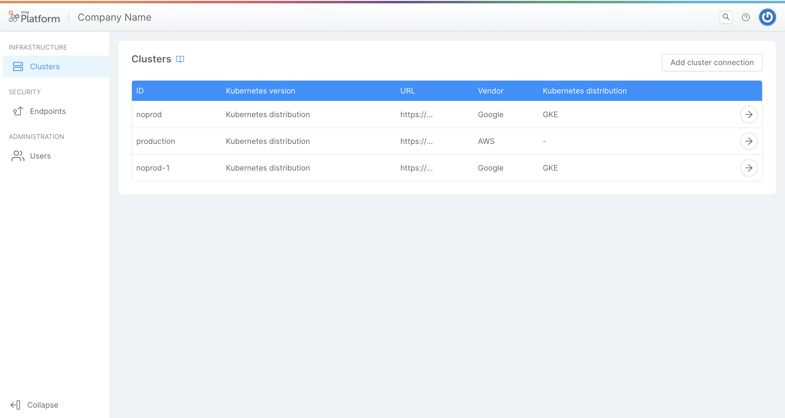

import bannerImageUrl from './img/banner-overview-v10.png'

Welcome to Mia-Platform v10, a major full of new integrations and functionalities for an Enriched Control Plane ensuring a Frictionless Developer Experience.

## Console

### Merge and Promote configurations

Making development in Mia-Platform Console easier and more efficient has been the principal focus of this major.
In this direction, this new feature aims to offer a better developer experience throughout the entire Console configuration lifecycle, enabling a smarter way to reduce the typically time-consuming conflict resolutions and providing the merge of configurations directly in Mia-Platform Console.
Now, within the project, different users can concurrently work on the same branch configuration while having visibility of any changes remotely made by other users.
More specifically, it is possible to:

- have visibility on all the configuration changes made locally before committing them;
- start the merge process in order to align those changes to the last committed configuration within the same branch. 

Moreover, users can also align configurations of two different branches within the same project.
In this way, the configuration of a branch can be easily and efficiently promoted across different environments up to the production one. Find out more [here](../development_suite/api-console/api-design/merge_collaboration).

  
 

  

### Management of Clusters in self-service mode

Infrastructure governance is a very important issue when it comes to a product like Mia-Platform. 
Both from an administrative perspective and purely from a developer experience perspective, the distance between the infrastructure part and the development implementation part can cause frictions.
Therefore, we have created a new section in Mia-Platform Console - inside the Company overview area - where each company will be able to view and fully manage the Kubernetes clusters connected to the console, which are then used to deploy their projects, regardless of the vendor and the Kubernetes distribution. Find out more [here](../development_suite/clusters-management). 

  
 

  

### Management of Environment in self-service mode

Just as with Clusters, Projects Environments also take on fundamental importance in the context of Mia-Platform offerings. Their easy and smooth management not only decreases useful friction between infrastructure and development teams, but also contributes fundamentally to reducing the time-to-market of projects. 
This is why we have introduced in the Environment section of the Project Settings area the possibility to manage in an almost self-service way the creation, modification and deletion of the environments of each project. Find out more [here](../development_suite/set-up-infrastructure/runtime-environments).

  
 

  

### Providers & Tools Integration

Product integrability with new providers, tools or external services is - in our view - a strength of our offering. For this reason, several new providers and tools have been integrated in Mia Platform Console.

#### Git Providers: Azure DevOps and BitBucket

Mia-Platform Console supports the use of 2 new Git Providers, Azure DevOps and BitBucket, in order to meet almost all the technical needs of the market.

#### CI Tool: Jenkins

Mia-Platform Console is now integrated with Jenkins, another provider to better manage the Deploy pipelines.

#### Secret Manager: Vault

Mia-Platform Console can now manage secreted variables through Vault secret manager.

### Project Quick Links

Now, in each project, the Project Administrator can set up and manage quick useful links to better organize and speed up the team workflows.
These links will be visible and available for consultation directly from the Project homepage for all the members of the project.
Moreover, they can also be reached through the shortcut Ctrl/Cmd + K, by clicking on the "Project Links" entry. Find out more [here](../development_suite/overview-dev-suite#project-links-and-dashboards).

  
 

  

## Fast Data

### Single View configuration Low Code in a dedicated area

Single View page now contains a dedicated tab where you can configure your Low Code aggregation without having to navigate to the Microservice page. Mia-Platform Console will help you to write your configuration thanks the integrated syntax checker.

### Single View Trigger

The Single View Trigger is a new microservice available on the Marketplace, whose purpose is to link the Real-Time Updater (RTU) and the Single View Creator.
The service will consume Kafka messages produced by the RTU on a specific topic, execute the appropriate strategies and generate projection changes either on MongoDB or Kafka.

### Salesforce Streaming API Connector

The Salesforce Connector Service provides a way to import data from StreamingAPI directly into your FastData projections.
This connector manages connection, authentication, and processing of data received via Salesforce streaming API. It listens to the changes in the data sources of Salesforce and brings them to one or more Kafka topics.

## Marketplace

### Applications 2.0

In addition to Microservices, the applications in the Marketplace support the configuration of resources such as Endpoints, Public Variables and CRUD Collections.  
In this way, with a few simple clicks you can deploy perfectly functional applications without configuring anything!

### Backoffice

Mia-Platform Backoffice has new functionalities such as handling geographic data and bulk actions.  
Existing features have been enhanced with a particular focus on files - which can now be viewed in browser and modified in batches - and filters - with the “exist” operator and hidden static filters.

### Extended Payment Gateway Manager

Manage in one place all logics and business processes related to payments, now also supporting BNPL and recurrent payments.

### MongoDB Views for CRUD Service

The MongoDB View section has been introduced inside the Design area of Mia-Platform Console.  
Here, user can create and configure a View. Then, the view can be exposed through an Endpoint of type MongoDB View.  
Moreover, it is possible to see a MongoDB View's content from the CMS by creating a new CMS Page from the CMS section of the Console. Find out more [here](../development_suite/api-console/api-design/mongo_views).

  

