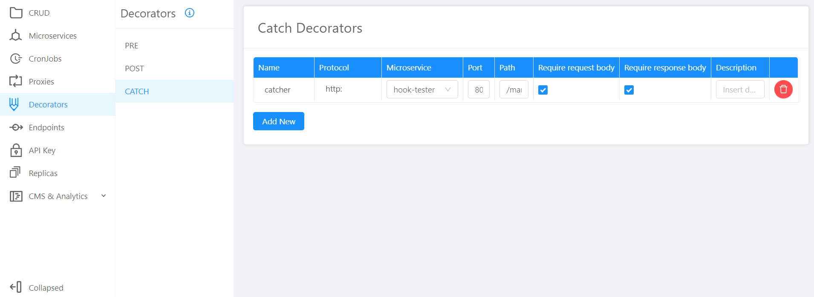
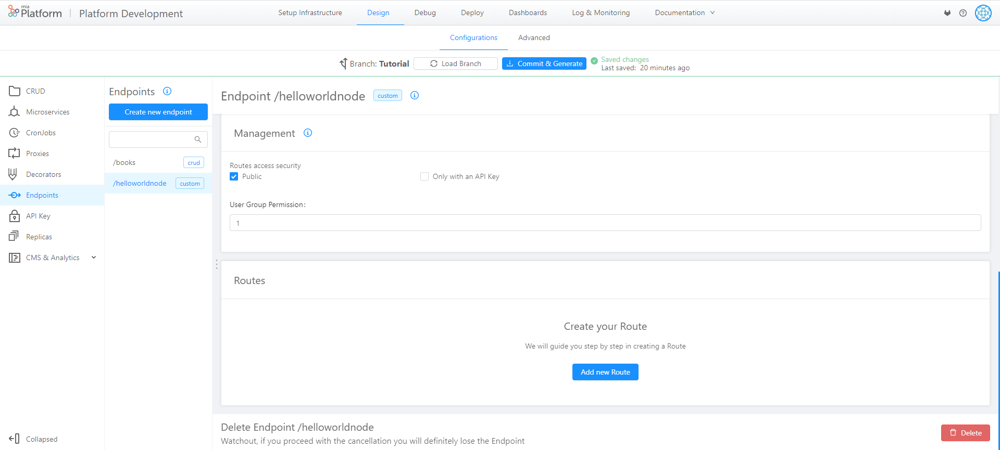
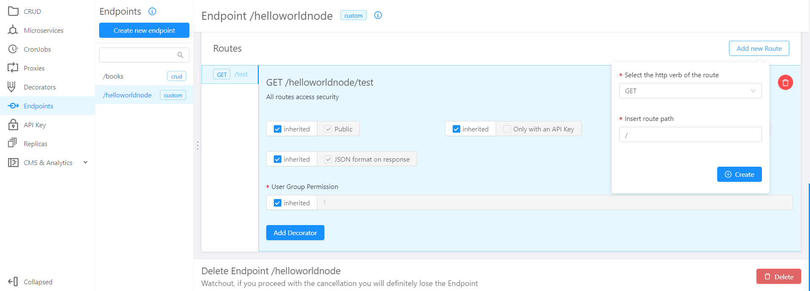
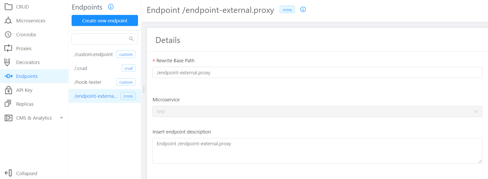

## v5.10.1 (July 16,2020)

### New features

* **Design - Decorators** - **New type of decorators available**      
    Now you have the possibility to set up a `CATCH` decorator! `CATCH` decorators are invoked whenever the decorated endpoint returns an error status code.

    

### Improvements

* **Design - Endpoint** - **New experience for creating a new route**     
    You can now create the first endpoint route clicking on the **new placeholder button.** A convenient popup will allow you to select method and path.

    
    
    Once the first endpoint route has been created, it will be possible to create further routes by clicking on the `Add new Route` **button at the top right of the card**, now more visible and easy to use.

    

* **Design - CMS** - **New header and footer**          
    With the new header and footer, CMS section has been aligned to CRUD, Microservices, Proxies, Endpoint and Cronjobs sections: the **Delete button is now at the footer of the page.**

    

### Fixes

* **Design - Endpoint**       
    In the endpoints section, endpoints that are linked to cross project proxies have now the **`Cross` label.**

    

* **Design - Endpoint**    
    When you delete a decorator, endpoints will update automatically.

* **Design**    
    You can now enter white-spaces at the beginning and at the end of forms without an error message appearing.

### How to update your DevOps Console?

## v5.10.0 (July 9,2020)

### New features

* **CMS in DevOps Console project**       
    `Console admin` users can now access the CMS and **modify Projects, Tenant, Templates, Services, Users and Groups directly from CMS**.

    

* **Project Creation for admin users**        
    Now project creation section is **enabled only for `tenant-id admin` and `project admin`  users**. To learn more about users permissions, please visit [this page](https://docs.mia-platform.eu/development_suite/Console%20levels%20and%20permits%20management/) of Mia Platform Docs.

### Improvements

* **API Portal - tags for type and required properties**        
    **New tags** to identify the `required` properties and the `type` of each property in the API Portal.

    

* **API Portal - managed error for unfilled properites**            
    Now **errors for unfilled fields** does not appear at the opening of a route, but when the field is not compiled.

* **API Portal - removed `All` filter**        
    Category filter in the API Portal **does not show anymore the duplicated option** `All`.

* **Deploy History - new Environment filter**        
    In History section of Deploy, you can now **filter for Environment**.

    

### Fixes

* **Memory resources and CPU resources documentation integration in Design Microservices**        
    Documentation integration has been added in Microservice configuration section with the addition of links to **learn more about Memory resources and CPU resources**.

    

* **Aligned menu resize icon in Design**            
    The menu resize icon **no longer overlaps with the menu item expansion**.

### How to update your DevOps Console?

In case of on-premise Console, to use these features, you have to update:

* Console Backend v3.2.0 (`nexus.mia-platform.eu/api-console/backend:3.2.0`)          

* Console Website v1.25.0 (`nexus.mia-platform.eu/api-console/website:1.25.0`)       

* Deploy Website v1.4.0 (`nexus.mia-platform.eu/console/deploy-website:1.4.0`)       
       
