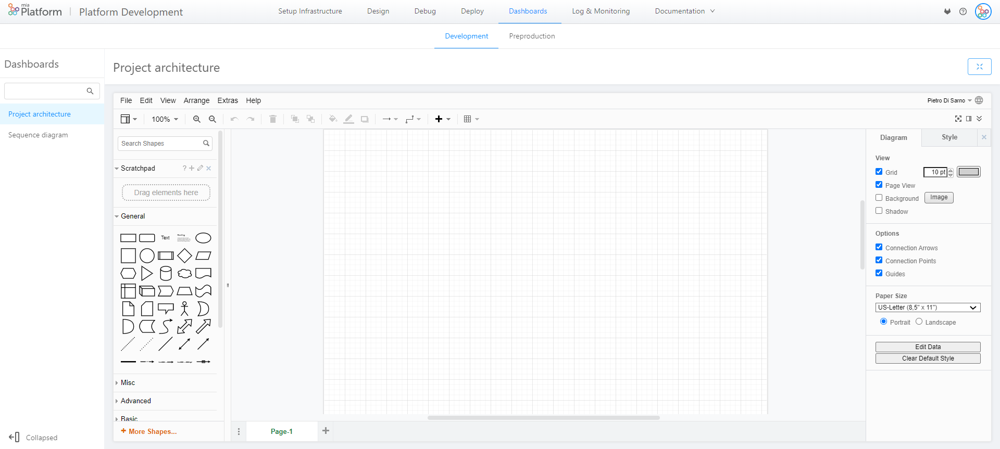
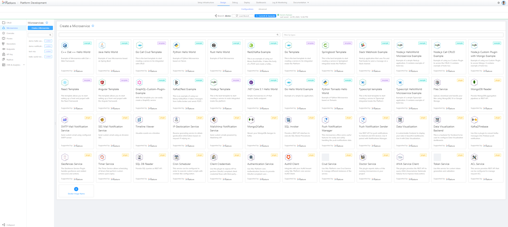
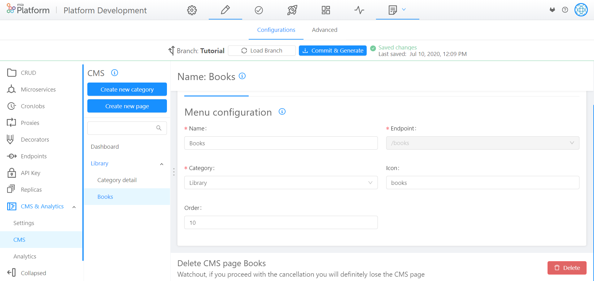
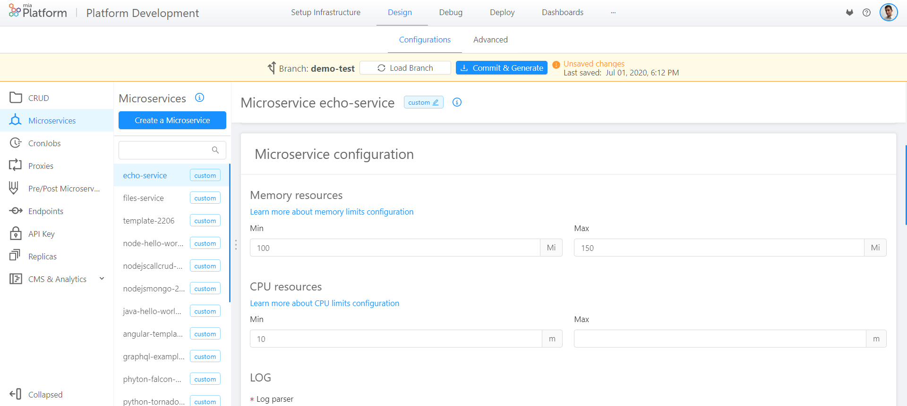

## v5.10.4 (September ,2020)

### New features

* **Dashboard** - **Full screen visualization enabled**    
You can now expand the dashboard **visualization to full screen** by clicking on the "full-screen" icon in the **upper right corner** of the screen.

### Improvements

* **Dashboard** - **Collapsible left side bar**    
You can now compress the **left sidebar** in the dashboard section to enlarge the data visualization.

* **Design-Decorators** - **Require body properties set true by default**    
"Require request body" and "require response body" properties are now **true by default** to speed up the workflow.

### Fixes

* **Design Endpoint** - **Fixed the delete button bug on endpoint's routes**   
It's now possibile to delete any routes of a given microservice endpoint.

* **DevOps Console** - **Fixed the visualization bug of the project creation button**      
The bug that prevented users with permission from viewing and using the **project creation button** has been fixed.

* **DevOps Console** - **Fixed the bug on "Setup infrastructure" buttons**   
The **"setup infrastructure"** section is now consistently enabled or disabled depending on the project features.

* **Design Microservices** - **Api documentation path placeholder**    
In the design area, after selecting a microservice you will now view the default documentation path equal to `/documentation/json`.

### How to update your DevOps Console?

## v5.10.3 (August 07,2020)

### Improvements

* **Api Portal** - **Improved the json editing experience in the documentation**    
   The **json edit panel** is now **larger** by default and **aligned** with the rest of the body parameters. If you wish, you can enlarge it by clicking and dragging the bottom right corner.

 

* **Api Portal** - **Autogeneration of examples is now enabled**    
In the Api Portal documentation you can now take advantage of self-generated examples to more easily fill the required body params and test your endpoints.

* **Design Microservices** - **Introduced new logos and labels in the marketplace**      
    The service marketplace now includes new **logos** and renewed **tags** through which you can more easily search and find your favorite example, template or plugin.

    

### Fixes

* **API Portal** - **Fixed bug on the API Portal**     
   Fixed the bug on the generation of swagger-aggregator configurations that prevented the proper functioning of the API Portal.

* **Design Endpoint** - **Fixed visualization bug on endpoint section fields**      
   Fixed the irregular behavior that resulted in a shared state between different fields of the endpoint section.

* **Design Proxies** - **Fixed the bug in the proxy area infobox**      
   The proxy area infobox now shows the correct information about the main steps on **how to create a proxy**.

### How to update your DevOps Console?

In case of on-premise Console, to use these features, you have to use the [Helm chart version](https://git.tools.mia-platform.eu/platform/devops/console-helm-chart): 2.2.5

From this version a new chart option has been added: `enableTelemetry` to enable Google Tag Manager installation and tracking via Google Analytics to collect information about console usage.By default it is disabled, if you want to turn it on you have to correctly configure the `enableTelemetry` option among the values of the chart helm.

## v5.10.2 (July 28,2020)

### Improvements

* **Commit & Generate** - **Introduced release note to tag**      
    You can now **add a release note** when creating a new tag (markdown is supported).

    

### Fixes

* **Design** - **Fixed placeholder bug**      
    Fixed placeholder message for forms in the proxies and decorators section: now they are no longer trimmed.

* **Design Endpoint** - **Fixed add new route bug**      
    Fixed the bug that made the previously created route path appear in the textbook **insert route path**.

* **DevOps Console** - **Fixed bug on Safari browser**      
    Fixed the bug that was preventing scrolling on **Safari**.

### How to update your DevOps Console?

In case of on-premise Console, to use these features, you have to use the [Helm chart version](https://git.tools.mia-platform.eu/platform/devops/console-helm-chart): 2.2.2 

## v5.10.1 (July 16,2020)

### New features

* **Design Microservices** - **The Marketplace now includes plugins**          
    The marketplace has been enriched with a new functionality! In addition to templates and examples, **it will be possible to use plugins** that can be customized according to your needs.  Mia Platform Plugins are useful to speed up the creation of your applications. For example, SQL Reader provides SQL queries as REST API, MongoDB Reader Provides MongoDB aggregation pipelines as REST API, SQL Invoker provides a REST API interface to execute SQL Stored Procedures, and so on.

    

* **Design Decorators** - **New type of decorators available**      
    Now you have the **possibility to set up a `CATCH` decorator**! `CATCH` decorators are invoked whenever the decorated endpoint returns an error status code. To learn more about decorators you can visit [this page](https://docs.mia-platform.eu/development_suite/api-console/api-design/decorators/) of Mia Platform Docs.

    

### Improvements

* **Design Endpoint** - **New experience for creating a new route**     
    You can now create the first endpoint route clicking on the **new placeholder button.** A useful popup will allow you to select method and path.

    
    
    Once the first endpoint route has been created, it will be possible to create further routes by clicking on the `Add new Route` **button at the top right of the card**, now more visible and easy to use.

    

* **Design CMS** - **New header and footer**          
    With the new header and footer, CMS section has been aligned to CRUD, Microservices, Proxies, Endpoint and Cronjobs sections: the **Delete button is now at the footer of the page.**

    

### Fixes

* **API Portal** - **security headers for endpoints and routes**      
    Now the **addition of security headers is required only for endpoints and routes** configured as `Required API Key`.

* **Design Endpoint - New Cross labels**       
    In the endpoints section, endpoints that are linked to cross project proxies now display the shorter **`Cross` label.**

    

* **Design Endpoint - automatic update of endpoints**    
    When you delete a decorator, **endpoints will update automatically**.

* **Design CRUD - fixed projectId deletion**         
    The configuration bug that deletes `projectId` on CRUD has been fixed.

* **Design - forms allow white-spaces**    
    You can now enter **white-spaces at the beginning, in the middle and at the end of forms** without an error message appearing.

### How to update your DevOps Console?

In case of on-premise Console, to use these features, you have to update:

* Console Backend v3.3.0 (`nexus.mia-platform.eu/api-console/backend:3.3.0`)          

* Console Website v1.26.0 (`nexus.mia-platform.eu/api-console/website:1.26.0`)       

Moreover, you have to modify the CRUD of the services in the marketplace by:

* Adding the `dockerImage` property (`string` type);

* Removing the `required` check from `archiveUrl`;

* Adding `customFilesConfig` (`array of object` type), which objects in the configuration should have the following properties:

    - `repositoryType`

    - `fileType`

    - `fileName`

    - `filePath`

    - `ref`

## v5.10.0 (July 9,2020)

### New features

* **CMS in DevOps Console project**       
    `Console admin` users can now access the CMS and **modify Projects, Tenant, Templates, Services, Users and Groups directly from CMS**.

    

* **Project Creation for admin users**        
    Now project creation section is **enabled only for `tenant-id admin` and `project admin`  users**. To learn more about users permissions, please visit [this page](https://docs.mia-platform.eu/development_suite/Console%20levels%20and%20permits%20management/) of Mia Platform Docs.

### Improvements

* **API Portal - tags for type and required properties**        
    **New tags** to identify the `required` properties and the `type` of each property in the API Portal.

    

* **API Portal - managed error for unfilled properites**            
    Now **errors for unfilled fields** does not appear at the opening of a route, but when the field is not compiled.

* **API Portal - removed `All` filter**        
    Category filter in the API Portal **does not show anymore the duplicated option** `All`.

* **Deploy History - new Environment filter**        
    In History section of Deploy, you can now **filter for Environment**.

    

### Fixes

* **Memory resources and CPU resources documentation integration in Design Microservices**        
    Documentation integration has been added in Microservice configuration section with the addition of links to **learn more about Memory resources and CPU resources**.

    

* **Aligned menu resize icon in Design**            
    The menu resize icon **no longer overlaps with the menu item expansion**.

### How to update your DevOps Console?

In the case of on-premise Console, to use these features, you have to update:

* Console Backend v3.2.0 (`nexus.mia-platform.eu/api-console/backend:3.2.0`)          

* Console Website v1.25.0 (`nexus.mia-platform.eu/api-console/website:1.25.0`)       

* Deploy Website v1.4.0 (`nexus.mia-platform.eu/console/deploy-website:1.4.0`)       
       
