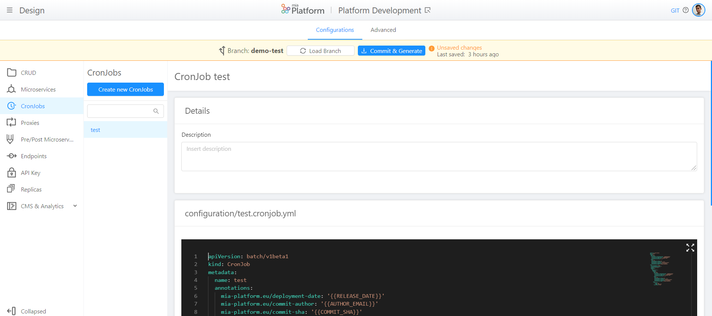

# v5.7.0 (May 12,2020)

!!! warning

    This version solves the breaking change of v5.6.1: now CMS backend does not go in error. If you have configured 'cmsmenu' CRUD, the menu items will be shown in CMS since 'groups' property will be automatically added.

## New capabilities

* **Create and Manage Cronjobs**        
  This new section of Design area enables you to **create, manage and delete CronJob**, a scheduled Job that will be executed periodically on a given schedule, from DevOps Console. 

  

    [Here](https://docs.mia-platform.eu/development_suite/api-console/api-design/jobs-cronjob/) you can find more details about CronJobs creation and management.

## New features

* **Design - Microservices: add a configmap**        
    With this version we have introduced 'add configuration' button that allows you to **create configmaps** in order to add files to your microservice without going to the advanced configuration. 

  
  
* **Design - Microservices: switch to standard mode witohout loosing information**     
    We have simplified the **switch from advanced to standard mode** in the Microservices section. Now, in fact, you can come back to standard configuration **without loosing your advanced settings** like your docker image, your variables and your configmaps.

!!! info

    We suggest you to convert in a standard mode all your microservices in order to achieve a better governance of your microservices. 

  

  [Here](https://docs.mia-platform.eu/development_suite/api-console/api-design/services/) you can find more detailed guidelines about the creation and the management of configurations from DevOps Console.

## Improvements

* **Design - Microservices, Cronjobs and Proxies**      
    Restyling of Microservices, Cronjobs and Proxies deletion: now, on the footer of the page, there is a **card with the 'delete' button**. If you push it, a pop up appears in the centre of the page to confirm the deletion.

  

* **Design - Microservices**      
    Restyling of Microservices page: name, tag, 'Clone' and 'View Repository' remains **on the header of the page** when the user scrolls down the page.

  

## Fixed

* **CMS**     
  **Logout from CMS is fixed** and returns a feedback in case of error. Moreover, v1-adapter has been updated to version 2.4.0, cms-site to version 9.8.1 and cms-backend to version 3.0.0

* **Restyling** of the padding between the Search bar and first input selected in each section of Design area. 
  
* Improvement of the **organization of the elements** of DevOps Console pages when the width of the window is reduced.

  

## How to update your DevOps Console?

In case of on-premise Console, to use the previous features, you have to update:  

* Console website @1.19.0

* Console backend @1.19.1

If you have a custom CMS, you have also to update it at v9.8.1.
