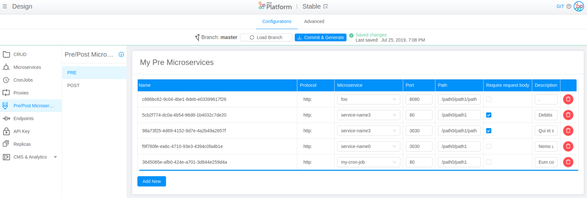

# v5.7.1 (May 19,2020)

## Improvements

* **Console**      

    From CMS it is now possible to configure different default environment variables for each template, in order to **overwrite the default environment variables applied by DevOps Console**. You can configure the environment variables by adding `defaultEnvironmentVariables` inside the data model of each template. To learn how to use this new feature, please visit this [page](https://docs.mia-platform.eu/development_suite/api-console/api-design/templates_conf/#how-to-configure-templates-default-environment-variables-from-cms) of Mia Platform Docs.

* You have now the possibility to **resize columns** in the Pre/Post section of DevOps Console.

    

    

## Fixed

* **Deploy**      

    Horizontal Pod Autoscaler (HPA) file is  **generated with *.yml* extension** instead of *.yaml*. So, HPA files can now be deployed successfully.

!!! info

    Mia Platform recommends you to delete al the *.hpa.yaml* files and to mantain all the *.hpa.yml* files.

## How to update your DevOps Console?

In case of on-premise Console, to use these features, you have to update:

* Console website @1.20.0

* Console backend @1.20.0
